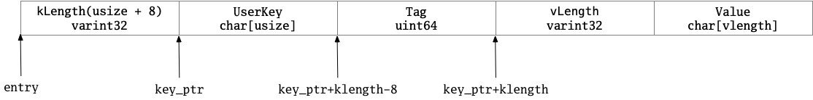

# §3.3 MemTable

## 1 路径

* db/memtable.h
* db/memtable.cc

## 2 功能

## 3 MemTable

### 3.1主要成员变量

```cpp
KeyComparator comparator_;
int refs_;
Arena arena_;
Table table_;
```

其中，`KeyComparator`的定义如下，其主要的是提供了`operator()`函数。使用的Comparator实际上是`InternalKeyComparator`。

```cpp
struct KeyComparator {
  const InternalKeyComparator comparator;
  explicit KeyComparator(const InternalKeyComparator& c) : comparator(c) {}
  int operator()(const char* a, const char* b) const;
};

int MemTable::KeyComparator::operator()(const char* aptr,
                                        const char* bptr) const {
  // Internal keys are encoded as length-prefixed strings.
  Slice a = GetLengthPrefixedSlice(aptr);
  Slice b = GetLengthPrefixedSlice(bptr);
  return comparator.Compare(a, b);
}

static Slice GetLengthPrefixedSlice(const char* data) {
  uint32_t len;
  const char* p = data;
  p = GetVarint32Ptr(p, p + 5, &len);  // +5: we assume "p" is not corrupted
  return Slice(p, len);
}
```

类型`Table`实际上是一个`SkipList`。

```cpp
typedef SkipList<const char*, KeyComparator> Table;
```

### 3.2 Add、Get

```cpp
// Add an entry into memtable that maps key to value at the
// specified sequence number and with the specified type.
// Typically value will be empty if type==kTypeDeletion.
void Add(SequenceNumber seq, ValueType type, const Slice& key,
         const Slice& value);

void MemTable::Add(SequenceNumber s, ValueType type, const Slice& key,
                   const Slice& value) {
  // Format of an entry is concatenation of:
  //  key_size     : varint32 of internal_key.size()
  //  key bytes    : char[internal_key.size()]
  //  value_size   : varint32 of value.size()
  //  value bytes  : char[value.size()]
  size_t key_size = key.size();
  size_t val_size = value.size();
  size_t internal_key_size = key_size + 8;
  const size_t encoded_len = VarintLength(internal_key_size) +
                             internal_key_size + VarintLength(val_size) +
                             val_size;
  char* buf = arena_.Allocate(encoded_len);
  char* p = EncodeVarint32(buf, internal_key_size);
  std::memcpy(p, key.data(), key_size);
  p += key_size;
  EncodeFixed64(p, (s << 8) | type);
  p += 8;
  p = EncodeVarint32(p, val_size);
  std::memcpy(p, value.data(), val_size);
  assert(p + val_size == buf + encoded_len);
  table_.Insert(buf);
}

// If memtable contains a value for key, store it in *value and return true.
// If memtable contains a deletion for key, store a NotFound() error
// in *status and return true.
// Else, return false.
bool Get(const LookupKey& key, std::string* value, Status* s);

bool MemTable::Get(const LookupKey& key, std::string* value, Status* s) {
  Slice memkey = key.memtable_key();
  Table::Iterator iter(&table_);
  iter.Seek(memkey.data());
  if (iter.Valid()) {
    // entry format is:
    //    klength  varint32
    //    userkey  char[klength]
    //    tag      uint64
    //    vlength  varint32
    //    value    char[vlength]
    // Check that it belongs to same user key.  We do not check the
    // sequence number since the Seek() call above should have skipped
    // all entries with overly large sequence numbers.
    const char* entry = iter.key();
    uint32_t key_length;
    const char* key_ptr = GetVarint32Ptr(entry, entry + 5, &key_length);
    if (comparator_.comparator.user_comparator()->Compare(
            Slice(key_ptr, key_length - 8), key.user_key()) == 0) {
      // Correct user key
      const uint64_t tag = DecodeFixed64(key_ptr + key_length - 8);
      switch (static_cast<ValueType>(tag & 0xff)) {
        case kTypeValue: {
          Slice v = GetLengthPrefixedSlice(key_ptr + key_length);
          value->assign(v.data(), v.size());
          return true;
        }
        case kTypeDeletion:
          *s = Status::NotFound(Slice());
          return true;
      }
    }
  }
  return false;
}

static Slice GetLengthPrefixedSlice(const char* data) {
  uint32_t len;
  const char* p = data;
  p = GetVarint32Ptr(p, p + 5, &len);  // +5: we assume "p" is not corrupted
  return Slice(p, len);
}
```

由此可见，Memtable的存储的KV数据结构为：



### 3.3 其它函数

```cpp
// Increase reference count.
void Ref() { ++refs_; }

// Drop reference count.  Delete if no more references exist.
void Unref() {
  --refs_;
  assert(refs_ >= 0);
  if (refs_ <= 0) {
    delete this;
  }
}

// Returns an estimate of the number of bytes of data in use by this
// data structure. It is safe to call when MemTable is being modified.
size_t ApproximateMemoryUsage();

// Return an iterator that yields the contents of the memtable.
//
// The caller must ensure that the underlying MemTable remains live
// while the returned iterator is live.  The keys returned by this
// iterator are internal keys encoded by AppendInternalKey in the
// db/format.{h,cc} module.
Iterator* NewIterator();

size_t MemTable::ApproximateMemoryUsage() { return arena_.MemoryUsage(); }

Iterator* MemTable::NewIterator() { return new MemTableIterator(&table_); }
```

### 3.4 构造函数、析构函数、拷贝构造和赋值函数

```cpp
 public:
  // MemTables are reference counted.  The initial reference count
  // is zero and the caller must call Ref() at least once.
  explicit MemTable(const InternalKeyComparator& comparator);

  MemTable(const MemTable&) = delete;
  MemTable& operator=(const MemTable&) = delete;

private:
  friend class MemTableIterator;
  friend class MemTableBackwardIterator;

  ~MemTable();  // Private since only Unref() should be used to delete it
```

```cpp
MemTable::MemTable(const InternalKeyComparator& comparator)
    : comparator_(comparator), refs_(0), table_(comparator_, &arena_) {}

MemTable::~MemTable() { assert(refs_ == 0); }
```

## 4 MemTableIterator

主要代码如下。其实主要是对MemTable中的Table（SkipList）的Iterator的封装。

```cpp
class MemTableIterator : public Iterator {
 public:
  explicit MemTableIterator(MemTable::Table* table) : iter_(table) {}

  MemTableIterator(const MemTableIterator&) = delete;
  MemTableIterator& operator=(const MemTableIterator&) = delete;

  ~MemTableIterator() override = default;

  bool Valid() const override { return iter_.Valid(); }
  void Seek(const Slice& k) override { iter_.Seek(EncodeKey(&tmp_, k)); }
  void SeekToFirst() override { iter_.SeekToFirst(); }
  void SeekToLast() override { iter_.SeekToLast(); }
  void Next() override { iter_.Next(); }
  void Prev() override { iter_.Prev(); }
  Slice key() const override { return GetLengthPrefixedSlice(iter_.key()); }
  Slice value() const override {
    Slice key_slice = GetLengthPrefixedSlice(iter_.key());
    return GetLengthPrefixedSlice(key_slice.data() + key_slice.size());
  }

  Status status() const override { return Status::OK(); }

 private:
  MemTable::Table::Iterator iter_;
  std::string tmp_;  // For passing to EncodeKey
};

// Encode a suitable internal key target for "target" and return it.
// Uses *scratch as scratch space, and the returned pointer will point
// into this scratch space.
static const char* EncodeKey(std::string* scratch, const Slice& target) {
  scratch->clear();
  PutVarint32(scratch, target.size());
  scratch->append(target.data(), target.size());
  return scratch->data();
}
```

