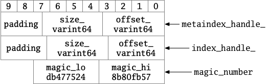

# § 3.6 Block

## 1 路径

## 2 功能

## 3 BlockContents

主要代码如下：

```cpp
struct BlockContents {
  Slice data;           // Actual contents of data
  bool cachable;        // True iff data can be cached
  bool heap_allocated;  // True iff caller should delete[] data.data()
};
```

## 4 Block

* 功能：用于对*BlockBuilder*s建立的Block进行读取。

### 4.1 成员变量

restart\_offset\_指向BlockBuilder中restart数组的起始位置。

```cpp
 private:
  const char* data_;
  size_t size_;
  uint32_t restart_offset_;  // Offset in data_ of restart array
  bool owned_;               // Block owns data_[]
```

### 4.2 构造函数、析构函数

函数NumRestarts读取了BlockBuilder的restart数组的长度，restart\_offset\_指向restart数组的起始位置。参见下图。

```cpp
// Initialize the block with the specified contents.
explicit Block(const BlockContents& contents);

~Block();

Block::Block(const BlockContents& contents)
    : data_(contents.data.data()),
      size_(contents.data.size()),
      owned_(contents.heap_allocated) {
  if (size_ < sizeof(uint32_t)) {
    size_ = 0;  // Error marker
  } else {
    size_t max_restarts_allowed = (size_ - sizeof(uint32_t)) / sizeof(uint32_t);
    if (NumRestarts() > max_restarts_allowed) {
      // The size is too small for NumRestarts()
      size_ = 0;
    } else {
      restart_offset_ = size_ - (1 + NumRestarts()) * sizeof(uint32_t);
    }
  }
}

inline uint32_t Block::NumRestarts() const {
  assert(size_ >= sizeof(uint32_t));
  return DecodeFixed32(data_ + size_ - sizeof(uint32_t));
}

Block::~Block() {
  if (owned_) {
    delete[] data_;
  }
}
```

*备注：不允许拷贝构造和赋值。*

### 4.3 NewIterator

```cpp
Iterator* NewIterator(const Comparator* comparator);

Iterator* Block::NewIterator(const Comparator* comparator) {
  if (size_ < sizeof(uint32_t)) {
    return NewErrorIterator(Status::Corruption("bad block contents"));
  }
  const uint32_t num_restarts = NumRestarts();
  if (num_restarts == 0) {
    return NewEmptyIterator();
  } else {
    return new Iter(comparator, data_, restart_offset_, num_restarts);
  }
}
```

### 4.4 Block::Iter

* 功能：继承自Iterator。

#### 4.4.1 主要成员变量

* `data_`指向BlockBuilder
* `restarts_`指向restart数组的起始位置
* `num_restarts_`是restart数组的长度
* `current_`、`restart_index_`、`key_`、`value_`是在Seek的过程中设定的，分别表示当前entry的offset、当前所在restart区域的restart数组的index、当前key和当前value。

```cpp
const Comparator* const comparator_;
const char* const data_;       // underlying block contents
uint32_t const restarts_;      // Offset of restart array (list of fixed32)
uint32_t const num_restarts_;  // Number of uint32_t entries in restart array

// current_ is offset in data_ of current entry.  >= restarts_ if !Valid
uint32_t current_;
uint32_t restart_index_;  // Index of restart block in which current_ falls
std::string key_;
Slice value_;
Status status_;
```

#### 4.4.2 Seek相关

* GetRestartPoint：根据传入的index，找到其所在的restart区域对应的restart数组的位置
* SeekToRestartPoint：调整当前指针，将`key_`置空，调用GetRestartPoint，将`value_`指向restart区域的第一个key的起始位置。
* NextEntryOffset：得到下一个entry的起始位置。
* ParseNextKey：解析下一个key。
* Seek利用二分查找来找到使得key小于target的一个key，然后调用SeekToRestartPoint找到这个key位于的一个restart区域，不断地调用ParseNextKey直到找到大于等于target的一个key。这个时候会更新`current_`为这个key的offset，`key_`设为当前key，`value_`设置为当前value，`restart_index_`设为当前的restart区域的restart数组的位置。

```cpp
void Seek(const Slice& target) override {
  // Binary search in restart array to find the last restart point
  // with a key < target
  uint32_t left = 0;
  uint32_t right = num_restarts_ - 1;
  while (left < right) {
    uint32_t mid = (left + right + 1) / 2;
    uint32_t region_offset = GetRestartPoint(mid);
    uint32_t shared, non_shared, value_length;
    const char* key_ptr =
        DecodeEntry(data_ + region_offset, data_ + restarts_, &shared,
                    &non_shared, &value_length);
    if (key_ptr == nullptr || (shared != 0)) {
      CorruptionError();
      return;
    }
    Slice mid_key(key_ptr, non_shared);
    if (Compare(mid_key, target) < 0) {
      // Key at "mid" is smaller than "target".  Therefore all
      // blocks before "mid" are uninteresting.
      left = mid;
    } else {
      // Key at "mid" is >= "target".  Therefore all blocks at or
      // after "mid" are uninteresting.
      right = mid - 1;
    }
  }

  // Linear search (within restart block) for first key >= target
  SeekToRestartPoint(left);
  while (true) {
    if (!ParseNextKey()) {
      return;
    }
    if (Compare(key_, target) >= 0) {
      return;
    }
  }
}

uint32_t GetRestartPoint(uint32_t index) {
  assert(index < num_restarts_);
  return DecodeFixed32(data_ + restarts_ + index * sizeof(uint32_t));
}

void SeekToRestartPoint(uint32_t index) {
  key_.clear();
  restart_index_ = index;
  // current_ will be fixed by ParseNextKey();

  // ParseNextKey() starts at the end of value_, so set value_ accordingly
  uint32_t offset = GetRestartPoint(index);
  value_ = Slice(data_ + offset, 0);
}

bool ParseNextKey() {
  current_ = NextEntryOffset();
  const char* p = data_ + current_;
  const char* limit = data_ + restarts_;  // Restarts come right after data
  if (p >= limit) {
    // No more entries to return.  Mark as invalid.
    current_ = restarts_;
    restart_index_ = num_restarts_;
    return false;
  }

  // Decode next entry
  uint32_t shared, non_shared, value_length;
  p = DecodeEntry(p, limit, &shared, &non_shared, &value_length);
  if (p == nullptr || key_.size() < shared) {
    CorruptionError();
    return false;
  } else {
    key_.resize(shared);
    key_.append(p, non_shared);
    value_ = Slice(p + non_shared, value_length);
    while (restart_index_ + 1 < num_restarts_ &&
           GetRestartPoint(restart_index_ + 1) < current_) {
      ++restart_index_;
    }
    return true;
  }
}

// Return the offset in data_ just past the end of the current entry.
inline uint32_t NextEntryOffset() const {
  return (value_.data() + value_.size()) - data_;
}
```

相关函数：

这个函数主要用于对输入的[p, limit]区域的一个key进行解码，是BlockBuilder中编码的反过程。

```cpp
// Helper routine: decode the next block entry starting at "p",
// storing the number of shared key bytes, non_shared key bytes,
// and the length of the value in "*shared", "*non_shared", and
// "*value_length", respectively.  Will not dereference past "limit".
//
// If any errors are detected, returns nullptr.  Otherwise, returns a
// pointer to the key delta (just past the three decoded values).
static inline const char* DecodeEntry(const char* p, const char* limit,
                                      uint32_t* shared, uint32_t* non_shared,
                                      uint32_t* value_length) {
  if (limit - p < 3) return nullptr;
  *shared = reinterpret_cast<const uint8_t*>(p)[0];
  *non_shared = reinterpret_cast<const uint8_t*>(p)[1];
  *value_length = reinterpret_cast<const uint8_t*>(p)[2];
  if ((*shared | *non_shared | *value_length) < 128) {
    // Fast path: all three values are encoded in one byte each
    p += 3;
  } else {
    if ((p = GetVarint32Ptr(p, limit, shared)) == nullptr) return nullptr;
    if ((p = GetVarint32Ptr(p, limit, non_shared)) == nullptr) return nullptr;
    if ((p = GetVarint32Ptr(p, limit, value_length)) == nullptr) return nullptr;
  }

  if (static_cast<uint32_t>(limit - p) < (*non_shared + *value_length)) {
    return nullptr;
  }
  return p;
}
```

另外还有几个和Seek相关或类似的函数：

* SeekToFirst：找到第一个key。
* SeekToLast：找到最后一个key。
* Next：Iter++。
* Prev：Iter--。

```cpp
void SeekToFirst() override {
  SeekToRestartPoint(0);
  ParseNextKey();
}

void SeekToLast() override {
  SeekToRestartPoint(num_restarts_ - 1);
  while (ParseNextKey() && NextEntryOffset() < restarts_) {
    // Keep skipping
  }
}

void Next() override {
  assert(Valid());
  ParseNextKey();
}

void Prev() override {
  assert(Valid());

  // Scan backwards to a restart point before current_
  const uint32_t original = current_;
  while (GetRestartPoint(restart_index_) >= original) {
    if (restart_index_ == 0) {
      // No more entries
      current_ = restarts_;
      restart_index_ = num_restarts_;
      return;
    }
    restart_index_--;
  }

  SeekToRestartPoint(restart_index_);
  do {
    // Loop until end of current entry hits the start of original entry
  } while (ParseNextKey() && NextEntryOffset() < original);
}
```

## 5 BlockHandle

* BlockHandle持有两个成员变量：`offset_`和`size_`，有了这两个参数就可以指示一个block的起始地址。
* EncodeTo：将`offset_`和`size_`进行varint64编码。
* DecodeFrom即EncodeTo的逆过程。

```cpp
// BlockHandle is a pointer to the extent of a file that stores a data
// block or a meta block.
class BlockHandle {
 public:
  // Maximum encoding length of a BlockHandle
  enum { kMaxEncodedLength = 10 + 10 };

  BlockHandle();

  // The offset of the block in the file.
  uint64_t offset() const { return offset_; }
  void set_offset(uint64_t offset) { offset_ = offset; }

  // The size of the stored block
  uint64_t size() const { return size_; }
  void set_size(uint64_t size) { size_ = size; }

  void EncodeTo(std::string* dst) const;
  Status DecodeFrom(Slice* input);

 private:
  uint64_t offset_;
  uint64_t size_;
};

inline BlockHandle::BlockHandle()
    : offset_(~static_cast<uint64_t>(0)), size_(~static_cast<uint64_t>(0)) {}

void BlockHandle::EncodeTo(std::string* dst) const {
  // Sanity check that all fields have been set
  assert(offset_ != ~static_cast<uint64_t>(0));
  assert(size_ != ~static_cast<uint64_t>(0));
  PutVarint64(dst, offset_);
  PutVarint64(dst, size_);
}

Status BlockHandle::DecodeFrom(Slice* input) {
  if (GetVarint64(input, &offset_) && GetVarint64(input, &size_)) {
    return Status::OK();
  } else {
    return Status::Corruption("bad block handle");
  }
}
```

## 6 Footer

* Footer用来编码对metaindexBlock和indexBlock进行指示。编码长度为2个BlockHandle的长度（此时为10+10，一个varint64最多可能编码为10字节）+8（MagicNumber所占的位置）。
* Footer含有两个成员变量：`metaindex_handle_`用来指示metaindex block，`index_handle_`用来指示index block，都是BlockHandle对象，即含有`offset_`、`size_`对象。
* EncodeTo：将`metaindex_handle_`和`index_handle_`写入，即调用BlockHandle的函数将`offset_`、`size_`写入。然后写入MagicNumber的低4位，最后写入MagicNumber的高4位，可能会有padding使其达到8位。
* DecodeFrom即EncodeTo的逆过程，这里会解码`metaindex_handle_`和`index_handle_`的`offset_`、`size_`，还会校验MagicNumber。

```cpp
// Footer encapsulates the fixed information stored at the tail
// end of every table file.
class Footer {
 public:
  // Encoded length of a Footer.  Note that the serialization of a
  // Footer will always occupy exactly this many bytes.  It consists
  // of two block handles and a magic number.
  enum { kEncodedLength = 2 * BlockHandle::kMaxEncodedLength + 8 };

  Footer() = default;

  // The block handle for the metaindex block of the table
  const BlockHandle& metaindex_handle() const { return metaindex_handle_; }
  void set_metaindex_handle(const BlockHandle& h) { metaindex_handle_ = h; }

  // The block handle for the index block of the table
  const BlockHandle& index_handle() const { return index_handle_; }
  void set_index_handle(const BlockHandle& h) { index_handle_ = h; }

  void EncodeTo(std::string* dst) const;
  Status DecodeFrom(Slice* input);

 private:
  BlockHandle metaindex_handle_;
  BlockHandle index_handle_;
};

void Footer::EncodeTo(std::string* dst) const {
  const size_t original_size = dst->size();
  metaindex_handle_.EncodeTo(dst);
  index_handle_.EncodeTo(dst);
  dst->resize(2 * BlockHandle::kMaxEncodedLength);  // Padding
  PutFixed32(dst, static_cast<uint32_t>(kTableMagicNumber & 0xffffffffu));
  PutFixed32(dst, static_cast<uint32_t>(kTableMagicNumber >> 32));
  assert(dst->size() == original_size + kEncodedLength);
  (void)original_size;  // Disable unused variable warning.
}

Status Footer::DecodeFrom(Slice* input) {
  const char* magic_ptr = input->data() + kEncodedLength - 8;
  const uint32_t magic_lo = DecodeFixed32(magic_ptr);
  const uint32_t magic_hi = DecodeFixed32(magic_ptr + 4);
  const uint64_t magic = ((static_cast<uint64_t>(magic_hi) << 32) |
                          (static_cast<uint64_t>(magic_lo)));
  if (magic != kTableMagicNumber) {
    return Status::Corruption("not an sstable (bad magic number)");
  }

  Status result = metaindex_handle_.DecodeFrom(input);
  if (result.ok()) {
    result = index_handle_.DecodeFrom(input);
  }
  if (result.ok()) {
    // We skip over any leftover data (just padding for now) in "input"
    const char* end = magic_ptr + 8;
    *input = Slice(end, input->data() + input->size() - end);
  }
  return result;
}
```

相关变量：

```cpp
// kTableMagicNumber was picked by running
//    echo http://code.google.com/p/leveldb/ | sha1sum
// and taking the leading 64 bits.
static const uint64_t kTableMagicNumber = 0xdb4775248b80fb57ull;
```

Footer示意图如下：

