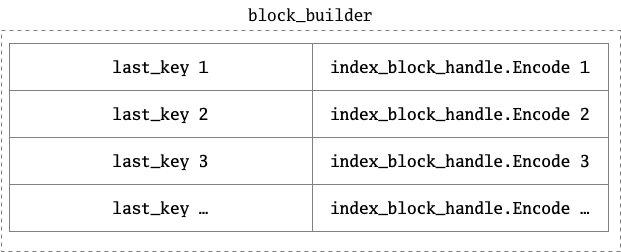

# §3.7 TableBuilder

## 1 路径

* include/leveldb/table_builder.h
* table/table_builder.cc

## 2 功能

## 3 TableBuilder::Rep

* `pending_index_entry`指示indexBlock是否为空。`pending_handle`是indexBlock的handle。
* `num_entries`指示目前的dataBlock中有多少条记录。`offset`指示当前文件写到的offset。
* `last_key`代表上一个Add的key。
* `file`是table要写入的文件。

```cpp
struct TableBuilder::Rep {
  Rep(const Options& opt, WritableFile* f)
      : options(opt),
        index_block_options(opt),
        file(f),
        offset(0),
        data_block(&options),
        index_block(&index_block_options),
        num_entries(0),
        closed(false),
        filter_block(opt.filter_policy == nullptr
                         ? nullptr
                         : new FilterBlockBuilder(opt.filter_policy)),
        pending_index_entry(false) {
    index_block_options.block_restart_interval = 1;
  }

  Options options;
  Options index_block_options;
  WritableFile* file;
  uint64_t offset;
  Status status;
  BlockBuilder data_block;
  BlockBuilder index_block;
  std::string last_key;
  int64_t num_entries;
  bool closed;  // Either Finish() or Abandon() has been called.
  FilterBlockBuilder* filter_block;

  // We do not emit the index entry for a block until we have seen the
  // first key for the next data block.  This allows us to use shorter
  // keys in the index block.  For example, consider a block boundary
  // between the keys "the quick brown fox" and "the who".  We can use
  // "the r" as the key for the index block entry since it is >= all
  // entries in the first block and < all entries in subsequent
  // blocks.
  //
  // Invariant: r->pending_index_entry is true only if data_block is empty.
  bool pending_index_entry;
  BlockHandle pending_handle;  // Handle to add to index block

  std::string compressed_output;
};
```

## 4 TableBuilder

### 4.1 构造、析构、复制构造、复制赋值函数

* 构造函数：将table存在file中。

```cpp
// Create a builder that will store the contents of the table it is
// building in *file.  Does not close the file.  It is up to the
// caller to close the file after calling Finish().
TableBuilder(const Options& options, WritableFile* file);

TableBuilder(const TableBuilder&) = delete;
TableBuilder& operator=(const TableBuilder&) = delete;

// REQUIRES: Either Finish() or Abandon() has been called.
~TableBuilder();
  
TableBuilder::TableBuilder(const Options& options, WritableFile* file)
    : rep_(new Rep(options, file)) {
  if (rep_->filter_block != nullptr) {
    rep_->filter_block->StartBlock(0);
  }
}

TableBuilder::~TableBuilder() {
  assert(rep_->closed);  // Catch errors where caller forgot to call Finish()
  delete rep_->filter_block;
  delete rep_;
}
```

### 4.2 Add

Add用来将key和value加入table。主要流程如下：

* 当indexBlock为空时，对lastKey和key调用FindShortestSeperator（结果保存在lastKey中），将目前的lastKey和indexHandle（size和offset）的信息写入indexBlock。
* 当filterBlock不为空时，对key调用AddKey。
* 将lastKey置为当前key，numEntries加一，dataBlock加入key和value。
* 当dataBlock的预估大小大于等于`options.block_size`（目前是4KB，）时，调用Flush。

```cpp
// Add key,value to the table being constructed.
// REQUIRES: key is after any previously added key according to comparator.
// REQUIRES: Finish(), Abandon() have not been called
void Add(const Slice& key, const Slice& value);

void TableBuilder::Add(const Slice& key, const Slice& value) {
  Rep* r = rep_;
  assert(!r->closed);
  if (!ok()) return;
  if (r->num_entries > 0) {
    assert(r->options.comparator->Compare(key, Slice(r->last_key)) > 0);
  }

  if (r->pending_index_entry) {
    assert(r->data_block.empty());
    r->options.comparator->FindShortestSeparator(&r->last_key, key);
    std::string handle_encoding;
    r->pending_handle.EncodeTo(&handle_encoding);
    r->index_block.Add(r->last_key, Slice(handle_encoding));
    r->pending_index_entry = false;
  }

  if (r->filter_block != nullptr) {
    r->filter_block->AddKey(key);
  }

  r->last_key.assign(key.data(), key.size());
  r->num_entries++;
  r->data_block.Add(key, value);

  const size_t estimated_block_size = r->data_block.CurrentSizeEstimate();
  if (estimated_block_size >= r->options.block_size) {
    Flush();
  }
}
```

### 4.3 WriteRawBlock

WriteRawBlock将传入的block内容和压缩类型经crc32后，写入file；另外更新相应的handle和文件offset。

```cpp
void WriteRawBlock(const Slice& data, CompressionType, BlockHandle* handle);

void TableBuilder::WriteRawBlock(const Slice& block_contents,
                                 CompressionType type, BlockHandle* handle) {
  Rep* r = rep_;
  handle->set_offset(r->offset);
  handle->set_size(block_contents.size());
  r->status = r->file->Append(block_contents);
  if (r->status.ok()) {
    char trailer[kBlockTrailerSize];
    trailer[0] = type;
    uint32_t crc = crc32c::Value(block_contents.data(), block_contents.size());
    crc = crc32c::Extend(crc, trailer, 1);  // Extend crc to cover block type
    EncodeFixed32(trailer + 1, crc32c::Mask(crc));
    r->status = r->file->Append(Slice(trailer, kBlockTrailerSize));
    if (r->status.ok()) {
      r->offset += block_contents.size() + kBlockTrailerSize;
    }
  }
}
```

经过WriteRawBlock之后的某种block的内存布局大约是这样的：


### 4.4 WriteBlock

WriteBlock的基本流程如下：

* 首先调用block的Finish函数，来生成block最终的数据Slice（`raw`）。
* 根据压缩类型`options.compression`（目前默认是Snappy压缩，根据注释，这比长期存储介质的速度快很多）来决定是否对`raw`进行压缩，生成`block_contents`。
* 调用WriteRawBlock来写入file。
* block调用Reset。

```cpp
void WriteBlock(BlockBuilder* block, BlockHandle* handle);

void TableBuilder::WriteBlock(BlockBuilder* block, BlockHandle* handle) {
  // File format contains a sequence of blocks where each block has:
  //    block_data: uint8[n]
  //    type: uint8
  //    crc: uint32
  assert(ok());
  Rep* r = rep_;
  Slice raw = block->Finish();

  Slice block_contents;
  CompressionType type = r->options.compression;
  // TODO(postrelease): Support more compression options: zlib?
  switch (type) {
    case kNoCompression:
      block_contents = raw;
      break;

    case kSnappyCompression: {
      std::string* compressed = &r->compressed_output;
      if (port::Snappy_Compress(raw.data(), raw.size(), compressed) &&
          compressed->size() < raw.size() - (raw.size() / 8u)) {
        block_contents = *compressed;
      } else {
        // Snappy not supported, or compressed less than 12.5%, so just
        // store uncompressed form
        block_contents = raw;
        type = kNoCompression;
      }
      break;
    }
  }
  WriteRawBlock(block_contents, type, handle);
  r->compressed_output.clear();
  block->Reset();
}
```

### 4.5 Flush

Flush的主要流程如下：

* 对dataBlock调用WriteBlock
  * 如果写成功，对file调用Flush
* filetrBlock重启一个filter（调用StartBlock）

```cpp
// Advanced operation: flush any buffered key/value pairs to file.
// Can be used to ensure that two adjacent entries never live in
// the same data block.  Most clients should not need to use this method.
// REQUIRES: Finish(), Abandon() have not been called
void Flush();

void TableBuilder::Flush() {
  Rep* r = rep_;
  assert(!r->closed);
  if (!ok()) return;
  if (r->data_block.empty()) return;
  assert(!r->pending_index_entry);
  WriteBlock(&r->data_block, &r->pending_handle);
  if (ok()) {
    r->pending_index_entry = true;
    r->status = r->file->Flush();
  }
  if (r->filter_block != nullptr) {
    r->filter_block->StartBlock(r->offset);
  }
}
```

### 4.6 Finish

Finish函数是最后创建table的函数。主要流程如下：

* 先调用Flush写入当前的dataBlock。
* 对FilterBlock调用WriteRawBlock，不进行压缩。
* 创建metaIndexBlock，并调用WriteBlock。
* 创建Footer，并直接追加到file后面。

```cpp
// Finish building the table.  Stops using the file passed to the
// constructor after this function returns.
// REQUIRES: Finish(), Abandon() have not been called
Status Finish();

Status TableBuilder::Finish() {
  Rep* r = rep_;
  Flush();
  assert(!r->closed);
  r->closed = true;

  BlockHandle filter_block_handle, metaindex_block_handle, index_block_handle;

  // Write filter block
  if (ok() && r->filter_block != nullptr) {
    WriteRawBlock(r->filter_block->Finish(), kNoCompression,
                  &filter_block_handle);
  }

  // Write metaindex block
  if (ok()) {
    BlockBuilder meta_index_block(&r->options);
    if (r->filter_block != nullptr) {
      // Add mapping from "filter.Name" to location of filter data
      std::string key = "filter.";
      key.append(r->options.filter_policy->Name());
      std::string handle_encoding;
      filter_block_handle.EncodeTo(&handle_encoding);
      meta_index_block.Add(key, handle_encoding);
    }

    // TODO(postrelease): Add stats and other meta blocks
    WriteBlock(&meta_index_block, &metaindex_block_handle);
  }

  // Write index block
  if (ok()) {
    if (r->pending_index_entry) {
      r->options.comparator->FindShortSuccessor(&r->last_key);
      std::string handle_encoding;
      r->pending_handle.EncodeTo(&handle_encoding);
      r->index_block.Add(r->last_key, Slice(handle_encoding));
      r->pending_index_entry = false;
    }
    WriteBlock(&r->index_block, &index_block_handle);
  }

  // Write footer
  if (ok()) {
    Footer footer;
    footer.set_metaindex_handle(metaindex_block_handle);
    footer.set_index_handle(index_block_handle);
    std::string footer_encoding;
    footer.EncodeTo(&footer_encoding);
    r->status = r->file->Append(footer_encoding);
    if (r->status.ok()) {
      r->offset += footer_encoding.size();
    }
  }
  return r->status;
}
```

MetaIndexBlock的数据部分如图所示：


IndexBlock的数据部分如图所示：



Table的总体结构如图所示：

