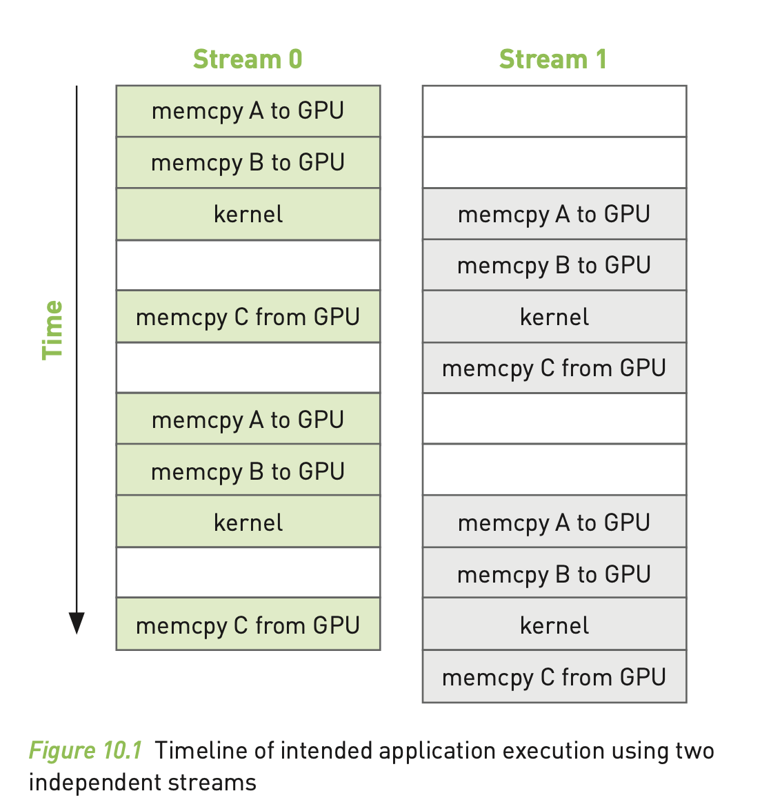
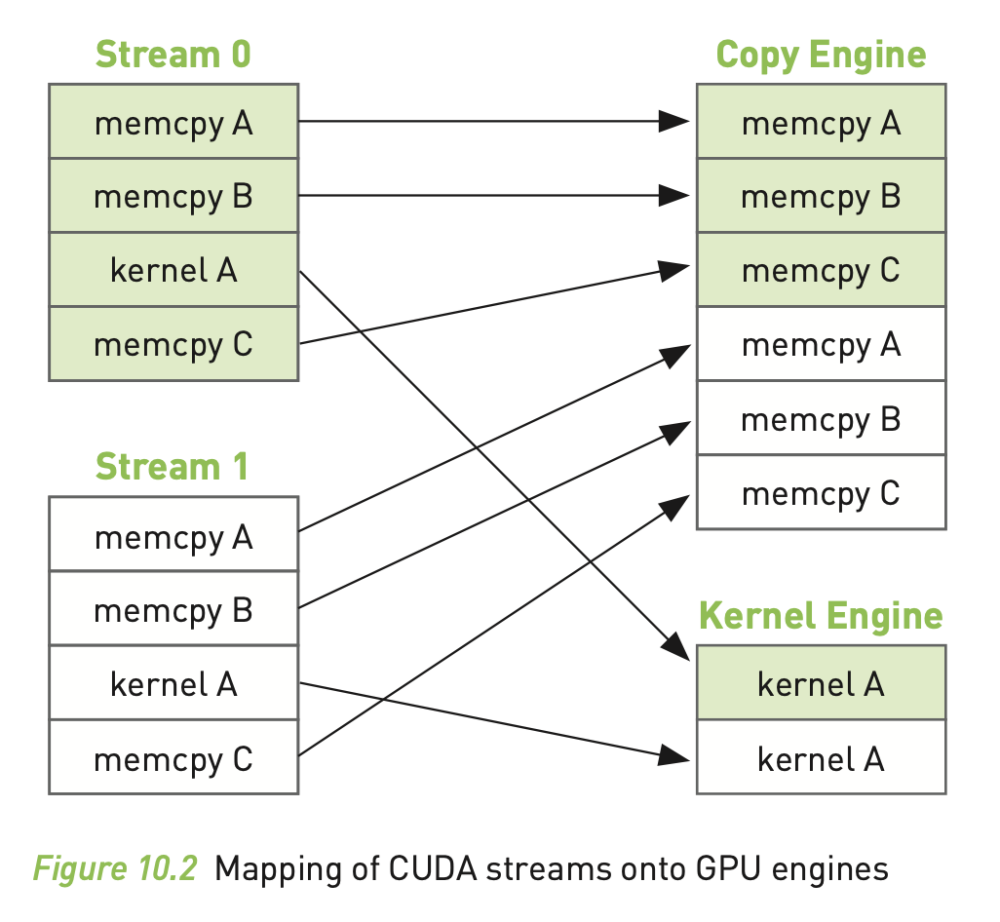
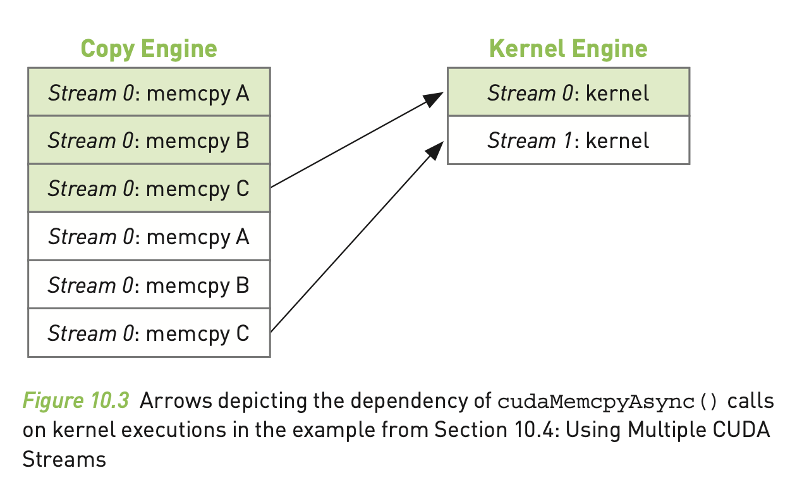
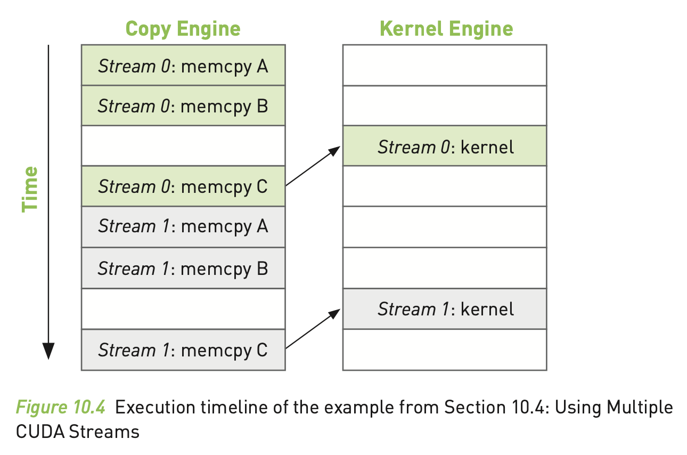
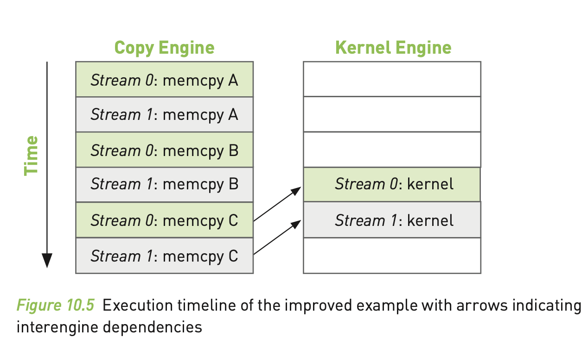

# CUDA by Example 笔记(七): 流

*对应书本第10章*

# 1 大纲

- 锁页内存
- CUDA stream、GPU引擎原理等
- 多stream的优化及使用

# 2 内容

**任务并行**和多线程CPU上的应用类似。**数据并行**是同时在很多数据上执行相同的函数，而任务并行是并行地运行多个任务。

## 2.1 锁页内存

CUDA运行时系统提供了一种在host上分配内存的方式：`cudaHostMalloc`。

对于用`malloc`函数分配的内存，是标准的*可换页*的host内存。而`cudaHostMalloc`分配的内存是一种**不可换页**的内存，也叫做**锁页内存**。它有一个重要的性质：操作系统保证它不会被从内存换出到磁盘，保证了它在物理内存上的驻留。所以，对操作系统来讲，对这些内存取其物理地址是安全的，因为这些内存不会被驱逐或重定位。

*<font color=red>问题5：它应该有大小限制吧？</font>*

知道了内存的物理地址，GPU就可以使用DMA（Direct Memory Access，直接内存存取）从host上拷贝数据。由于DMA使用进行拷贝是不通过CPU的，意味着CPU可能同时在进行换页或重定位等操作。因为这个原因，如果要使用DMA，那么就必须要在锁页内存上使用。

实际上，当你使用可换页内存进行内存拷贝时，CUDA驱动也会用到DMA来传输数据。所以，拷贝操作就分为了两部分。第一部分，将可换页内存放到锁业内存上暂存；第二部分，使用DMA将期放到GPU上。所以，对可换页内存上的内存拷贝来说，它的速度局限于PCIE传输速度和系统前端总线（Front-Side Bus，FSB）的速度。在某些系统上，这两种总线的差异会导致锁页内存的内存拷贝速度是标准的可换页内存的速度的两倍。就算两种总线的速度是相同的，可换页内存也会有通过CPU管理带来的额外开销。

*<font color=red>问题6：总体看下书中用到“cuda runtime”的地方在哪儿？</font>*

但这也是一把双刃剑，使用锁页内存就相当于放弃系统的虚拟内存机制，如果程序中大量使用锁页内存的话，就意味着系统的内存不会被换出，可能面临系统内存资源枯竭的问题。

使用建议：只在要进行`cudaMemcpy`的内存上使用锁页内存，并且只要不再使用的时候就将其释放，不要等到整个程序退出才释放。

## 2.2 使用方法

### 分配

``` cpp
cudaHostAlloc((void**)&a, size * sizeof(int), cudaHostAllocDefault);
```

其中，最后一个参数*cudaHostAllocDefault*我们下一节再讲。

*备注：书本在P189的举例，第二个参数应该是如上面所写，即最后面不是sizeof(a\*)。*

### 释放

``` cpp
cudaFreeHost(a);
```

用到锁页内存有时候不仅仅是因为性能问题，而是在一些情况下必须要这么做，后面会讲到这种情形。

## 2.3 CUDA stream

### 简介

回想我们在学习事件的时候的代码：

``` cpp
cudaEventRecord(start, 0);
```

CUDA stream代表了一个队列上GPU操作的特定的顺序。可以讲kernel调用、内存拷贝、时间开始和结束放入到stream当中。放入stream的操作的顺序就是它们被执行的顺序。你可以认为每个stream代表了一个GPU上的*任务*，不同的任务之间有*机会*并行执行。这里为什么说是有*机会*呢？具体后面会讲到。

### device overlap

使用stream的时候，device最好支持device overlap。这个可以通过`cudaDeviceProp`的`deviceOverlap`字段来获取。device overlap的意思是device可以在执行kernel的同时，进行device和host之间的内存拷贝。所以，我们可以使用不同的stream来完成计算和数据传输之间的重叠。

### 创建stream

``` cpp
cudaStream_t stream;
cudaStreamCreate(&stream);
```

### 异步内存拷贝

``` cpp
cudaMemcpyAsync(dev_a, host_a + i, N * sizeof(int), cudaMemcpyHostToDevice, stream);
```

注意到这里使用了`cudaMemcpyAsync`，和`cudaMemcpy`不同，主要区别是：

`cudaMemcpy`和C上的`memcpy`类似，是*同步*执行的，意味着当函数返回时，拷贝就已经完成了，输出buffer的内容已经是拷贝之后的了。

同步函数的相反面就是*异步*函数，就是`cudaMemcpyAsync`。对这个函数的调用只是将内存拷贝的请求放入到stream中。当函数调用返回时，并不要求并不保证拷贝开始了，更不必说拷贝结束了。但可以保证的是会在stream中下一个函数执行开始之前执行。它要求任何host上的内存指针都是通过`cudaHostAlloc`分配的。也就是说，只可以对锁页内存进行异步内存拷贝。

### kernel调用

``` cpp
kernel<<<N/256, 256, 0, stream>>>(dev_a, dev_b, dev_c);
```

注意到调用kernel的尖括号里面最后一个参数就是stream，意味着这个kernel的调用就是异步的。

### 同步

如果我们需要保证GPU的计算和内存拷贝完成了，我们就需要和host同步。也就是说，我们想要告诉host在继续进行下一步的时候等待GPU完成。方法：

``` cpp
cudaStreamSynchronize(stream);
```

### 销毁

``` cpp
cudaStreamDestroy(stream);
```

如果当GPU在处理塞入stream的任务的时候，我们希望在host上做一些事情，那么，就算使用一个stream仍然可以获得加速。不过，就算我们不需要在host上做很多的事情的时候，我们仍然可以利用多个stream获得加速。

## 2.3 使用多个stream

使用多个stream，依赖两个方面：一，计算可以被*切分*；二，内存拷贝和kernel执行可以重叠。

我们想要stream1来拷贝它的输入数据，与此同时，stream0执行kernel；然后stream1执行kernel，stream0将它的结果拷贝回到host；stream1拷贝它的结果回到host，stream0在下一个数据分片上执行kernel。就像下图所示，其中空白的地方表示一个stream等待不能和另一个stream重合的操作。即一个stream中的kernel和另一个stream中的拷贝是可以同时执行的，但两个stream中都是拷贝操作的话，是不能同时执行的。



一些更新的NVIDA的GPU，执行同时进行一个kernel执行和两个内存拷贝（一个到device，另一个从device）。

*<font color=red>问题7：意思是至少有一端是device就行，另一端是device或host无所谓？</font>*

## 2.4 GPU作业调度

实际上，我们讲到的stream的概念和GPU上的队列机制并不相同。作为编程者，我们把stream作为操作的有顺序的序列。然而，硬件是不知晓stream的概念的。实际上，它有一个或多个引擎来处理内存拷贝和执行kernel。这些引擎的队列之间相互独立，导致了类似于图2中的作业调度情况，其中箭头表示了放到stream上的操作是如何调度到真正执行他们的硬件引擎上面。



所以，用户和硬件对如何排队GPU工作，有一种“正交”的观念，而处于中间协调位置的就是CUDA驱动。最重要的是，根据放入stream的顺序就产生了一种特别重要的依赖。拿图2举例，stream0的拷贝A在拷贝B之前，而拷贝B又在kernelA之前。但是当它们被放到硬件两个不同的引擎当中时，这种依赖关系就丢失了。所以，CUDA驱动需要保证stream内部的依赖仍然能在硬件执行单元上被满足。

*<font color=red>问题8：stream之间有顺序吗？比如说，stream0的拷贝A，必须在stream1的拷贝A之前？</font>*

所以，为了保证这种顺序依赖，同一个stream在不同引擎之间也就产生了依赖。图3展示了引擎示图的操作执行顺序，其中箭头表示拷贝C依赖于kernel执行。



如图4，我们整理下每个操作的执行顺序。可以发现，因为stream0的拷贝C依赖它的kernel执行完毕，所以，stream1的拷贝A、B是完全独立的操作，却被阻塞了。因为GPU引擎会按照提供的顺序执行所有作业。因此，并不是所有使用了两个stream的程序就会比使用一个stream有速度提升。




## 2.5 高效利用多个stream

正如之前看到的，如果我们一起调度所有的操作到stream，就很容易阻塞其他stream的拷贝或kernel执行。为了缓解这个问题，只是将操作“广度优先”而非“深度优先”地入队。

之前是将stream0的拷贝A、B，kernel执行，拷贝C的操作入队，然后在将stream1的操作入队。现在，我们在stream之间来回入队操作。入队顺序改为：stream0的拷贝A、stream1的拷贝A、stream0的拷贝B、stream1的拷贝B、stream0的kernel执行、stream1的kernel执行、stream0的拷贝C、stream1的拷贝C。

因为我们按照“广度优先”的策略入队我们的操作，就不会再出现stream0的拷贝C阻塞stream1的拷贝A、B的情况了。这就使得GPU可以并行地运行执行拷贝和kernel，我们的应用就可以更快了。对于几乎可以重叠所有的计算和内存拷贝的应用，基本可以获得两倍加速，因为拷贝、引擎一直处于工作中（见图4）。



# 3 总结

本节主要学习了锁页内存、stream等的使用、优化等，理论内容比较多，但对于理解GPU底层有很多的益处，更方便我们将来的优化。

# 4 英语学习

- time and time again：一再
- corollary：必然结果
- disparity：悬殊的差异
- opt out (of sth)：决定退出，选择不参与
- strictly：绝对地；it's not strictly because ...：并不仅是因为……
- excerpt：摘录片段
- crank：用曲柄转动（或启动）