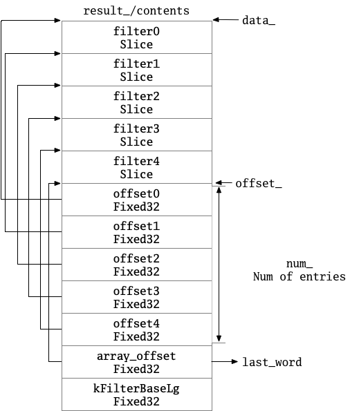

# §3.5 FilterBlock

## 1 路径

* table/filter_block.h
* table/filter_block.cc

## 2 功能

## 3 FilterBlockBuilder

### 3.1 主要成员变量

* `keys_`主要是将用户加入的Key放入，`start_`记录每个key的开始位置和结束位置。参见AddKey函数。
* 在生成Filter时，将`keys_`每一个放入`tmp_keys_`。
* `result_`是暂存的Filter，`filter_offsets_`参见后面。

```cpp
 private:
  const FilterPolicy* policy_;
  std::string keys_;             // Flattened key contents
  std::vector<size_t> start_;    // Starting index in keys_ of each key
  std::string result_;           // Filter data computed so far
  std::vector<Slice> tmp_keys_;  // policy_->CreateFilter() argument
  std::vector<uint32_t> filter_offsets_
```

### 3.2 构造函数

构造函数主要是赋值`policy_`，主要代码如下：

```cpp
FilterBlockBuilder::FilterBlockBuilder(const FilterPolicy* policy)
    : policy_(policy) {}
```

*备注：默认析构函数，禁止复制构造和赋值。*

### 3.3 GenerateFilter

这个函数用于：利用目前的key，调用`poliy_`的CreateFilter函数，产生一个Filter，放在`result_`中。

```cpp
void FilterBlockBuilder::GenerateFilter() {
  const size_t num_keys = start_.size();
  if (num_keys == 0) {
    // Fast path if there are no keys for this filter
    filter_offsets_.push_back(result_.size());
    return;
  }

  // Make list of keys from flattened key structure
  start_.push_back(keys_.size());  // Simplify length computation
  tmp_keys_.resize(num_keys);
  for (size_t i = 0; i < num_keys; i++) {
    const char* base = keys_.data() + start_[i];
    size_t length = start_[i + 1] - start_[i];
    tmp_keys_[i] = Slice(base, length);
  }

  // Generate filter for current set of keys and append to result_.
  filter_offsets_.push_back(result_.size());
  policy_->CreateFilter(&tmp_keys_[0], static_cast<int>(num_keys), &result_);

  tmp_keys_.clear();
  keys_.clear();
  start_.clear();
}
```

### 3.4 StartBlock

在block\_offset处创建一个FilterBlock。参见下面，可得每2KB数据有一个FilterBlock。

相关变量：

```cpp
// Generate new filter every 2KB of data
static const size_t kFilterBaseLg = 11;
static const size_t kFilterBase = 1 << kFilterBaseLg;
```

主要代码如下：

```cpp
void FilterBlockBuilder::StartBlock(uint64_t block_offset) {
  uint64_t filter_index = (block_offset / kFilterBase);
  assert(filter_index >= filter_offsets_.size());
  while (filter_index > filter_offsets_.size()) {
    GenerateFilter();
  }
}
```

### 3.5 AddKey

```cpp
void FilterBlockBuilder::AddKey(const Slice& key) {
  Slice k = key;
  start_.push_back(keys_.size());
  keys_.append(k.data(), k.size());
}
```

### 3.6 Finish

Finish函数用于FilterBlockBuilder生成一个FilterBlock。

```cpp
Slice FilterBlockBuilder::Finish() {
  if (!start_.empty()) {
    GenerateFilter();
  }

  // Append array of per-filter offsets
  const uint32_t array_offset = result_.size();
  for (size_t i = 0; i < filter_offsets_.size(); i++) {
    PutFixed32(&result_, filter_offsets_[i]);
  }

  PutFixed32(&result_, array_offset);
  result_.push_back(kFilterBaseLg);  // Save encoding parameter in result
  return Slice(result_);
}
```

## 4 FilterBlockReader

### 4.1 主要成员变量

* `data_`指向FilterBlock的开始，`offset_`指向OffsetArray的开始，`num_`是OffsetArray的数量。

```cpp
const FilterPolicy* policy_;
const char* data_;    // Pointer to filter data (at block-start)
const char* offset_;  // Pointer to beginning of offset array (at block-end)
size_t num_;          // Number of entries in offset array
size_t base_lg_;      // Encoding parameter (see kFilterBaseLg in .cc file)
```

### 4.2 构造函数

对传入的`contents`即Filter解析，主要代码如下：

```cpp
FilterBlockReader::FilterBlockReader(const FilterPolicy* policy,
                                     const Slice& contents)
    : policy_(policy), data_(nullptr), offset_(nullptr), num_(0), base_lg_(0) {
  size_t n = contents.size();
  if (n < 5) return;  // 1 byte for base_lg_ and 4 for start of offset array
  base_lg_ = contents[n - 1];
  uint32_t last_word = DecodeFixed32(contents.data() + n - 5);
  if (last_word > n - 5) return;
  data_ = contents.data();
  offset_ = data_ + last_word;
  num_ = (n - 5 - last_word) / 4;
}
```

由此参见FilterBlock的示意图：



### 4.3 KeyMayMatch

根据传入的`block_offset`决定去寻找FilterBlock中的哪一个Filter，在其中调用`policy_`的KeyMayMatch函数。主要代码如下：

```cpp
bool FilterBlockReader::KeyMayMatch(uint64_t block_offset, const Slice& key) {
  uint64_t index = block_offset >> base_lg_;
  if (index < num_) {
    uint32_t start = DecodeFixed32(offset_ + index * 4);
    uint32_t limit = DecodeFixed32(offset_ + index * 4 + 4);
    if (start <= limit && limit <= static_cast<size_t>(offset_ - data_)) {
      Slice filter = Slice(data_ + start, limit - start);
      return policy_->KeyMayMatch(key, filter);
    } else if (start == limit) {
      // Empty filters do not match any keys
      return false;
    }
  }
  return true;  // Errors are treated as potential matches
}
```

