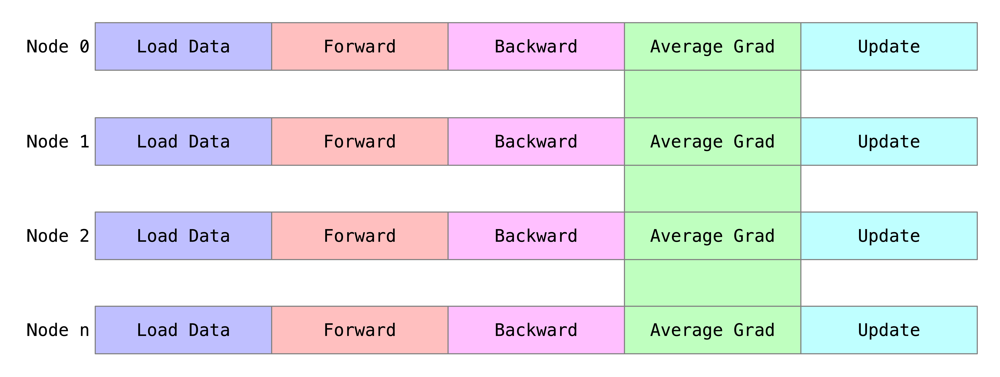

# 模型训练中的集合通信
> reference:  
> https://zhuanlan.zhihu.com/p/348982652

## 基本方式
分布式训练通常在计算集群上进行，集群的每个节点分别执行一部分计算。不同节点的计算之间有数据依赖和共享，需要将数据在不同节点间传输，这就是通信。  
以最常用的数据并行为例，在一个迭代步骤内，每个节点先对各自的数据进行前向和后向的计算得出模型梯度，再将各个节点的模型梯度进行平均，最后将梯度更新到各自的模型参数上。  

梯度平均的常见实现方式是先归约求和，再除以节点数量做算术平均。这里的梯度求和是跨节点的，它需要用到一个集合通信操作Allreduce。  

## 通信策略
### 通信融合
在训练中，大部分通信是对参数的梯度进行平均。最朴素的做法是对模型的每个参数梯度都调用一次Allreduce 进行通信。然而，对于大多数通信库的实现，通信调用本身具有一定开销，这样就会导致通信时间并不是与通信量成严格的正比关系。所以通信量一定时，通信次数越少，效率越高。一般的，每个参数的梯度是互相独立的，每个梯度唯一依赖的是产生它的反向计算。所以可以将整个模型的梯度统一用一次Allreduce进行通信。  
具体的做法是：  
- 将模型的梯度按顺序拷贝到一个连续的buffer。
- 将这个buffer做Allreduce。
- 按顺序将buffer中的数据拷贝回模型的梯度变量。

通信融合能提高梯度通信的效率，在模型参数梯度的数据量较小而个数较多的情况下效果显著。

### 通信与计算并行
通信与计算组成一个流水线似的结构。
### 并行+融合

## 其他例子
DDP 是 PyTorch 提供的用于模型数据并行训练的接口，它不仅实现了常用的梯度同步，还封装了一整套分布式并行训练的功能。DDP 的用法例子在[基于_Python_API_搭建深度学习模型](https://zhuanlan.zhihu.com/p/345096806)中数据并行部分有介绍，只需稍微修改代码，就能将一个模型改造成分布式并行训练的模型，这里不再赘述。  
SenseParrots 提供了兼容的 DDP 接口，并在内部实现了上述的通信优化策略，使得现有的模型可以轻易地获得分布式训练的加速。