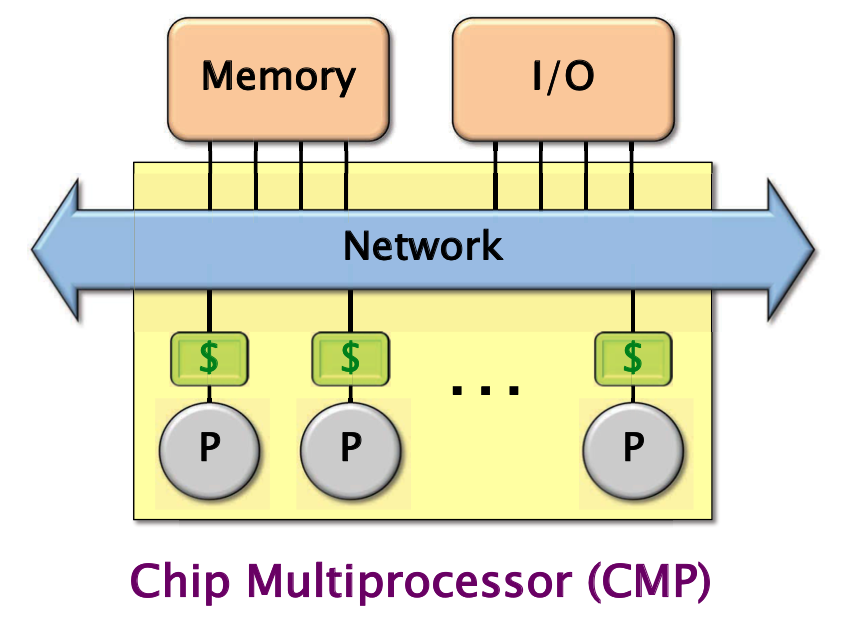

# Lecture 6 Multicore Programming

# 课程内容
本节课主要讲的就是多线程编程的一些基础知识，重点在各个线程库的使用上。

## 多核处理器
为什么需要多核处理器？

因为摩尔定律的『失效』，因为时钟频率的客观局限性，单核可容纳的晶体管数已经达到上限。

## 抽象的多核架构

Chip Multiprocessor (CMP)


*图源本课课件*

## Cache缓存一致性
多核系统中，比较重要的问题就是缓存的一致性问题。

问题发生在当不同的核对同一个变量读取后，放到自己核的Cache中。其中某一个核对这个变量更改后，其他的核再从自己的Cache读取这个变量的时候，Cache中所存储的数据已经过期了，不是最新的。

因此而产生了MSI协议。

## MSI协议
每一个Cache Line都被打上了一个状态标签。

M (modified)：Cache Block 被修改过了。
S (sharing)：其他的 Cache 也共享了这个Block。
I (invalid)：Cache Block 失效了。

在每一个Cache修改了一个数据后，硬件系统会先将其他Cache的拷贝置为失效。

### 几个问题
#### 为什么是按Cache Line粒度的？
理论上可以为每个内存中的位置都设置一个状态标签。但是这样带来的开销是特别大的。选了一个适中的粒度。

#### 这个协议是硬件上实现的，而非软件的。

#### 相似的协议有很多，这只是其中一种。

## 并发平台
以斐波那契的计算为例，单线程代码：

``` c
#include <inttypes.h>
#include <stdio.h>
#include <stdlib.h>

int64_t fib(int64_t n) {
	if (n < 2) {
		return n;
	} else {
		int64_t x = fib(n - 1);
		int64_t y = fib(n - 2);
		return x + y;
	}
}

int main(int argc, char** argv) {
	int64_t n = atoi(argv[1]);
	int64_t result = fib(n);
	printf("Fibonacci of %" PRId64 " is %" PRId64 ".\n", n , result);
	return 0;
}
```
### pthread & WinAPI thread
- 特殊的非C语义的一个库函数。
- 每一个thread是一个核（processor）的抽象，会根据机器资源进行多路复用。*注：当核数小于要使用的线程数时，会将多个线程绑定到一个核上。*
- 线程之间使用共享内存来进行通信。
- 库函数掩盖了线程间调度所涉及的协议。

使用了pthread的斐波那契计算。

``` c
#include <inttypes.h>
#include <pthread.h>
#include <stdio.h>
#include <stdlib.h>

int64_t fib(int64_t n) {
	if (n < 2) {
		return n;
	} else {
		int64_t x = fib(n - 1);
		int64_t y = fib(n - 2);
		return x + y;
	}
}

typedef struct {
	int64_t input;
	int64_t output;
} thread_args;

void* thread_func(void* ptr) {
	int64_t i = ((thread_args*)ptr)->input;
	((thread_args*)ptr)->output = fib(i);
	return NULL;
}

int main(int argc, char** argv) {
	pthread_t thread;
	thread_args args;
	int status;
	int64_t result;

	int64_t n = atoi(argv[1]);
	if (n < 30) {
		result = fib(n);
	} else {
		args.input = n - 1;
		status = pthread_create(&thread,
			                    NULL,
			                    thread_func,
			                    (void*)&args);
		if (status != NULL) return 1;
		result = fib(n - 2);
		status = pthread_join(thread, NULL);
		if (status != NULL) return 1;
		result += args.output;
	}
	printf("Fibonacci of %" PRId64 " is %" PRId64 ".\n", n , result);
	return 0;
}
```

#### pthread的缺陷
- 开销：创建线程的开销>10^4 个时钟周期。*可以用线程池来解决这个问题*
- 可扩展性
- 多线程的函数已经不能很好的封装进`fib()`函数了。
- 简洁性

### Threading Building Blocks
- Intel开发的C++库，在原生的thread上运行。
- 开发者定义task而非thread。
- task自动地在线程之间负载均衡，使用了 work-stealing 的技巧。
- 专注于性能。

使用了TBB的斐波那契计算：

``` c++
#include <cstdint>
#include <iostream>
#include "tbb/task.h"

using namespace tbb;

// 计算被组织成了task（任务）的形式
class FibTask : public: task {
public:
  const int64_t n;
  int64_t* const sum;

public:
  // @input: n
  // @output: sum
  FibTask(int64_t n_, int64_t* sum_) : n(n_), sum(sum_) {}

  // 主要计算逻辑
  task* execute() {
    if (n < 2) *sum = n;
    else {
      int64_t x, y;

      // 创建2个子task：a和b。
      FibTask& a = *new(allocate_child()) FibTask(n - 1, &x);
      FibTask& b = *new(allocate_child()) FibTask(n - 2, &y);

      // 需要等待3个task：上面的2个子任务和1个默认的任务。
      set_ref_count(3);
      // start b
      spawn(b);
      // start a，且等待所有任务。
      spawn_and_wait_for_all(a);
      *sum = x + y;
    }
    return NULL;
  }
}

int main(int argc, char** argv) {
  int64_t res;
  int64_t n = atoi(argv[1]);
  // 创建根任务，开始并等待。
  FibTask& a = *new(task::allocate_root()) FibTask(n, &res);
  task::spawn_root_and_wait(a);

  std::cout << "Fibonacci of " << n << " is " << res << std::endl;
  return 0;
}
```

#### 其他的TBB特征
- TBB提供了很多的C++模板来表达一些常见的编程范式：
	- parallel_for
	- parallel_reduce
	- pipeline & filter
- 提供了并发容器类
- 各种的互斥锁

### OpenMP
- 工业界的支持
- 许多编译器的支持：GCC、ICC、Clang、VS
- 使用编译器的pragma方式作为C、C++、Fortran的语言延伸。
- 在原生线程之上运行。
- 支持循环并行、任务并行、流水线并行。

OpenMP的斐波那契计算：

``` c++
#include <cstdlib>

#include <iostream>

#include <omp.h>

int fib(int n) {
    if (n < 2) {
        return n;
    } else {
        int x = 0, y = 0;

        // 编译器指令：
        // 指示下面的语句是一个单独的task。
        // x, n是共享的内存
#pragma omp task shared(x, n)
        x = fib(n - 1);
#pragma omp task shared(y, n)
        y = fib(n - 2);
        
        // 编译器指令：等待两个task运行成功
#pragma omp taskwait
        return x + y;
    }
}

int main(int argc, char** argv) {
    int i = std::atoi(argv[1]);
    int res = fib(i);
    std::cout << res << std::endl;
}
```

#### 其他的OpenMP特征
- OpenMP提供了很多pragma指令，如：
	- parallel_for：循环并行
	- reduce：数据聚合
	- 其他调度和数据共享的指令
- 一些『同步』所需要的，如：barrier、atomic、mutex。

### cilk
在外界用的比较少，这里暂时不介绍了。喜欢的同学可以去看看相关文字或视频资料。

## 其他
- contraction: 词的缩写形式。
- TBB相关书籍：《Intel Threading Building Blocks》
- ICC：Intel C++ Compiler
- OpenMP：如何实现的与编译器联动？
- elision：省略部分
- provably：可证明的