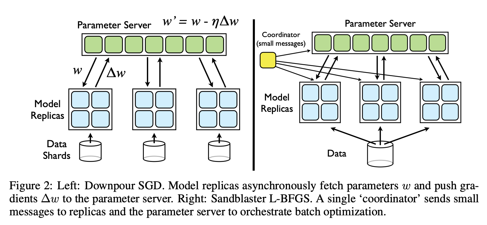

# DistBelief

[原始论文见此](https://static.googleusercontent.com/media/research.google.com/zh-CN//archive/large_deep_networks_nips2012.pdf)

## 1 主要工作

模型并行、数据并行。

- Downpour SGD，异步随机梯度下降，适应性学习率，支持大规模模型副本。
- Sandblaster L-BFGS，<u>L-BFGS</u>（解释见最后）的分布式实现。

通过实验得到的几个关于大规模非凸优化的结论：

- 异步SGD，一般不会在非凸优化上使用，但在训练深度学习网络上表现很好，特别是和**Adagrad适应性学习率方法**结合起来时。
- 在资源足够的情况下，L-BFGS可以和很多SGD的变体相比可以更快。

## 2 模型并行

用户定义的计算发生在模型每一层的每一个节点上，消息随着计算的过程传递。对大的模型，用户可以将模型分到不同的机器上，所以模型不同节点的计算也就分配到不同的机器上。框架自动将每个机器上的计算并行起来，管理机器间的通信、同步、数据传输。

在多个机器间的深度网络的分布式计算的性能收益，取决于结构之间的连通性和模型对计算的需求。有着大规模参数、或者大量计算需求的模型，一般会从访问更多CPU和内存中获益。

## 3 分布式优化算法

DistBelief的目标不只是在模型的单个实例之间并行，但是要在多个模型实例之间进行分布式训练。Downpour SGD和Sandblaster L-BFGS使用一个中心化分片式参数服务器，模型副本使用它来共享参数。两个方法都利用了DistBelief在单个副本的分布式计算的优势。但是更重要地，两种方法都设计来**兼容不同模型副本的处理速度的不同，甚至是模型副本的大规模的失败**（可能涉及到机器下线或随机地重启）。两种方法都可以同时地处理很多模型副本中不同的训练样本，并且周期性地综合它们的结果来优化目标函数。

### 3.1 Downpour SGD

Downpour SGD是一种异步随机梯度下降算法，使用单个DistBelief模型的多个副本。最基本的方法就是：将训练样本分成多个子集，然后在每个机器上运行一个模型的拷贝。模型通过中心化的参数服务器来通信参数更新，参数服务器记录了模型所有参数的当前状态，在多个机器之间分片。这个方法是异步的，体现在两个方面：模型副本之间独立运行，参数服务器的分片也是独立运行的。

在最简单的实现中，在处理每个mini-batch之前，一个模型副本会请求参数服务器服务，来要一个模型最新的参数拷贝。因为DistBelief模型在多个机器之间分片，每个机器需要和自己模型分片的参数相关的参数服务器分片子集通信。在收到它参数拷贝之后，DistBelief模型副本就处理一个mini-batch的数据来计算参数梯度，并且将梯度回传至参数服务器，在那里将梯度应用到当前参数模型的参数上。

Downpour SGD比起同步SGD对机器失败更具有鲁棒性。对于同步SGD，如果一个机器失败了，那么整个训练过程都会延迟。但是对于异步SGD，如果一个模型副本的机器是失败了，其他的模型副本会继续训练数据、利用参数服务器更新参数。

### 3.2 Sandblaster L-BFGS

Sandblaster L-BFGS存在于coordinator进程中，它不会直接访问模型参数。coordinator从一个操作的小集合中发布指令，它可以由每个参数服务器独立地执行，结果被存储在本地。额外的信息也存储在参数服务器分片上。

负载均衡算法：coordinator分配给N个模型副本以工作量的一小部分，比第1/N个batch的总量要小，并且当它们空闲的时候，分配给这些模型副本以新的工作。为了更进一步地管理每个batch结尾最后最慢的几个模型副本，coordinator调度几个未完成的工作部分，并且将其分配给最先完成工作的几个模型副本。预取数据，并且通过给同样的worker以连续的数据部分支持了数据之间的联系，使得数据访问不再是一个问题。与Downpour SGD不同，Sandblaster的worker只在每个batch开始的之后取参数，并且只每个完成工作的部分发送梯度（来防止模型副本失败和重启）。

## 4 文中部分名词解释

- L-BFGS：[Wikipedia](https://en.wikipedia.org/wiki/Limited-memory_BFGS)
