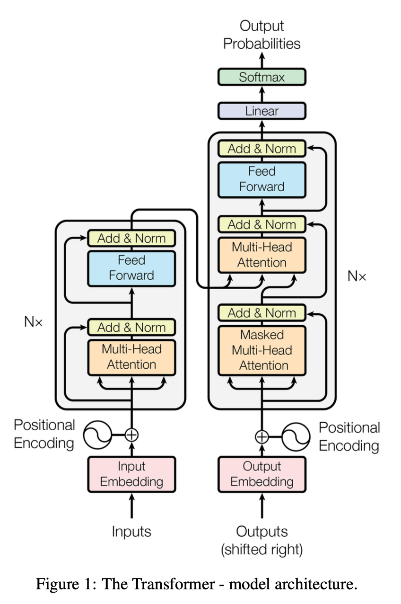

# Transformer 论文研读

论文原文链接：*[Attention Is All You Need](https://arxiv.org/pdf/1706.03762)*

## 1 简介

当前主流的序列转义类的模型，都基于复杂的递归、卷积神经网络，并且包含编码器和解码器。这些模型的内在特点，阻碍了在训练时的并行。对于长序列，在内存受限的情况下，这就十分关键了。

本文提出的 Transformer 模型，仅仅依赖于 Attention（注意力）机制，完全不使用递归和卷积。

# 2 模型结构

常见的序列转义类模型，都使用编码器-解码器结构。编码器将符号表示的输入序列 $(x_1,...,x_n)$ 映射到连续表示序列 $\mathrm{z}=(z_1,...,z_n)$。对于 $\mathrm{z}$，解码器生成一个符号的输出序列 $(y_1,...,y_m)$，一次输出一个元素。每个步骤，模型都是自回归的，当生成下一个时，使用之前生成的符号作为额外的输入。

对所有的编码器和解码器，Transformer 使用如下的架构，堆叠的 self-attention（自注意力）和 point-wise 全连接层。如下图左半边和右半边所示：

### 2.1 编码器和解码器

#### 编码器

解码器由 $N=6$ 个完全相同的层组成。每一层有两个子层。第一个是 multi-head self-attention（多头自注意力）机制，第二个是一个简单的、position-wise 的全连接前馈网络。我们在每个子层后面都添加一个残差连接，然后接一个层标准化。*如果对这两个概念不了解的话，可以参看我之前的文章：[残差学习](3_ResidualLearning.html)和[层标准化](2_LayerNorm.html)。* 也就是说，每个子层的输出是 $\mathrm{LayerNorm}(x+\mathrm{Sublayer}(x))$，其中 $\mathrm{Sublayer}$ 是子层自己实现的函数。为了便利这些残差连接，模型里面的所有子层，包括 embedding 层，输出的维度都是 $d_{model} = 512$。

#### 解码器

解码器也是由 $N=6$ 个完全相同的层组成。除了编码器的两个子层外，解码器插入了第三个子层，它对编码器的输出添加 multi-head attention。和编码器类似，在每个子层的输出添加残差连接和层标准化。我们也修改了编码器中的 self-attention 子层来防止一个位置的数据参与后面位置的计算。这种 masking（掩码多头注意力），加上输出 embedding 都有一个位置的偏移，共同保证了对位置 $i$ 的预测只依赖于 $i-1$ 位置的已知的输出。

### 2.2 Attention

attention 函数，可以视作将一个query 和 一组 key、value 对映射到输出的函数，其中 query、key、value、输出都是向量。输出是 value 的加权和，其中每个 value 的权重是通过 query 和对应的 key 的函数计算出来的。

#### 2.2.1 Scaled Dot-Product Attention（缩放点积注意力）

输出包括维度为 $d_k$ 的 query、key 和 维度为 $d_v$ 的value。我们计算 query 和 key 的点积（上图左边的“Matmul”层），除以 $\sqrt{d_k}$（上图左边的“Scale”层），然后使用 SoftMax 函数来获取应用在 value 上的权重。

在实操中，我们同时计算一组 query，将其封装为矩阵 $Q$，key、value 也封装为矩阵 $K$、$V$。使用如下方法计算输出矩阵：

$$
\mathrm{Attention}(Q, K, V) = \mathrm{softmax}\left( \frac{Q K^T}{\sqrt{d_k}} \right) V \tag{1}
$$

#### 2.2.2 Multi-Head Attention（多头注意力）

我们发现将 query、key、value 线性投影 $h$ 次，分别到 $d_k$、$d_k$、$d_v$ 维度上。在这些投影的 query、key、value 上，我们并行的执行 attention 函数，产生一个维度为 $d_v$ 的输出。最后再连接起来，然后在投影输出。如上图右面所示。

multi-head attention 机制允许模型同时考虑不同位置的不同表示子空间的信息。

$$
\begin{align*}
\mathrm{MultiHead}(Q, K, V) &= \mathrm{Concat}(\mathrm{head}_1, \dots, \mathrm{head}_h) W^O \\
\text{where} \quad \mathrm{head}_i &= \mathrm{Attention}(QW_i^Q, KW_i^K, VW_i^V)
\end{align*}
$$

其中投影是参数矩阵 $W_{i}^{Q} \in \mathbb{R}^{d_{\mathrm{model}} \times d_{k}}$、$W_{i}^{K} \in \mathbb{R}^{d_{\mathrm{model}} \times d_{k}}$、$W_{i}^{V} \in \mathbb{R}^{d_{\mathrm{model}} \times d_{v}}$、$W^{O} \in \mathbb{R}^{hd_v \times d_{\mathrm{model}}}$。

本文中，我们使用 $h = 8$ 平行的 attention 层，或称为 head。另外，$d_k = d_v = d_{model} / h = 64$。

#### 2.2.3 模型中 Attention 的使用

- 在“编码器-解码器 attention”层中，query 来自于前一个解码器层，key、value 来自于编码器的输出。这就使得解码器的每一个位置可以参与到输入序列的所有位置。
- 编码器包含 self-attention 层。在 self-attention 层中，query、key、value 来自于同一个地方，即编码器上一层的输出。编码器的每一个位置都可以参与到前面层的所有位置。
- 同样地，解码器中的 self-attention 层可以使得解码器的每一个位置参与到包括这个位置之前的所有。我们需要防止解码器中向左的数据流来保持自回归特性。为了做到这一点，我们在 scaled dot-production attention 通过在 SoftMax 之前 maksing（设置掩码值为 $-\infty$）掉非法连接。

### 2.3 position-wise 前馈网络

除了 attention 子层外，编码器和解码器的每一个层都包含一个全连接前馈网络，这分别应用到每一个位置上。这包含两个线性变换，还有 ReLU 激活函数在其中。

$$
\mathrm{FFN}(x) = \max(0, xW_1 + b_1) W_2 + b_2 \tag{2}
$$

尽管每个不同位置的线性变换都一样，但是每一层都用不同的参数。

### 2.4 embedding 和 softmax

在两个 embedding 和 softmax 之前的线性变换，共享同样的权重矩阵。在 embedding 层，我们将这些权重乘以 $\sqrt{d_{model}}$。

### 2.5 位置编码

因为我们的模型不是递归或卷积的，所以，为了使用位置信息，我们必须要将序列中 token 绝对或相对的位置注入。因此，我们在编码器和解码器的最下面的输入 embedding 中加入“位置编码”。位置编码和 embedding 有同样的维度 $d_{model}$。在这里，我们使用如下编码方式：

$$
\begin{aligned}
PE_{(pos, 2i)} &= \sin\left(pos / 10000^{2i / d_{\text{model}}}\right) \\
PE_{(pos, 2i+1)} &= \cos\left(pos / 10000^{2i / d_{\text{model}}}\right)
\end{aligned}
$$

其中，$pos$ 是位置，$i$ 是维度。

## 3 为什么使用 self-attention

激励我们使用 self-attention 的原因主要有以下三点：

1. 每个层的计算复杂度；
2. 可以并行的计算量，通过需要的顺序执行的操作的最小数量来度量；
3. 网络中长范围依赖的路径长度；

self-attention 和递归、卷积网络的对比如下表所示：

## 附：英语学习

- sinusoid：正弦曲线
- mimic：模仿，模拟
- inhibit：制止，约束
- attend to：处理，关注，照料
- in all but a few cases：除了极少数情况外，其他情况下都是
- eschew：避免，避开
- preclude：阻碍，妨碍
- dispensing with：省去
