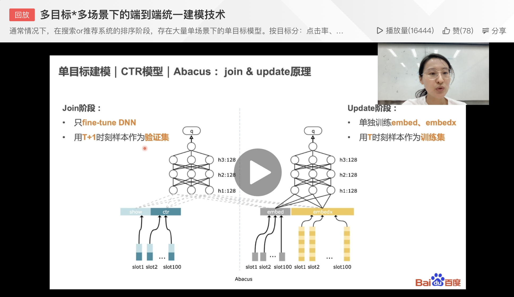

# 问题集锦

## 1 为什么推荐模型用的都是数据并行结构？

1. 特征规模大，且是离散的。
2. 特征是slot，具体对应的值是离散的，成为feasign。
3. 参数存储以feasign为key，分布在不同的server上。
4. 某个worker不需要所有的参数，只需要一部分参数。

sparse的样本特点，只有有值的数据。如feas:slot，对此slot的其他取值，不写上，feas就是对应的1.

### 为什么不用模型并行结构？

没必要，不存在但节点跑不了一个网络的问题。数据量是核心问题。

## 2 为什么分join和update两阶段？

1. 现在的模型都是千亿级别特征，小时级样本量不够，导致T时刻的embbeding学不好，容易过拟合，
2. T+1时刻，基于新的样本在DNN参数上做finetune，DNN参数更接近q值，它学好了，q值就准了
3. 所以线上用 T+1时刻的DNN参数 + T时刻的 embbeding。

## 3 单阶段不使用cvm？

单阶段没有用到cvm特征，如果直接在update阶段加入cvm，因为每轮大模型push参数更新，使得cvm更新，会使得单阶段过拟合更加严重。

举个例子，比如一个新的nid c,在delta9这个delta刚publish出来，然后在训练delta9这个时候，如果update阶段cvm被更新，用户a看了c没有点击c，但其他人看了c，那么c这个nid的这个slot的cvm会被其他人在delta9的行为累积更新cvm，当用户a点击c这条ins前向bp的时候，cvm已被更新，这时候形成特征穿越，即预估a点击c的时候，看到了未来c的cvm特征，使得模型训练的更好，但真正预估时，cvm不会有穿越特征的记录，所以测试auc就会低，从而造成过拟合的现象。

cvm都是“加”的，所以影响比较大。

## 4 为啥join用cvm，而update不用？

abacus建模使用join和update两个网络，update网络在profile特征上没有使用show-click信息，训练每条ins时，这条ins的时间可能是过去某个时刻，但是join特征上show-click是到当前为止一段固定时间的统计信息，如果直接用join特征的show-click，这条ins在update网络会看到未来的统计信息。这种未来的统计信息不准确，可能给模型带来偏差。例如30天query展点profile，训练数据可能是过去一周的日志，7天前的这个特征、1天前的这个特征，用到统计信息都是一样的。

## 5 网络优化

1. pull、push、train流水线异步。
2. server、worker配比。

## 6 优化细节

1. 访存优化。
   1. 局部性优化&对象池。
   2. ps上的热点cache。（paddle没有）
2. dataset流水线。prefetch与train（+shuffle）组成的流水线。
3. SIMD。
   1. Eigen。（paddle也有）