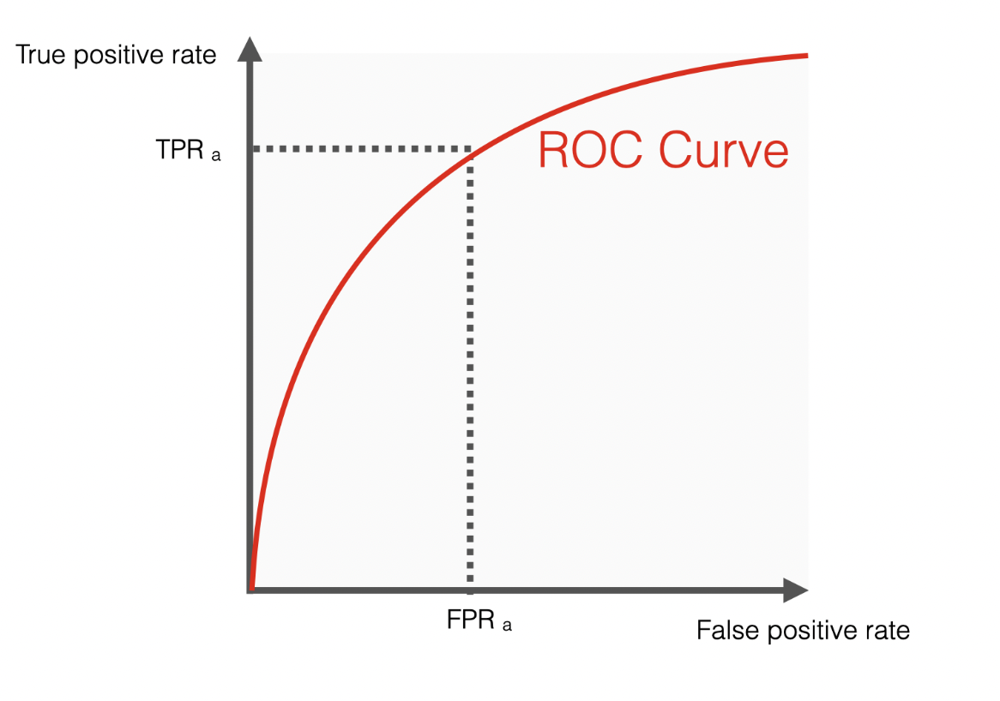
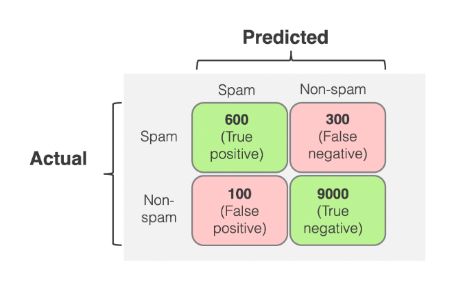
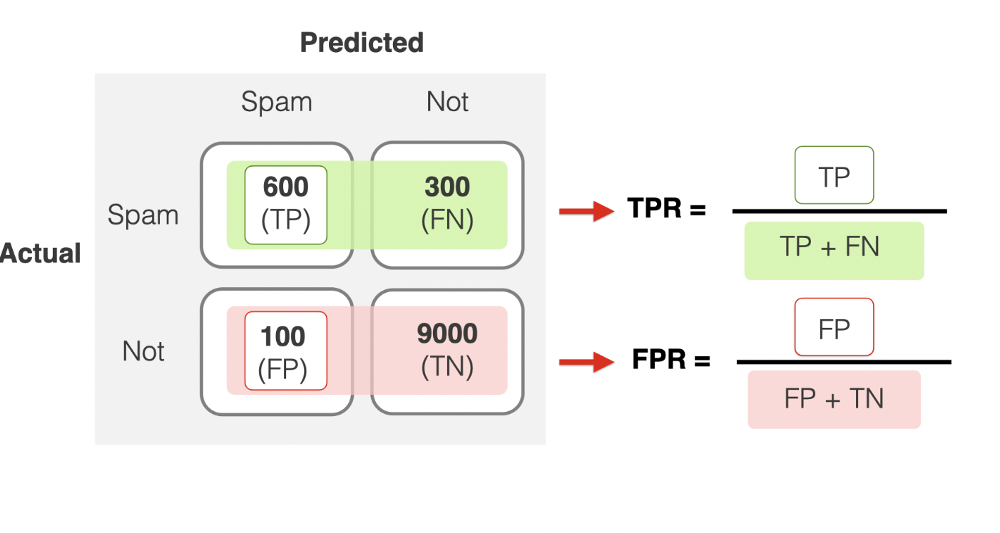
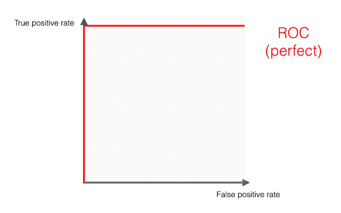
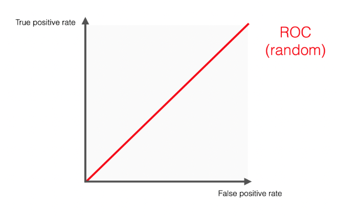
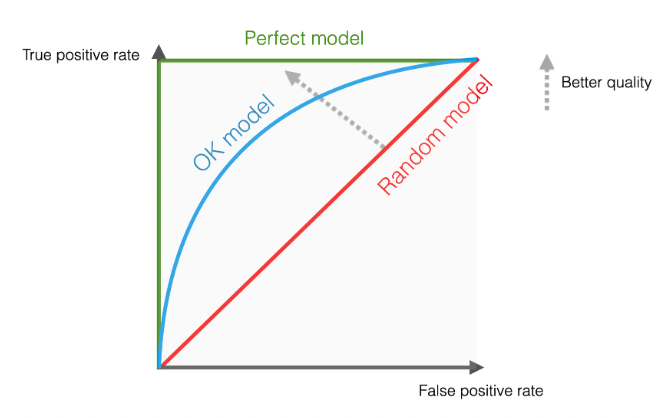

# ROC曲线与ROC AUC

参考[How to explain the ROC curve and ROC AUC score?](https://www.evidentlyai.com/classification-metrics/explain-roc-curve)

## 1 基本概念

- ROC(Receiver Operating Characteristic)曲线：表示一个二分类器在不同决策阈值（decision thresholds）下的表现。这个曲线是关于TPR（True Positive Rate，真正率）和FPR（False Positive Rate，假正率）。
- AUC(Area Under Curve)：是ROC曲线下的面积。
- AUC的值域为从0到1，0.5意味着随机猜测，1代表完美预测。

ROC曲线一般长这样：

## 2 TPR与FPR

### 有一个数学上的工具叫混淆矩阵（Confusion Matrix）

一般长这样：

具体的有：

- True Positive: 实际上是真的，**预测是真的**。
- False Positive: 实际上是假的，**预测是真的**。

总结规律，预测值和实际值一样第一位就是True，否则是False；第二位代表预测值是啥，Positive（True），Negative（False）

### 利用此矩阵计算TPR与FPR

- TRP，又叫做召回率（Recall Rate）。公式描述：预测为真且实际为真 在 所有实际为真 中的比率。
- FPR，可以当作虚警率（False Alarm Rate）。公式描述：预测为真但实际为假 在 所有实际为假 中的比率。

所以，为了得到一个ROC曲线，必须要在不同的thresholds下，画出FPR和TPR。

### 分类阈值

CM是在某一个特定阈值下得出来的，而实际上需要在不同的阈值下分别计算TPR、FPR的值。

这个阈值的作用：

因为是二分类，真实值有两种0、1。预测值是0.0、0.1、0.2……0.9、1.0。比如说阈值为0.8，则小于0.8的预测值被当作0，大于0.8的预测值被当作1。

当阈值设的高的时候，这个模型就是“更保守的”。它在预测为1的时候“更可信”。但是，这样一般就会得到更低的召回率。预测为真的更少了，所以TP、FP都少了。

当阈值设的低的时候，这个模型就是”更不严谨的“。它在预测为1的时候“更不可信”。但是，这样就会得到更高的召回率。当然，这也会导致更低的精确率。预测为真的更多了，所以TP、FP都多了。

所以，TPR、TFP的变化趋势是一致的，也就是正相关，即ROC曲线是一个从左下向右上走的一个曲线。

## 3 ROC曲线

### 完美的模型

TPR=1，FPR=0，即没有预测错的。*此时AUC=1。*

### 随机的模型

TPR = FPR，即对于任何阈值，它都会产生同样数量的TP、FP。属于随机预测。*此时AUC=0.5。*

### 一般的模型

一般模型都会处在完美模型与随机模型之间的位置。

ROC曲线是对分类器在不同阈值下表现能力的二维反应。所以，很容易用一个指标来“总结”。这就是AUC。

## 4 好的AUC

- 0.5意味着随机猜测。
- 大于0.5代表有一定的预测能力。
- 大于0.8就是good，大于0.9就是great。
- 要看具体的场景，并结合其他指标。

## 5 使用AUC的优点与缺点

### 优点

- 只需要一个数字
- 不会随着分类阈值的变化而变化
- 对于不均衡的数据（正负样本的比例差距大）比较合适
- 不随着数据集分布的变化而变化
- 数据如何scale，不影响

### 缺点
- 不直观
- 不会关注cost
- 如果数据过于不均衡，不容易发现