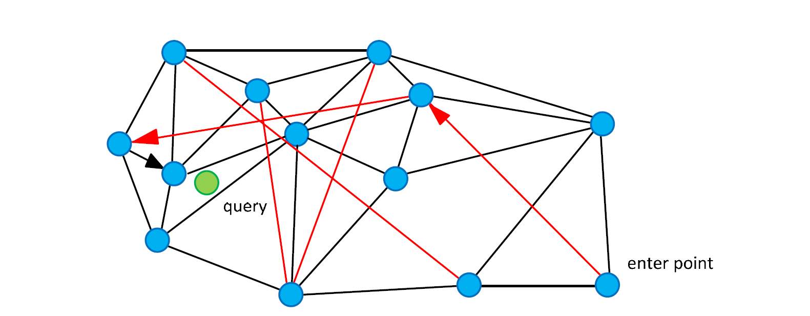

# NSW：ANN 检索算法（一）

本文介绍 NSW，它的升级版 HNSW 是 ANN 检索的常见算法之一。本文所研读的论文来自于下面这篇文章：
[Scalable Distributed Algorithm for Approximate Nearest Neighbor Search Problem in High Dimensional General Metric Spaces](https://www.hse.ru/data/2013/10/01/1277293157/Sisap%202012%20Scalable%20Distributed%20Algorithm%20for%20Approximate%20Nearest.pdf)

## 1 NSW简介

- 基于 small world graph，vertex（顶点）是存储的元素
- 基于 greedy algorithm（贪心算法）的检索算法
- 增量地创建一个图只需要对数复杂度
- 可调节精确度
- 检索和插入算法只需要使用图的局部信息
- 拥有 navigation 属性

## 2 结构定义

结构$S$按照 small world network 来构建，用$G(V, E)$来表示这个图。来自集合$X$的元素独一无二地映射到顶点的集合$V$上。边的集合$E$由结构构建算法来确定。我们使用“friends”（朋友）来称呼共享一条边的顶点。和顶点$v_i$共享一条边的顶点，被称为顶点$v_i$的“friend list”（朋友列表）。

我们使用贪心检索算法的一个变种来作为NNS（Nearest Neighbor Search，近邻检索）的基础算法。我们在下一节中详细讲述。

链接（边）由两种用途。一种是短程链接（short-range link），作为贪心算法需要的 Delaunay graph（德劳内图）的近似。一种是长程链接（long-range link），用来做贪心算法的对数伸缩，负责 navigation 属性。

所有的查询都是独立的，可以并行进行。如果所有的元素都是随机地放在物理计算节点上，处理查询的负载会均匀地分摊到每个节点上。系统整体的性能（每秒的并行查询数）只取决于节点的数量。

上图是结构的图表示。顶点是数据，黑色的边是 Delaunay graph 的近似，红色的边负责对数伸缩的长程链接。箭头演示了一次从 enter point 到 query（图中绿色圆圈）的贪心算法。

## 3 算法

### 3.1 贪心算法（Greedy Search）

算法简述：

1. 从 enter point（起点）开始，设置此为当前节点，计算其与 query 节点的 metric value（比如说距离）。
2. 计算当前节点的 friend list 中的节点与 query 的 metric value，并找到最小的 metric value。
3. 比较1、2中的 metric value，若1中的最小，则当前节点即为与 query 最近的点；否则，将2中最小 metric value 的节点设为当前节点，重复此步骤。直到当前节点的 metric value 最小为止。

此处获得的 metric value 是局部最小值（local minimum），有可能不是全局最小值（离query最近的点）。

从拓扑学上来说，找到的这个局部最小值很可能就是离 query 最近的点（0.95的概率）。如果不是的话，那就可能是第二近的点，依次类推，并且概率急剧下降。

### 3.2 Multi-Search

为了避免此局部最小值可能引发的问题，我们提出了对上述算法的改进。即我们随机选择$m$个顶点作为 enter point同时发起查询。并选择最小的一个 metric value 的节点作为最终结果。

如果对于一个固定 query，一次就能找到离它最近的点的概率是$p$，那么至少$m$次才能找到最近的点的概率是$1-(1-p)^m$。所以，失败的概率是随着查询次数的增加而指数级下降的。

**算法很简单，但也很有效。**

## 4 数据插入算法

算法简述：

1. 将新数据的点作为 query，使用上面说的 Multi Search 算法，查询$w$次，获得距离此新数据最近的点。
2. 将上述算法找到的所有的局部最小值的点放入$u$中。
3. 将$u$按距离升序排列，选最前面的$k$个。将新节点与此$k$个节点连接。

## 5 一点感想

对于论文中提到的图论的一些知识，自己确实知之甚少。因此在上文中故意略去了一些。更深刻的原理仍然需要继续学习。