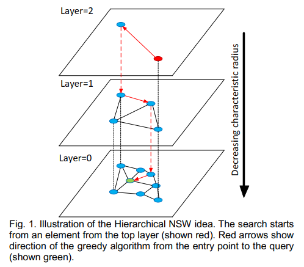

# HNSW：ANN 检索算法（二）

本文介绍的论文是 ANN 检索领域的常见算法 **HNSW**，原文参见：[Efficient and robust approximate nearest neighbor search using Hierarchical Navigable Small World graphs](https://arxiv.org/pdf/1603.09320)

## 1 整体介绍

作者是 NSW（Navigable Small World graph）的作者，HNSW 是 Hierarchical NSW 的缩写。如果还不了解 NSW 的，欢迎大家参考我的上一篇文章 [NSW：ANN 检索算法（一）](./1_NSW.html)。

NSW 有的特征，HNSW 都有。比如 navigable、使用贪心算法等。而 HNSW 在 NSW 的基础上做出的升级是什么呢？

> 这里补充一下什么是 navigable？比较细致的介绍是：
> 
> In graph theory, a navigable graph is one where, starting from any node, you can reach any other node using a greedy algorithm that always chooses the neighbor closest to the target.
> 
> 上述参见[Navigable Graphs for High-Dimensional Nearest Neighbor Search: Constructions and Limits](https://arxiv.org/pdf/2405.18680)
> 
> 简单来讲，navigable 就是使用贪心算法，可以从一个节点到另一个节点。虽然这看起来像是废话，但是这在图论中，是一个特别重要的性能，也是作者立论的基础。

第一，**Hierarchical**，简单来讲就是分层的。不像 NSW，只有一个平面，而 HNSW 是立体的，分了多层的。后面会结合图片来讲到。

第二，**性能更优**。在低维数据集上，由于 NSW 的多重对数复杂度的缩放，仍然有一个比较严重的性能下降。HNSW 的缩放可以达到对数复杂度。

第三，可以理解为一个概率跳表结构的变种。

## 2 算法思路

HNSW 算法的思路就是根据链接的长度量级来将其划分到不同的层，并且检索也是在多个层里面进行的。在检索的时候，只有一小部分的链接会用到，和整体的网络量级无关。

检索从最上层开始，（最上层的链接也最长），使用贪心算法遍历，直至找到局部最小值。而后，切换到下一层（链接也比上一层要短些），重复上述过程。参见下图（绿色点是query，红色箭头是贪心算法的检索路径，最上层的红色点是entry point）：

为了保证随机性，HNSW 的构建算法，在插入一个元素之前要进行shuffle。而 HNSW 不同，随机性是通过随机来选择元素所要插入的层来实现的。

## 3 算法详述

### 3.1 插入算法

插入算法伪代码见 alg. 1下，对于每一个被插入的元素，它插入的最大层$l$是随机选择的，还有一个指数级下降分布的算法来控制。

插入算法的第一个阶段，即下面第5~7行的内容。从最上层开始，使用贪心算法找到 $q$ 的 $ef$ 个近邻节点。之后，在下一层，使用找到的这几个节点作为起始节点，重复上述过程。找到近邻节点的算法见 alg. 2，它是 NSW 查找算法的一个变种。

插入算法的第二个阶段，即 alg. 1的8~17行。当插入算法遍历的层到了小于等于 $l$ 的时候，第二个阶段和第一阶段的区别是，$ef$ 参数从 $efConstruction$ 变为 1；在每一层找到的近邻节点也和要插入节点产生链接。==**注意到，从 $l$ 层到最后一层，每一层都要插入 $q$ 节点。**==

在第二阶段选择近邻节点时，有两种方法：第一种方法即 alg. 3，比较直观的算法。第二种算法即 alg. 4，是一种启发式算法。它会扩大候选节点的范围（$extendCandidates$），也会裁剪一些节点（$keepPrunedConnections$）。具体见算法表述，都是比较简单明了的。

在第二阶段的最后，还会根据传入的每个节点的最大链接数 $M_{max}$ 来进行一个裁剪，即 alg. 1中第14~16行的内容。

$$
\begin{aligned}
&\textbf{Algorithm 1: INSERT}(hnsw, q, M, M_{\max}, efConstruction, m_L) \\
&\textbf{Input:} \\
&\quad \text{multilayer graph } hnsw, \text{ new element } q, \\
&\quad \text{number of established connections } M, \\
&\quad \text{maximum number of connections } M_{\max}, \\
&\quad \text{size of dynamic candidate list } efConstruction, \\
&\quad \text{normalization factor for level generation } m_L \\
&\textbf{Output:} \\
&\quad \text{update } hnsw \text{ inserting element } q \\
&\quad \\
&1.\ W \leftarrow \varnothing \quad \text{// list for the currently found nearest elements} \\
&2.\ ep \leftarrow \text{get enter point for } hnsw \\
&3.\ L \leftarrow \text{level of } ep \quad \text{// top layer for } hnsw \\
&4.\ l \leftarrow \left\lfloor -\ln(\text{unif}(0..1)) \cdot m_L \right\rfloor \quad \text{// new element's level} \\
&5.\ \textbf{for } l_c \leftarrow L \text{ downto } l+1 \\
&6.\quad W \leftarrow \text{SEARCH-LAYER}(q, ep, ef=1, l_c) \\
&7.\quad ep \leftarrow \text{get the nearest element from } W \text{ to } q \\
&8.\ \textbf{for } l_c \leftarrow \min(L, l) \text{ downto } 0 \\
&9.\quad W \leftarrow \text{SEARCH-LAYER}(q, ep, efConstruction, l_c) \\
&10.\quad \text{neighbors} \leftarrow \text{SELECT-NEIGHBORS}(q, W, M, l_c) \quad \text{// alg. 3 or alg. 4} \\
&11.\quad \text{add bidirectional connections from neighbors to } q \text{ at layer } l_c \\
&12.\quad \textbf{for each } e \in \text{neighbors} \quad \text{// shrink connections if needed} \\
&13.\quad\quad eConn \leftarrow \text{neighbourhood}(e) \text{ at layer } l_c \\
&14.\quad\quad \textbf{if } |eConn| > M_{\max} \quad \text{// shrink connections of } e \\
&15.\quad\quad\quad eNewConn \leftarrow \text{SELECT-NEIGHBORS}(e, eConn, M_{\max}, l_c) \\
&16.\quad\quad\quad \text{set neighbourhood}(e) \text{ at layer } l_c \text{ to } eNewConn \\
&17.\quad ep \leftarrow W \\
&18.\ \textbf{if } l > L \\
&19.\quad \text{set enter point for } hnsw \text{ to } q
\end{aligned}
$$

$$
\begin{aligned}
&\textbf{Algorithm 2: SEARCH-LAYER}(q, ep, ef, l_c) \\
&\textbf{Input:} \\
&\quad \text{query element } q, \text{ enter points } ep, \\
&\quad \text{number of nearest to } q \text{ elements to return } ef, \\
&\quad \text{layer number } l_c \\
&\textbf{Output:} \\
&\quad ef \text{ closest neighbors to } q \\
&\quad \\
&1.\ v \leftarrow ep \quad \text{// set of visited elements} \\
&2.\ C \leftarrow ep \quad \text{// set of candidates} \\
&3.\ W \leftarrow ep \quad \text{// dynamic list of found nearest neighbors} \\
&4.\ \textbf{while } |C| > 0 \\
&5.\quad c \leftarrow \text{extract nearest element from } C \text{ to } q \\
&6.\quad f \leftarrow \text{get furthest element from } W \text{ to } q \\
&7.\quad \textbf{if } \text{distance}(c, q) > \text{distance}(f, q) \\
&8.\quad\quad \textbf{break} \quad \text{// all elements in } W \text{ are evaluated} \\
&9.\quad \textbf{for each } e \in \text{neighbourhood}(c) \text{ at layer } l_c \quad \text{// update } C \text{ and } W \\
&10.\quad\quad \textbf{if } e \notin v \\
&11.\quad\quad\quad v \leftarrow v \cup e \\
&12.\quad\quad\quad f \leftarrow \text{get furthest element from } W \text{ to } q \\
&13.\quad\quad\quad \textbf{if } \text{distance}(e, q) < \text{distance}(f, q) \text{ or } |W| < ef \\
&14.\quad\quad\quad\quad C \leftarrow C \cup e \\
&15.\quad\quad\quad\quad W \leftarrow W \cup e \\
&16.\quad\quad\quad\quad \textbf{if } |W| > ef \\
&17.\quad\quad\quad\quad\quad \text{remove furthest element from } W \text{ to } q \\
&18.\ \textbf{return } W
\end{aligned}
$$

$$
\begin{aligned}
&\textbf{Algorithm 3: SELECT-NEIGHBORS-SIMPLE}(q, C, M) \\
&\textbf{Input:} \\
&\quad \text{base element } q, \\
&\quad \text{candidate elements } C, \\
&\quad \text{number of neighbors to return } M \\
&\textbf{Output:} \\
&\quad M \text{ nearest elements to } q \\
&\quad \\
&\text{return } M \text{ nearest elements from } C \text{ to } q
\end{aligned}
$$

$$
\begin{aligned}
&\textbf{Algorithm 4: SELECT-NEIGHBORS-HEURISTIC}(q, C, M, l, \text{extendCandidates}, \text{keepPrunedConnections}) \\
&\textbf{Input:} \\
&\quad \text{base element } q, \\
&\quad \text{candidate elements } C, \\
&\quad \text{number of neighbors to return } M, \\
&\quad \text{layer number } l, \\
&\quad \text{flag extendCandidates}, \\
&\quad \text{flag keepPrunedConnections} \\
&\textbf{Output:} \\
&\quad M \text{ elements selected by the heuristic} \\
&\quad \\
&1.\ R \leftarrow \varnothing \\
&2.\ W \leftarrow C \quad \text{// working queue for the candidates} \\
&3.\ \textbf{if } \text{extendCandidates} \quad \text{// extend candidates by their neighbors} \\
&4.\quad \textbf{for each } e \in C \\
&5.\quad\quad \textbf{for each } e_{\text{adj}} \in \text{neighbourhood}(e) \text{ at layer } l \\
&6.\quad\quad\quad \textbf{if } e_{\text{adj}} \notin W \\
&7.\quad\quad\quad\quad W \leftarrow W \cup e_{\text{adj}} \\
&8.\ W_d \leftarrow \varnothing \quad \text{// queue for the discarded candidates} \\
&9.\ \textbf{while } |W| > 0 \text{ and } |R| < M \\
&10.\quad e \leftarrow \text{extract nearest element from } W \text{ to } q \\
&11.\quad \textbf{if } e \text{ is closer to } q \text{ than any element in } R \\
&12.\quad\quad R \leftarrow R \cup e \\
&13.\quad \textbf{else} \\
&14.\quad\quad W_d \leftarrow W_d \cup e \\
&15.\ \textbf{if } \text{keepPrunedConnections} \quad \text{// add discarded connections} \\
&16.\quad \textbf{while } |W_d| > 0 \text{ and } |R| < M \\
&17.\quad\quad R \leftarrow R \cup \text{extract nearest element from } W_d \text{ to } q \\
&18.\ \textbf{return } R
\end{aligned}
$$

### 3.2 检索算法

检索算法如 alg. 5所示。这个算法和当 $l=0$ 时的插入算法很类似。对于插入算法在最后一层返回的做链接的节点，就是检索算法返回的结果。

$$
\begin{aligned}
&\textbf{Algorithm 5: K-NN-SEARCH}(hnsw, q, K, ef) \\
&\textbf{Input:} \\
&\quad \text{multilayer graph } hnsw, \\
&\quad \text{query element } q, \\
&\quad \text{number of nearest neighbors to return } K, \\
&\quad \text{size of dynamic candidate list } ef \\
&\textbf{Output:} \\
&\quad K \text{ nearest elements to } q \\
&\quad \\
&1.\ W \leftarrow \varnothing \quad \text{// set for current nearest elements} \\
&2.\ ep \leftarrow \text{get enter point for } hnsw \\
&3.\ L \leftarrow \text{level of } ep \quad \text{// top layer for } hnsw \\
&4.\ \textbf{for } l_c \leftarrow L \text{ downto } 1 \\
&5.\quad W \leftarrow \text{SEARCH-LAYER}(q, ep, ef=1, l_c) \\
&6.\quad ep \leftarrow \text{get nearest element from } W \text{ to } q \\
&7.\ W \leftarrow \text{SEARCH-LAYER}(q, ep, ef, l_c=0) \\
&8.\ \textbf{return } K \text{ nearest elements from } W \text{ to } q
\end{aligned}
$$

## 4 补充材料

如果大家想阅读原论文的话，这里有些背景知识，帮助大家理解。

### zoom-in & zoom-out?

”zoom-out“和”zoom-in“类似于显微镜的”粗准焦螺旋“和”细准焦螺旋“，简单理解”zoom-out“就是u粗略地查找，”zoom-in“就是细致地查找。
### KNN & ANN？

- KNN：K 近邻查找
- ANN：近似近邻查找