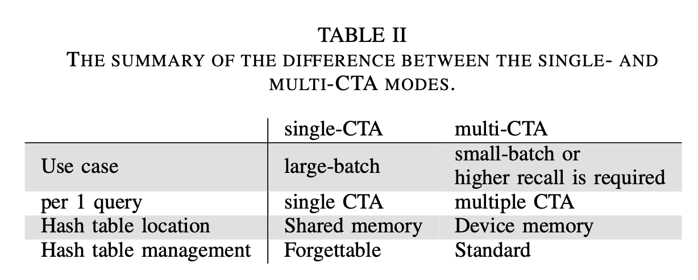

# CAGRA：ANN 检索算法（三）

本文的主要内容来源于文章：[CAGRA: Highly Parallel Graph Construction and Approximate Nearest Neighbor Search for GPUs](https://arxiv.org/pdf/2308.15136)

## 1 主要内容

本文的主要贡献总结如下：

1) 提出了一种 ANNS 的近似图，它的组图过程适合大规模并行计算。这个方法通过避免精确的相似度计算，来减少内存占用（memory footprint and usage），而其经常是图优化过程的主要性能瓶颈。
2) 本文提供了为 GPU 优化的检索实现，在单个 query 和大批量 query 时，都有很高的吞吐量。我们利用 warp splitting 和 forgettable hash table 来高效地利用 GPU 资源。
3) 我们展示了 CAGRA (Cuda Anns GRAph-based) 在组图和检索时，比当前尖端的基于图的 CPU 和 GPU 算法，都取得了更高的性能。

## 2 背景

### 2.1 ANNS

比起 k-NNS ，ANNS 取得了在吞吐量和准确率之间的平衡，减少了计算负荷，并使得大数据集成为可能。基于图的方法包含两个主要步骤：从数据集中构建近似图，然后遍历来检索距离 query 最近的 k 个节点。想了解其他 CPU 上的图近似 ANN 算法的小伙伴，可以参考我之前的两篇文章：[NSW](./1_NSW.html) 和 [HNSW](./2_HNSW.html)。

对于给定 query，尽管 k-ANNS 取得 k 个相似的向量，结果并不总是准确的。我们评估结果的准确度的指标叫做召回率（recall）：

$$
\mathrm{recall} = |U_{\mathrm{ANNS}} \cap U_{\mathrm{NNS}}| / |U_{\mathrm{NNS}}|
$$
其中，$U_{\mathrm{ANNS}}$ 是 ANNS 召回的向量集合，$U_{\mathrm{NNS}}$ 是 NNS 召回的向量集合。我们使用“$\mathrm{recall}@k$”来表示 k-ANNS 的召回。

### 2.2 CUDA

1) 线程结构：32个线程称之为 warp，它们会同时执行相同的指令。另一方面，不同的指令不会并行地在一个 warp 中执行，会导致性能下降，被称之为 warp divergence。32个 warp 组成一个 CTA (Cooperative Thread Array)，或称之为线程块（thread block），一个 CTA 在一个 GPU SM (streaming multiprocessor) 上执行。SM 就像多核 CPU 中的一个核。因为 GPU 上有很多个 SM，所以我们可以同时使用多个 CTA。
2) 内存结构：GPU 的 device memory 最大，并且每个线程都可以访问。共享内存是一个局部内存，在每个 CTA 之内，CTA 之内的所有线程都共享这块内存。尽管共享内存比 device memory 要小很多，但是其延迟低、带宽高。此外还有寄存器。

希望了解更多的 CUDA 知识的，可以参考我的另一个合集：[CUDA By Example 学习笔记](../Book_CUDAByExample/0_content.html)。

## 3 图的组建

CAGRA 图有以下三个特征：固定的出度、有向、无层级。

我们组建一个 k-NN 图作为初始图，对每个节点的度 $k = d_{init}$ 。我们使用 NN-Descent 方法来组建一个图，一般设置 $d_{init}$ 为 $2d$ 或 $3d$，其中 $d$ 为最终图的度。最后，我们将每一个节点的与之相连的节点列表根据距离来进行升序排序。这个排序是可以高效并行地使用 GPU 来进行计算的。

CAGRA 图优化算法的目的就是通过减少图的度来减少图的大小，同时不破坏可达性（reachability）。

## 4 图的优化

### 第一步：重新排序边

现在的剪枝算法一般是，当可以通过绕路的方式从一点到达另一点，则剪掉这两点的直接连接。我们考虑基于此的两种剪枝算法，基于距离的和基于 rank 的。

在基于距离的重排中，我们先是计算每个边的可绕路的路径，并且根据这个数量对节点进行重新排序。可绕路的路线越少的边，表示这个边的重要度越高。然后我们将列表中边的位置作为这个边的顺序，这个顺序就是其重要度的指示。*尽管我们可以并行计算每个边的可绕路路线，但是因为要在过程中计算距离，或者在过程前生成一个距离的表，所以对于量级较大的数据集，这个方法就不太实用了。*

在基于 rank 的重排中，我们将在图构建时计算的距离，作为初始的 rank 来排序边的邻居节点列表。然后，我们重新排序边，使用初始 rank，而不是使用距离。换句话说，我们使用 rank 来近似距离。*这种近似就使得我们不必计算数量巨大的距离，并且也不用在内存中存储大量的距离表。* 我们使用一个节点的顺序索引作为 rank。通过剪枝，我们对每个节点，只保留最多 $d$ 个邻居。如下图。

### 第二步：建立反向图

我们建立一个反向图，它的边的方向和上面重排和剪枝后的图的边的方向相反。利用剪枝图的 rank，对反向图的边进行升序排序。*原因是：如果一个人认为你很重要，那么他对你也很重要。*

### 第三步：合并剪枝图和反向图

我们从每个图中对每个亲节点取 $2/d$ 个子节点，并且组成一个图。整体算法如下所示。

## 5 检索

### 算法

检索算法需要使用到一块线性内存 buffer，包括一个 top-M 列表（一般称为优先队列，priority queue）和它的 candidate 列表（候选列表）。top-M 列表的大小为 $M(\geq k)$，candidate 列表大小为 $p \times d$，其中 $p$ 是每个循环遍历的节点的数量，$d$ 是图的度。buffer 中的每个元素是一个 kv 对，包含节点的索引和节点与 query 之间的距离。

0) 随机采样（初始化）：我们随机选取 $p \times d$ 个节点索引，将结果存储在 candidate 列表中。我们设置 top-M 列表有一个 dummy 入口节点，它的距离无限大。
1) top-M 列表更新：我们将选取 top-M 个距离最小的节点放入其中。
2) candidate 列表索引更新（图遍历）：我们选择 top-M 列表中的 top-p 个节点的邻居，将它们放入 candidate 列表中。
3) 距离计算：我们计算 candidate 列表中每个节点和 query 之间的距离。

我们重复执行1)~3)步，直到 top-M 列表中的索引编号收敛，即在两次执行结果中，索引编号不再变化。上述算法可用下图表示：

### 基本的技术和设计

1) warp splitting：我们提出一种在软件上对一个 warp 进一步细分，称之为 team。这样做进一步提高了 GPU 的利用率。通俗的讲，因为 warp 大而 vector 小，所以 warp 中的一部分（一个 team）用于 load，另一部分（另一个 team）用于计算。相当于进行了并行的流水线优化。
2) top-M 计算：top-M 的计算涉及到排序算法，当 candidate buffer 大小小于或等于 512 时，使用单 warp 层级的 **bitonic sort**，当大于 512 时，在一个 CTA 内使用 **radix sort**。原因就是当数量比较少时，我们可以使用寄存器来进行排序，而不需占用共享内存。但是当数量比较多时，就必须要用到共享内存了。
3) 存储已访问过的节点的哈希表的管理：在检索过程中，需要计算 query 与 节点之间的距离，为了保存已经访问过的节点，避免重复浪费计算，文章使用了**开放寻址哈希表**来存储访问过的节点。预估哈希表中的数据量为 $I_{max} \times p \times d$ ，其中 $I_{max}$ 代表检索的最大循环数。当哈希表必须放在如共享内存等比较小的内存中时，我们可以使用有**周期性重置**的哈希表，就是每隔一段时间，驱逐一些过去访问的节点。这可能会导致对一些距离的重复计算，但不会造成比较大的性能影响。我们称其为 **forgettable hash table management**。
4) 1-bit 亲节点管理：为了跟踪某个节点是否作为过亲节点，我们使用索引的最高有效位作为一个标志位。

### 实现

CAGRA 的具体实现分为单 CTA 和 多 CTA 两种，尽管基本的检索策略和操作是相同的，但是将query 映射到硬件上的方法是不同的。

1) 单 CTA。指的是将一个 query 映射到一个 CTA 上，这种方法一般适用于中等以上大小的 batch，如大于等于 100。使用单个的 kernel 来控制整个的检索过程。
2) 多 CTA。指的是将一个 query 映射到多个 CTA 上，这种方法一般适用于中等以下的 batch，如 1 ～ 100. 它会启动 query 的 batch 个 CTA，提高 GPU 的利用率。

## 英语学习

- ANNS：Approximate Nearest Neighbor Search
- garner：获得
- k-NNS：k Nearest Neighbor Search
- expedite：加快
