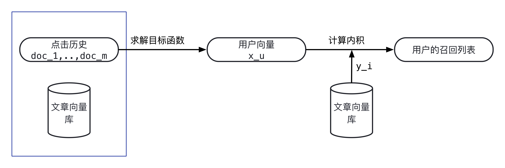

# 矩阵分解
英文：Matrix Factorization, MF

Reference
- https://zhuanlan.zhihu.com/p/69662980
- https://zhuanlan.zhihu.com/p/360689325
- https://zhuanlan.zhihu.com/p/363259363
- https://en.wikipedia.org/wiki/Matrix_factorization_(recommender_systems)

## wikipedia解释

> Matrix factorization is a class of collaborative filtering algorithms used in recommender systems. Matrix factorization algorithms work by decomposing the user-item interaction matrix into the product of two lower dimensionality rectangular matrices. This family of methods became widely known during the Netflix prize challenge due to its effectiveness as reported by Simon Funk in his 2006 blog post, where he shared his findings with the research community. The prediction results can be improved by assigning different regularization weights to the latent factors based on items' popularity and users' activeness.

中文摘要：  
矩阵分解是一种在推荐系统中使用的协同过滤算法。矩阵分解算法将用户-物品交互矩阵（？）分解为两个低纬度长方矩阵的乘积。可以通过基于物品的人气和用户的活跃度来对隐藏因子赋值不同正则化权重来提升预测结果。

## 具体例子

- MF把用户对item的评分矩阵分解为User矩阵和Item矩阵，其中User矩阵每一行代表一个用户的向量，Item矩阵的每一列代表一个item的向量；
- 用户i 对item j 的预测评分等于User矩阵的第i 行和Item矩阵的第j 列的内积，预测评分越大表示用户i 喜欢item j 的可能性越大；
- MF是把User矩阵和Item矩阵设为未知量，用它们来表示每个用户对每个item的预测评分，然后通过最小化预测评分和实际评分的差异学习出User矩阵和Item矩阵；
- MF是一种隐变量模型，它通过在隐类别的维度上去匹配用户和item来做推荐。
- MF是一种降维方法，它将用户或item的维度降低到隐类别个数的维度。

## 显示数据和隐式数据

MF用到的用户行为数据分为显式数据和隐式数据两种。显式数据是指用户对item的显式打分，比如用户对电影、商品的评分，通常有5分制和10分制。隐式数据是指用户对item的浏览、点击、购买、收藏、点赞、评论、分享等数据，其特点是用户没有显式地给item打分，用户对item的感兴趣程度都体现在他对item的浏览、点击、购买、收藏、点赞、评论、分享等行为的强度上。  
显式数据的优点是行为的置信度高，因为是用户明确给出的打分，所以真实反映了用户对item的喜欢程度。缺点是这种数据的量太小，因为绝大部分用户都不会去给item评分，这就导致数据非常稀疏，同时这部分评分也仅代表了小部分用户的兴趣，可能会导致数据有偏。隐式数据的优点是容易获取，数据量很大。因为几乎所有用户都会有浏览、点击等行为，所以数据量大，几乎覆盖所有用户，不会导致数据有偏。其缺点是置信度不如显式数据的高，比如浏览不一定代表感兴趣，还要看强度，经常浏览同一类东西才能以较高置信度认为用户感兴趣。  

## 显示矩阵分解
矩阵分解算法的输入是user对item的评分矩阵，输出是User矩阵和Item矩阵，其中User矩阵的每一行代表一个用户向量，Item矩阵的每一列代表一个item的向量。User对item的预测评分用它们的向量内积来表示，通过最小化预测评分和实际评分的差异来学习User矩阵和Item矩阵。
### 1 目标函数
$$
\min_{x,y}\sum_{r_{ui}=0}(r_{ui}-x_u^Ty_i)^2+\lambda(\sum_u||x_u||_2^2+\sum_i||y_i||_2^2)
$$
其中，$r_ui$是用户$u$对物品$i$的显示评分，当$r_{ui}=0$时，用户$u$对物品$i$有评分；当$r_{uid}$时，表示用户$u$对物品$i$无评分。$x_u$表示用户$u$的向量。$y_i$表示物品$i$的向量。$x_u$、$y_i$时$k$维列向量，$k$为隐变量的个数。$X=[x_1,x_2,...,x_N]$为所有$x_u$构成的矩阵。$Y=[y_1,y_2,...,y_M]$为所有$y_i$构成的矩阵。$N$为用户总数，$M$为物品总数，$\lambda$为正则化参数。$x_u^Ty_i$为用户向量与物品向量的内积，表示用户对物品的预测评分。目标函数通过最小化预测评分和实际评分$r_{ui}$之间的残差平方和，来学习所有用户向量和物品向量。这里的残差项只包含了有评分的数据，不包含没有评分的数据目标函数中第二项是L2正则项，用于保证数值计算稳定性和防止过拟合。
### 2 求解方法
求解$X$和$Y$采用的是交替最小二乘法(alternative least square, ALS)，也就是先固定$X$优化$Y$，然后固定$Y$优化$X$，这个过程不断重复，直到$X$和$Y$收敛为止。每次固定其中一个优化另一个都需要解一个最小二乘问题，所以这个算法叫做交替最小二乘方法。
- 得到$x_u$解析解：
$$
x_u=(Y_uY_u^T+\lambda I)^{-1}Y_uR_u
$$
- 得到$y_i$的解析解：
$$
y_i=(X_iX_i^T+\lambda I)^{-1}X_iR_i
$$

## 隐式矩阵分解
隐式矩阵分解与显式矩阵分解的一个比较大的区别，就是它会去拟合评分矩阵中的零，即没有评分的地方也要拟合。
### 1 目标函数
我们仍然用$r_{ui}$表示用户$u$对物品$i$的评分，但这里的评分表示的是行为的强度，比如浏览次数、阅读时长、播放完整度等。当$r_{ui}>0$时，表示用户对物品有过行为，当$r_{ui}=0$时，表示用户对物品没有过行为。首先，我们定义一个二值变量$p_{ui}$如下：
$$
p_{ui}=
\begin{cases}
1,&r_{ui}>0 \\
0,&r_{ui}=0
\end{cases}
$$
这个$p_{ui}$是一个依赖于$r_{ui}$的量，用于表示用户对物品是否感兴趣，也称为用户偏好。当用户对物品有过行为时，我们认为用户对物品感兴趣，此时$p_{ui}=1$；当用户对物品没有过行为时，我们认为用户对物品不感兴趣，此时$p_{ui}=0$。  
模型除了要刻画用户对物品是否感兴趣外，还要刻画感兴趣或不感兴趣的程度，所以这里的隐式矩阵分解还引入了**置信度**的概念。从直观上来说，当$r_{ui}>0$时，$r_{ui}$越大，我们越确信用户喜欢物品，而当$r_{ui}=0$时，我们不能确定用户是否喜欢物品，没有行为可能只是因为用户并不知道物品的存在。  
因此，置信度是$r_{ui}$的函数，并且当$r_{ui}>0$时，置信度是$r_{ui}$的增函数；当$r_{ui}=0$时，置信度取值要小。论文中给出的置信度的表达式为：
$$
c_{ui}=1+\lambda r_{ui}
$$
当$r_{ui}时，$c_{ui}$关于$r_{ui}$线性递增，表示对于有评分的物品，行为强度越大，我们越相信用户对物品感兴趣；当$r_{ui}=0$时，置信度恒等于1，表示对所有没有评分的物品，用户不感兴趣的置信度都一样，并且比有评分物品的置信度低。用$x_u$表示用户的向量，$y_i$表示物品的向量，引入置信度以后，隐式矩阵分解的目标函数为：
$$
\min_{X,Y}\sum_{u=1}^N\sum_{i=1}^Mc_{ui}(p_{ui}-x_u^Ty_i)^2+\lambda(\sum_{u=1}^N||x_u||_2^2+\sum_{i=1}^M||y_i||_2^2)
$$
- 得到$x_u$解析解：
$$
x_u=(Y\Lambda_u Y^T+\lambda I)^{-1}Y\Lambda_u P_u
$$
其中，$P_u=[p_{u1},...,p_{uM}]$为用户对每个物品的偏好构成的列向量，$\Lambda_u$为用户对所有物品的置信度构成的对角阵。
$$
\Lambda_u=
\begin{pmatrix}
c_{u1} &  & \\
 & \ddots & \\
 & & c_{uM}
\end{pmatrix}
$$
- 得到$y_i$的解析解：
$$
x_i=(X\Lambda_u X^T+\lambda I)^{-1}X\Lambda_u P_u
$$
其中，$P_i=[p_{1i},...,p_{Ni}]$为所有用户对物品的偏好构成的向量，$\Lambda_i$为所有用户对物品的偏好的置信度构成的对角矩阵，即$\Lambda_i=diag\{c_{1i},c_{2i},..,c_{Ni}\}$。

## 增量矩阵分解
无论是显式矩阵分解，还是隐式矩阵分解，我们在模型训练完以后，就会得到训练集里每个用户的向量和每个物品的向量。假设现在有一个用户，在训练集里没出现过，但是我们有他的历史行为数据，那这个用户的向量该怎么计算呢？当然，最简单的方法就是把这个用户的行为数据合并到旧的训练集里，重新做一次矩阵分解，进而得到这个用户的向量，但是这样做计算代价太大了，在时间上不可行。 为了解决**训练数据集以外的用户**(我们称之为新用户)的推荐问题，我们就需要用到增量矩阵分解算法。增量矩阵分解算法能根据用户历史行为数据，在不重算所有用户向量的前提下，快速计算出新用户向量。 在交替最小二乘法里，当固定$Y$计算$x_u$时，我们只需要用到用户的历史行为数据$r_{ui}$以及$Y$的当前值，不同用户之间$x_u$的计算是相互独立的。这就启发我们，对于训练集以外的用户，我们同样可以用他的历史行为数据以及训练集上收敛时学到的$Y$，来计算新用户的用户向量。

## 在推荐系统召回中的应用
### 1 基于内容的召回
基于内容的召回通过计算“用户-文章”或“文章-文章”的内容相似度，把相似度高的文章作为召回结果。内容相似度的计算仅使用内容数据。文章的内容数据有标签、一级分类、二级分类、正文、标题等，用户的内容数据就是用户的画像。通过用向量表示内容数据，计算出内容相似度。对于内容数据中的分类变量，可以对其one/multi-hot向量直接计算余弦相似度，也可以先对其做embedding，然后再计算余弦相似度。 基于内容的召回方法优点是可以召回时新文章。因为无论文章有多新，我们都可以获取到其内容数据，从而能计算内容相似度进行召回。缺点是召回内容可能会走向两个极端，比如用正文或标题的embedding可能会召回内容很相似的文章，从而降低了推荐的多样性。如果用一级分类或二级分类召回，粒度又太粗，可能会召回不太相关的内容，从而降低了推荐的准确性。  

与基于邻域的内容召回方法(用历史点击文章的相似文章作为召回结果)相比，MF的优势在于它能提高召回内容的准确性。在本系列的原理篇文章中，我们通过公式推导得出了一个结论，就是基于邻域的方法可以看成是MF的一种特例。两者的主要区别在于，在基于邻域的算法里，两篇文章的相似度对所有用户都是一样的，而在MF中，两篇文章的相似度对不同用户是不一样的。也就是MF考虑得更细，因此会比基于邻域的方法更准确。下文将会给出基于内容的最近邻召回方法和MF召回方法的在线实验对比数据，从实验中我们也能明显看出MF召回比基于邻域的内容召回方法要更好。
### 2 基于行为的召回
基于行为的召回就是通过计算“用户-文章”或“文章-文章”的行为相似度，把相似度高的文章作为召回结果。行为相似度的计算仅使用用户行为数据。由于同一个用户在一段时间内的兴趣相对比较固定，点击的文章之间会有一定程度的相关性，所以从用户的行为数据中也能学到文章之间的相似性，即行为相似性。 计算行为相似度的经典方法是使用jaccard相似度公式或者cosine相似度公式。

## 在推荐系统排序中的应用
基于CTR预估的排序模型本质上就是一个二分类的分类器，除了近几年发展起来的各种深度CTR模型以外，实践中用得最多的传统CTR排序模型应该就是LR和GBDT了(p.s. FM可以看成是升级版的LR，XGBoost和lightGBM可以看成是升级版的GBDT)。对于LR和GBDT本身而言，并没有太多的trick，决定效果的关键是特征工程。GBDT相对LR来说，优点是可以做到自动特征交叉，减少了人工构造交叉特征的工作量。在推荐场景下，数据中有很多分类变量，比如文章id，标签id、一级分类、二级分类、地域等，并且有些分类变量取值非常多，比如标签，从几万到几十万都有可能。如果用one-hot或multi-hot来表示这些分类变量，由于维度太高，GBDT会训练得很慢，甚至训练不出来，所以GBDT要用上这些分类变量，就要先对它们做embedding，也就是用低维稠密向量来表示它们。在图文推荐中，**产生embedding的方法之一就是MF**。