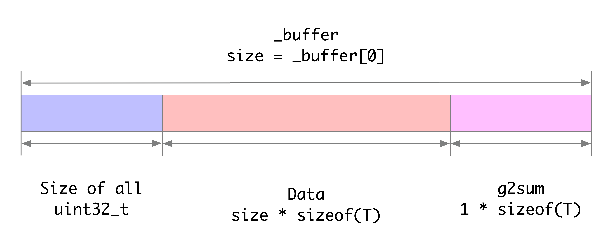

# §Ch2 SparseTable

SparseTable最核心的数据结构是SparseTableShards组成的数组。主要代码如下：
```cpp
template<class KEY, class VALUE>
class SparseTable : public Table {
	public:
		typedef SparseTableShard<KEY, VALUE> shard_type;
	private:
		std::shared_ptr<shard_type[]> _local_shards;
}
```

### FeatureValue
根据abacus_learner对SparseTable的声明：
```cpp
abacus_table::SparseTable<FeatureKey, FeatureValue> _table;
```
可以看到KEY的类型是FeatureKey（实际上是`uint64_t`的别名），VALUE的类型是FeatureValue，其主要代码如下：  
```cpp
struct FeatureValue {
    uint16_t slot;
    uint16_t unseen_days;
    double show;
    double clk;
    float lr_w;
    float lr_g2sum;
    MfArray<float> mf;
};
template<class AR>
abacus::Archive<AR>& operator<<(abacus::Archive<AR>& ar, const FeatureValue& x) {
    ar << x.slot;
    ar << x.unseen_days;
    ar << x.show << x.clk;
    ar << x.lr_w << x.lr_g2sum;
    ar << x.mf;
    return ar;
}

template<class AR>
abacus::Archive<AR>& operator>>(abacus::Archive<AR>& ar, FeatureValue& x) {
    x.version = 0;
    x.delta_score = 0;
    x.delta_updated = false;
    ar >> x.slot;
    ar >> x.unseen_days;
    ar >> x.show >> x.clk;
    ar >> x.lr_w >> x.lr_g2sum;
    ar >> x.mf;
    return ar;
}

inline abacus::Archive<abacus::TextArchiveType>& operator>> (
    abacus::Archive<abacus::TextArchiveType>& ar, FeatureValue& x) {
    x.version = 0;
    x.delta_score = 0;
    x.delta_updated = false;
    int32_t slot_id = 0;
    ar >> slot_id;
    x.slot = (uint16_t)slot_id;
    ar >> x.unseen_days;
    ar >> x.show >> x.clk;
    ar >> x.lr_w >> x.lr_g2sum;
    ar >> x.mf ;
    return ar;
}
```

### MFArray
参数是否使用多个g2sum（`s_multi_g2sum`）默认是false。这种情况下，MFArray的内存结构是：


### 主要函数
- load：将path中的数据load到table中。
```cpp
void load(const std::string& path, const std::string& converter = "");

void load_elements(abacus::Channel<std::pair<KEY, VALUE>> channel);
```

- save：将path中的数据save到table中。
```cpp
template<class FUNC = std::function<bool(int tid, const KEY& key, VALUE& value)>>

void save(const std::string& path, const std::string& converter = "", FUNC save_condition_func = nullptr, 
          const bool is_compress = true);

template<class FUNC = std::function<bool(int tid, const KEY& key, VALUE& value)>>
void save_catch_err(const std::string& path, const std::string& converter = "", FUNC save_condition_func = nullptr, 
                    const bool is_compress = true);

void save_elements(abacus::Channel<std::pair<KEY, VALUE>> channel);
```

## SparseTableShard
本质上是一个Hash Map数组。核心数据成员如下：
```cpp
static const int SPARSE_TABLE_SHARD_BUCKET_NUM_BITS = 6;
static const size_t SPARSE_TABLE_SHARD_BUCKET_NUM = (size_t)1 << SPARSE_TABLE_SHARD_BUCKET_NUM_BITS;

template<class Key, class Value>
struct alignas(64) SparseTableShard : public abacus::VirtualObject {
	typedef typename mct::closed_hash_map<Key, mct::Pointer, boost::hash<KEY>> map_type;
private:
	map_type _buckets[SPARSE_TABLE_SHARD_BUCKET_NUM];
}
```
其中，SPARSE_TABLE_SHARD_BUCKET_NUM为64。SparseTableShard内存按64位对齐。hash_map使用的是[库mct](https://launchpad.net/libmct/)中的closed_hash_map。