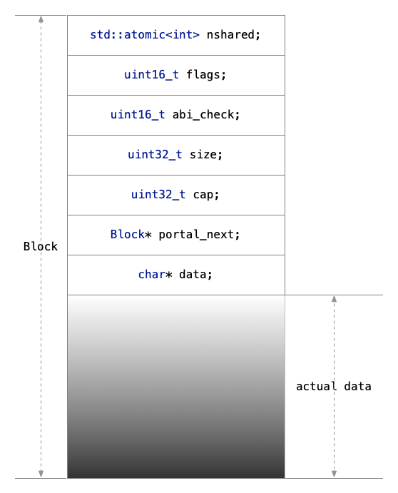

# `IOBuf`

百度内部库，已在brpc中开源。

## 1 设计思路

### 核心数据结构乃是Block

1. 对于一般的数据（非user data）来说，使用Block来进行存储。Block通过`malloc`来分配，**在内存上是紧凑**的。数据部分紧接着结构体各成员变量，数据指针指向它后面的地址。
2. 对于一般的数据（默认capacity）来说，全局共享`Block`数据结构，通过全局数据结构`TLSData`将空闲Block串起来。需要时就从其中获取，没有时再分配。
3. 自身带有共享计数变量。以此来判断是否需要放入被释放队列。
4. 默认capacity的Block，统一销毁。**减少内存分配与释放的开销耗时。**



### `IOBuf`简述

1. 对于不同的`IOBuf`来说，当涉及copy、move等相关的操作时，实际上不涉及具体数据的操作。只是通过操作`BlockRef`的指针指向的Block来完成的。**减少拷贝。**
2. 当Block的个数小于等于2时，使用small view，它是固定长度为2的数组。当大于2时，使用big view，它是可以动态分配内存的指向数组的指针。在这个方面上也是节省了内存的分配。**减少内存分配。**
3. 在brpc中的使用，主要是其实现了google protobuf的`ZeroCopyInputStream`和`ZeroCopyOutputStream`。

## 2 全局block

### 2.1 block计数

``` cpp
base::static_atomic<size_t> g_nblock = BASE_STATIC_ATOMIC_INIT(0);
base::static_atomic<size_t> g_blockmem = BASE_STATIC_ATOMIC_INIT(0);
base::static_atomic<size_t> g_newbigview = BASE_STATIC_ATOMIC_INIT(0);
```

其中，
- `g_nblock`代表了总共有多少个block。
- `g_blockmem`代表了所有block的size。
- `g_newbigview`代表了big view的个数。**（暂时没啥用。）**

### 2.2 全局变量：block链表

``` cpp
struct TLSData {
    // Head of the TLS block chain.
    IOBuf::Block* block_head;
    
    // Number of TLS blocks
    int num_blocks;
    
    // True if the remote_tls_block_chain is registered to the thread.
    bool registered;

#ifdef CACHE_IOBUF_BLOCKREFS
    // Reuse array of BlockRef
    int num_blockrefs;
    IOBuf::BlockRef* blockrefs[MAX_BLOCKREFS_PER_THREAD];
#endif
};

#ifdef CACHE_IOBUF_BLOCKREFS
static __thread TLSData g_tls_data = { NULL, 0, false, 0, {} };
#else
static __thread TLSData g_tls_data = { NULL, 0, false };
#endif
```

结构体`TLSData`是block的链表，`g_tls_data`应该是全局的一个block链表。

### 2.3 相关函数：`share_tls_block()`

执行逻辑：
- 获取全局`tls_data`的头结点`b`。
- 如果`b`不为NULL且不为full的时候，直接返回此头结点。
- 如果`b`不为NULL但为full的时候，将`new_block`设置为其的next节点，`b`减引用。**（因为初始化的时候，block的引用计数默认为1。）**
- 如果`b`为NULL且`tls_data.registered`为true时，将其设为false。再注册下*线程退出时*执行的函数，即`remove_tls_block_chain`。
- 如果`new_block`为NULL时，新建一个block（`create_block()`）。
- 将`new_block`设置为全局`tls_data`的头结点，并返回`new_block`。

``` cpp
// Get a (non-full) block from TLS.
// Notice that the block is not removed from TLS.
inline IOBuf::Block* share_tls_block() {
    TLSData& tls_data = g_tls_data;
    IOBuf::Block* const b = tls_data.block_head;
    if (b != NULL && !b->full()) {
        return b;
    }
    IOBuf::Block* new_block = NULL;
    if (b) {
        new_block = b->portal_next;
        b->dec_ref();
        --tls_data.num_blocks;
    } else if (!tls_data.registered) {
        tls_data.registered = true;
        // Only register atexit at the first time
        base::thread_atexit(remove_tls_block_chain);
    }
    if (!new_block) {
        new_block = create_block(); // may be NULL
        if (new_block) {
            ++tls_data.num_blocks;
        }
    }
    tls_data.block_head = new_block;
    return new_block;
}
```

### 2.4 相关函数：`remove_tls_block_chain()`

链表的一般删除逻辑。

**(啥时候free内存？在block的`dec_ref()`里面。)**

``` cpp
// Called in UT.
void remove_tls_block_chain() {
    TLSData& tls_data = g_tls_data;
    IOBuf::Block* b = tls_data.block_head;
    if (!b) {
        return;
    }
    tls_data.block_head = NULL;
    int n = 0;
    do {
        IOBuf::Block* const saved_next = b->portal_next;
        b->dec_ref();
        b = saved_next;
        ++n;
    } while (b);
    CHECK_EQ(n, tls_data.num_blocks);
    tls_data.num_blocks = 0;
}
```

## 3 全局函数

### 3.1 `acquire_blockref_array()`

分配了`IOBuf::INITIAL_CP`或`cap`长度的`BlockRef`数组。

``` cpp
inline IOBuf::BlockRef* acquire_blockref_array() {
#ifdef CACHE_IOBUF_BLOCKREFS
    TLSData& tls_data = g_tls_data;
    if (tls_data.num_blockrefs) {
        return tls_data.blockrefs[--tls_data.num_blockrefs];
    }
#endif
    iobuf::g_newbigview.fetch_add(1, base::memory_order_relaxed);
    return new IOBuf::BlockRef[IOBuf::INITIAL_CAP];
}

inline IOBuf::BlockRef* acquire_blockref_array(size_t cap) {
#ifdef CACHE_IOBUF_BLOCKREFS
    if (cap == IOBuf::INITIAL_CAP) {
        return acquire_blockref_array();
    }
#endif
    iobuf::g_newbigview.fetch_add(1, base::memory_order_relaxed);
    return new IOBuf::BlockRef[cap];
}
```

## 4 `IOBuf`

### 4.1 `BlockRef`

``` cpp
    struct BlockRef {
        // NOTICE: first bit of `offset' is shared with BigView::start
        uint32_t offset;
        uint32_t length;
        Block* block;
    };
```

`block`为指向`Block`的指针，`offset`为指针偏移，`length`为长度。

### 4.2 `SmallView`

``` cpp
    struct SmallView {
        BlockRef refs[2];
    };
```

`refs`是个数组，共两个元素，里面都是`BlockRef`，即指向了block的指针。

### 4.3 `BigView`

``` cpp
    struct BigView {
        int32_t magic;
        uint32_t start;
        BlockRef* refs;
        uint32_t nref;
        uint32_t cap_mask;
        size_t nbytes;

        const BlockRef& ref_at(uint32_t i) const
        { return refs[(start + i) & cap_mask]; }
        
        BlockRef& ref_at(uint32_t i)
        { return refs[(start + i) & cap_mask]; }

        uint32_t capacity() const { return cap_mask + 1; }
    };
```

成员变量有：
- `refs`为`BlockRef`指针。
- `nref`为`refs`长度。
- `nbytes`为所有`Block`存在的字节。

### 4.4 view总结

`IOBuf`的private的变量：

``` cpp
    union {
        BigView _bv;
        SmallView _sv;
    };
```

是一个union，意味着在`IOBuf`中只存在`BigView`和`SmallView`的一个。当`IOBuf`中存在两个及以下的`Block`时，使用`SmallView`；两个以上时，使用`BigView`。

### 4.5 结构体`Block`

#### 成员变量

``` cpp
    base::atomic<int> nshared;
    uint16_t flags;
    uint16_t abi_check;  // original cap, never be zero.
    uint32_t size;
    uint32_t cap;
    Block* portal_next;
    // When flag is 0, data points to `size` bytes starting at `(char*)this+sizeof(Block)'
    // When flag & IOBUF_BLOCK_FLAGS_USER_DATA is non-0, data points to the user data and
    // the deleter is put in UserDataExtension at `(char*)this+sizeof(Block)'
    char* data;
```

其中：
- `nshared`是这个block的ref count。
- `flags`代表是不是用户自己的数据，1代表是，默认0（不是）。
- `portal_next`指针，指向下一个block。

#### 构造函数

``` cpp
    Block(char* data_in, uint32_t data_size)
        : nshared(1)
        , flags(0)
        , abi_check(0)
        , size(0)
        , cap(data_size)
        , portal_next(NULL)
        , data(data_in) {
        iobuf::g_nblock.fetch_add(1, base::memory_order_relaxed);
        iobuf::g_blockmem.fetch_add(data_size + sizeof(Block),
                                    base::memory_order_relaxed);
    }

    Block(char* data_in, uint32_t data_size, UserDataDeleter deleter)
        : nshared(1)
        , flags(IOBUF_BLOCK_FLAGS_USER_DATA)
        , abi_check(0)
        , size(data_size)
        , cap(data_size)
        , portal_next(NULL)
        , data(data_in) {
        get_user_data_extension()->deleter = deleter;
    }
```

#### 其他函数
- `inc_ref()`：增加引用，即`nshared`加1。
- `dec_ref()`：减少引用，即`nshared`减1。当减少到0时，需要减少全局计数变量，`g_nblock`和`g_blockmem`。并调用`Block`析构函数，`free` this。**（为啥这么操作呢？因为内存是调用`malloc`分配的，且用的placement new构造。）**
- `ref_count()`：返回引用，即`nshared`。
- `full()`：
- `left_space()`：

#### 相关函数：`create_block()`

创建一个block：
- 分配`block_size`个长度的内存`mem`，默认大小`DEFAULT_BLOCK_SIZE = 8192`
- 在这块内存上直接调用placement new来创建一个block，参数分别为：
  - `data`：`mem + sizeof(IOBuf::Block)`，即data指针紧接着block结构体的成员变量。
  - `size`：`block_size - sizeof(IOBuf::Block)`。

``` cpp
inline IOBuf::Block* create_block(const size_t block_size) {
    if (block_size > 0xFFFFFFFFULL) {
        LOG(FATAL) << "block_size=" << block_size << " is too large";
        return NULL;
    }
    char* mem = (char*)iobuf::blockmem_allocate(block_size);
    if (mem == NULL) {
        return NULL;
    }
    return new (mem) IOBuf::Block(mem + sizeof(IOBuf::Block),
                                  block_size - sizeof(IOBuf::Block));
}

inline IOBuf::Block* create_block() {
    return create_block(IOBuf::DEFAULT_BLOCK_SIZE);
}
```

### 4.6 `_push_or_move_back_ref_to_smallview()`

执行逻辑：
- 默认small view。
- 当`refs[0]`为NULL时，将`r`赋值给`refs[0]`。*当不为MOVE时，对`r.block`增加引用。*返回。
- 当`refs[1]`为NULL时，
  - 如果`refs[0]`指向的block和`r`指向的block是一致的，且`r`的数据是紧接在`refs[0]`之后的。将`r`合并到`refs[0]`上。合并的步骤就是增加下`refs[0].length`，即其长度。*对MOVE时，`r.block`减少引用。*
  - 否则，直接将`refs[1]`指向`r`。*当非MOVE时，增加引用。*
  - 返回。
- 如果`refs[1]`指向的block和`r`指向的block是一致的，且`r`的数据是紧接在`refs[1]`之后的。将`r`合并到`refs[1]`上。合并的步骤就是增加下`refs[1].length`，即其长度。*对MOVE时，`r.block`减少引用。*
- 在以上条件都不满足的情况下，意味着单只有两个`refs`是不够的。所以转向更大的ref数据。
- 先申请ref数组（函数：`iobuf::acquire_blockref_array()`，默认大小32），并将small view的ref（共两个ref）复制到big view的ref。并将`r`赋值给`refs[2]`。*当非MOVE的情况时，`r.block`增加引用。*
- big view初始化为：`magic = -1, start = 0, refs = new_refs, nref = 3, cap_mask = INITIAL_CAP - 1, nbytes = new_nbytes`。**（由此可见，big view的`nrefs`的意思是有效的refs数组长度，`nbytes`代表总共多少字节数据，`cap_mask`是ref数组长度减1，感觉以后会在位运算中用到。**

``` cpp
template <bool MOVE>
void IOBuf::_push_or_move_back_ref_to_smallview(const BlockRef& r) {
    BlockRef* const refs = _sv.refs;
    if (NULL == refs[0].block) {
        refs[0] = r;
        if (!MOVE) {
            r.block->inc_ref();
        }
        return;
    }
    if (NULL == refs[1].block) {
        if (refs[0].block == r.block &&
            refs[0].offset + refs[0].length == r.offset) { // Merge ref
            refs[0].length += r.length;
            if (MOVE) {
                r.block->dec_ref();
            }
            return;
        }
        refs[1] = r;
        if (!MOVE) {
            r.block->inc_ref();
        }
        return;
    }
    if (refs[1].block == r.block &&
        refs[1].offset + refs[1].length == r.offset) { // Merge ref
        refs[1].length += r.length;
        if (MOVE) {
            r.block->dec_ref();
        }
        return;
    }
    // Convert to BigView
    BlockRef* new_refs = iobuf::acquire_blockref_array();
    new_refs[0] = refs[0];
    new_refs[1] = refs[1];
    new_refs[2] = r;
    const size_t new_nbytes = refs[0].length + refs[1].length + r.length;
    if (!MOVE) {
        r.block->inc_ref();
    }
    _bv.magic = -1;
    _bv.start = 0;
    _bv.refs = new_refs;
    _bv.nref = 3;
    _bv.cap_mask = INITIAL_CAP - 1;
    _bv.nbytes = new_nbytes;
}
```

### 4.7 `_push_or_move_back_ref_to_bigview()`

执行逻辑：
- 获得最后一个`Block`为`back`。如果`block`指向的block和`r`指向的block是一致的，且`r`的数据是紧接在`block`之后的。将`r`合并到`block`上。合并的步骤就是增加下`block.length`，即其长度。*对MOVE时，`r.block`减少引用。*
- 如果目前block的个数不等于总体的capacity时（即小于），将`r`放在`refs`数组的最后一个。*在非MOVE情况下，`r.block`增加引用。*
- 以上情况都不满足，即block的个数已经到了capacity的时候了，新建一个block ref的数组，大小为当前capacity的2倍。然后将`r`放在`refs`数组的最后一个。*在非MOVE情况下，`r.block`增加引用。*

``` cpp
template <bool MOVE>
void IOBuf::_push_or_move_back_ref_to_bigview(const BlockRef& r) {
    BlockRef& back = _bv.ref_at(_bv.nref - 1);
    if (back.block == r.block && back.offset + back.length == r.offset) {
        // Merge ref
        back.length += r.length;
        _bv.nbytes += r.length;
        if (MOVE) {
            r.block->dec_ref();
        }
        return;
    }

    if (_bv.nref != _bv.capacity()) {
        _bv.ref_at(_bv.nref++) = r;
        _bv.nbytes += r.length;
        if (!MOVE) {
            r.block->inc_ref();
        }
        return;
    }
    // resize, don't modify bv until new_refs is fully assigned
    const uint32_t new_cap = _bv.capacity() * 2;
    BlockRef* new_refs = iobuf::acquire_blockref_array(new_cap);
    for (uint32_t i = 0; i < _bv.nref; ++i) {
        new_refs[i] = _bv.ref_at(i);
    }
    new_refs[_bv.nref++] = r;

    // Change other variables
    _bv.start = 0;
    iobuf::release_blockref_array(_bv.refs, _bv.capacity());
    _bv.refs = new_refs;
    _bv.cap_mask = new_cap - 1;
    _bv.nbytes += r.length;
    if (!MOVE) {
        r.block->inc_ref();
    }
}
```

### 4.8 `push_back()`单个字符和`append()`字符串

#### 单个字符

调用`share_tls_block()`获取一个block`b`，将输入参数字符`c`放入`b`中，利用其创建一个`BlockRef r`，然后将它`_push_back_ref()`。

#### 字符串

循环地：调用`share_tls_block()`获取一个block`b`，尽量将字符串写入其中（需要写的字符串大小和可容纳的字符串大小的最小值），利用此block创建ref，并调用`_push_back_ref()`。

``` cpp
int IOBuf::push_back(char c) {
    IOBuf::Block* b = iobuf::share_tls_block();
    if (BAIDU_UNLIKELY(!b)) {
        return -1;
    }
    b->data[b->size] = c;
    const IOBuf::BlockRef r = { b->size, 1, b };
    ++b->size;
    _push_back_ref(r);
    return 0;
}

int IOBuf::append(char const* s) {
    if (BAIDU_LIKELY(s != NULL)) {
        return append(s, strlen(s));
    }
    return -1;
}

inline int IOBufAppender::append(const StringPiece& str) {
    return append(str.data(), str.size());
}

int IOBuf::append(void const* data, size_t count) {
    if (BAIDU_UNLIKELY(!data)) {
        return -1;
    }
    if (count == 1) {
        return push_back(*((char const*)data));
    }
    size_t total_nc = 0;
    while (total_nc < count) {  // excluded count == 0
        IOBuf::Block* b = iobuf::share_tls_block();
        if (BAIDU_UNLIKELY(!b)) {
            return -1;
        }
        const size_t nc = std::min(count - total_nc, b->left_space());
        iobuf::cp(b->data + b->size, (char*)data + total_nc, nc);
        
        const IOBuf::BlockRef r = { (uint32_t)b->size, (uint32_t)nc, b };
        _push_back_ref(r);
        b->size += nc;
        total_nc += nc;
    }
    return 0;
}

```

### 4.9 `append()`一个`IOBuf`或`Movable`

#### append一个`IOBuf`

遍历`other`，将其的每个ref push back到`this`里面。

#### append一个`Movable`

- 如果empty的话，直接和`movable_other`进行swap。
- 不为empty的话，对`other`的每个ref move到`this`这里。如果`other`用的是big view的话，将`other`的refs delete掉。再在`other`上用placement new构造一个新的`IOBuf`。

``` cpp
void IOBuf::append(const IOBuf& other) {
    const size_t nref = other._ref_num();
    for (size_t i = 0; i < nref; ++i) {
        _push_back_ref(other._ref_at(i));
    }
}

void IOBuf::append(const Movable& movable_other) {
    if (empty()) {
        swap(movable_other.value());
    } else {
        base::IOBuf& other = movable_other.value();
        const size_t nref = other._ref_num();
        for (size_t i = 0; i < nref; ++i) {
            _move_back_ref(other._ref_at(i));
        }
        if (!other._small()) {
            iobuf::release_blockref_array(other._bv.refs, other._bv.capacity());
        }
        new (&other) IOBuf;
    }
}
```

### 4.10 `clear()`

- 在small view下，对两个block减引用，并reset。
- 在big view下，对所有的block减引用，并释放refs数组的内存，并在`this`的基础上调用placement new重新创建对象。

``` cpp
void IOBuf::clear() {
    if (_small()) {
        if (_sv.refs[0].block != NULL) {
            _sv.refs[0].block->dec_ref();
            reset_block_ref(_sv.refs[0]);
                        
            if (_sv.refs[1].block != NULL) {
                _sv.refs[1].block->dec_ref();
                reset_block_ref(_sv.refs[1]);
            }
        }
    } else {
        for (uint32_t i = 0; i < _bv.nref; ++i) { 
            _bv.ref_at(i).block->dec_ref();
        }
        iobuf::release_blockref_array(_bv.refs, _bv.capacity());
        new (this) IOBuf;
    }
}
```

### 4.11 `pop_front()` & `pop_back()`

#### 从前面pop

- 当需要pop的大小`n`大于len的时候，直接调用`clear()`。
- 否则，依次从队列的最前面拿到一个ref。
  - 如果当前ref的block长度大于等于`n`，从其中缩减`n`的字符，并返回。
  - 如果当前ref的block长度不足`n`，将此ref pop后（`_pop_front_ref`），拿取下一个ref。直到pop了`n`个字符。

#### 从后面pop

`pop_back()`和`pop_front()`唯一的区别就是取ref和pop ref的位置。

``` cpp
size_t IOBuf::pop_front(size_t n) {
    const size_t len = length();
    if (n >= len) {
        clear();
        return len;
    }
    const size_t saved_n = n;
    while (n) {  // length() == 0 does not enter
        IOBuf::BlockRef &r = _front_ref();
        if (r.length > n) {
            r.offset += n;
            r.length -= n;
            if (!_small()) {
                _bv.nbytes -= n;
            }
            return saved_n;
        }
        n -= r.length;
        _pop_front_ref();
    }
    return saved_n;
}

size_t IOBuf::pop_back(size_t n) {
    const size_t len = length();
    if (n >= len) {
        clear();
        return len;
    }
    const size_t saved_n = n;
    while (n) {  // length() == 0 does not enter
        IOBuf::BlockRef &r = _back_ref();
        if (r.length > n) {
            r.length -= n;
            if (!_small()) {
                _bv.nbytes -= n;
            }
            return saved_n;
        }
        n -= r.length;
        _pop_back_ref();
    }
    return saved_n;
}
```

### 4.12 `_pop_front_ref()` & `_pop_back_ref()`

#### pop最前面的ref

- 当为small view时，当`refs[0]`不为NULL时（即至少有一个block时），对其指向的block减引用，并返回0。否则（当一个block都没有时），返回-1。
- 否则（当为big view时），将最前面（start位置）的ref指向的block减引用。
  - 当`--nref`大于2时，修改下`start`即可。
  - 否则，将其转换为small view，并delete掉ref数组。

#### pop最后面的ref

- 当为small view时，如果`refs[1]`不为NULL时，对其指向的block减引用，并返回0；如果`refs[0]`不为NULL时，对其指向的block减引用，并返回0；否则（空的），返回-1。
- 当为big view时，获得最后面一个block且减引用。
  - 当`--nref`大于2时，修改下`nbytes`即可。
  - 否则，转换为small view，并delete掉ref数组。

``` cpp
int IOBuf::_pop_front_ref() {
    if (_small()) {
        if (_sv.refs[0].block != NULL) {
            _sv.refs[0].block->dec_ref();
            _sv.refs[0] = _sv.refs[1];
            reset_block_ref(_sv.refs[1]);
            return 0;
        }
        return -1;
    } else {
        // _bv.nref must be greater than 2
        const uint32_t start = _bv.start;
        _bv.refs[start].block->dec_ref();
        if (--_bv.nref > 2) {
            _bv.start = (start + 1) & _bv.cap_mask;
            _bv.nbytes -= _bv.refs[start].length;
        } else {  // count==2, fall back to SmallView
            BlockRef* const saved_refs = _bv.refs;
            const uint32_t saved_cap_mask = _bv.cap_mask;
            _sv.refs[0] = saved_refs[(start + 1) & saved_cap_mask];
            _sv.refs[1] = saved_refs[(start + 2) & saved_cap_mask];
            iobuf::release_blockref_array(saved_refs, saved_cap_mask + 1);
        }
        return 0;
    }
}

int IOBuf::_pop_back_ref() {
    if (_small()) {
        if (_sv.refs[1].block != NULL) {
            _sv.refs[1].block->dec_ref();
            reset_block_ref(_sv.refs[1]);
            return 0;
        } else if (_sv.refs[0].block != NULL) {
            _sv.refs[0].block->dec_ref();
            reset_block_ref(_sv.refs[0]);
            return 0;
        }
        return -1;
    } else {
        // _bv.nref must be greater than 2
        const uint32_t start = _bv.start;
        IOBuf::BlockRef& back = _bv.refs[(start + _bv.nref - 1) & _bv.cap_mask];
        back.block->dec_ref();
        if (--_bv.nref > 2) {
            _bv.nbytes -= back.length;
        } else {  // count==2, fall back to SmallView
            BlockRef* const saved_refs = _bv.refs;
            const uint32_t saved_cap_mask = _bv.cap_mask;
            _sv.refs[0] = saved_refs[start];
            _sv.refs[1] = saved_refs[(start + 1) & saved_cap_mask];
            iobuf::release_blockref_array(saved_refs, saved_cap_mask + 1);
        }
        return 0;
    }
}
```

### 4.13 `cutn()`

#### 截取`n`个字符到`IOBuf*`

- 不断循环：
  - 获取最前面的ref。
  - 当这个ref的长度小于`n`时，直接将这个ref放到`out`的最后面，并从`this`中pop出来。
  - 否则，截取此ref指向的block前`n`个，push到`out`的最后面。并且从此ref中减去`n`的长度。

#### 截取`n`个字符到`void*`

和上面的操作区别不大，只是不再会将ref放到`out`的后面，而是利用`iobuf::cp()`（即`memcpy`）来拷贝数据。

#### 截取`n`个字符到`std::string*`

实际上是调用的上一个函数，将`std::string*`转换为了`void*`。

``` cpp
size_t IOBuf::cutn(IOBuf* out, size_t n) {
    const size_t len = length();
    if (n > len) {
        n = len;
    }
    const size_t saved_n = n;
    while (n) {   // length() == 0 does not enter
        IOBuf::BlockRef &r = _front_ref();
        if (r.length <= n) {
            out->_push_back_ref(r);
            n -= r.length;
            _pop_front_ref();
        } else {
            const IOBuf::BlockRef cr = { r.offset, (uint32_t)n, r.block };
            out->_push_back_ref(cr);
            
            r.offset += n;
            r.length -= n;
            if (!_small()) {
                _bv.nbytes -= n;
            }
            return saved_n;
        }
    }
    return saved_n;
}

size_t IOBuf::cutn(void* out, size_t n) {
    const size_t len = length();
    if (n > len) {
        n = len;
    }
    const size_t saved_n = n;
    while (n) {   // length() == 0 does not enter
        IOBuf::BlockRef &r = _front_ref();
        if (r.length <= n) {
            iobuf::cp(out, r.block->data + r.offset, r.length);
            out = (char*)out + r.length;
            n -= r.length;
            _pop_front_ref();
        } else {
            iobuf::cp(out, r.block->data + r.offset, n);
            out = (char*)out + n;
            r.offset += n;
            r.length -= n;
            if (!_small()) {
                _bv.nbytes -= n;
            }
            return saved_n;
        }
    }
    return saved_n;
}

size_t IOBuf::cutn(std::string* out, size_t n) {
    if (n == 0) {
        return 0;
    }
    const size_t len = length();
    if (n > len) {
        n = len;
    }
    const size_t old_size = out->size();
    out->resize(out->size() + n);
    cutn(&out[0][old_size], n);
    return n;
}
```

### 4.14 `cut_until()`

以下两个函数最大的区别是第二个参数类型不同。除此之外，逻辑类似。当长度为1时，调用`_cut_by_char()`；否则，调用`_cut_by_delim`。

#### `_cut_by_char()`

遍历所有的ref，直到找到这个delim（即`d`）。用`cutn()`来拷贝数据，利用`pop_front()`来pop出来这个的delim。

*<font color=red>是不是遍历完一个ref，就拷贝一个ref比较好。现在是最后拷贝一次。</font>*

#### `_cut_by_delim()`

这里和上面的逻辑差不多，只是比较的时候是多个比较，且为了效率用到了位运算。可以自己运算试下，很有意思。

*备注：这个函数返回的情况是以整个的传入的字符串作为分割符，而非只满足一个字符即可。*

``` cpp
inline int IOBuf::cut_until(IOBuf* out, char const* delim) {
    if (*delim) {
        if (!*(delim+1)) {
            return _cut_by_char(out, *delim);
        } else {
            return _cut_by_delim(out, delim, strlen(delim));
        }
    }
    return -1;
}

inline int IOBuf::cut_until(IOBuf* out, const std::string& delim) {
    if (delim.length() == 1UL) {
        return _cut_by_char(out, delim[0]);
    } else if (delim.length() > 1UL) {
        return _cut_by_delim(out, delim.data(), delim.length());
    } else {
        return -1;
    }
}

int IOBuf::_cut_by_char(IOBuf* out, char d) {
    const size_t nref = _ref_num();
    size_t n = 0;
    
    for (size_t i = 0; i < nref; ++i) {
        IOBuf::BlockRef const& r = _ref_at(i);
        char const* const s = r.block->data + r.offset;
        for (uint32_t j = 0; j < r.length; ++j, ++n) {
            if (s[j] == d) {
                // There's no way cutn/pop_front fails
                cutn(out, n);
                pop_front(1);
                return 0;
            }
        }
    }

    return -1;
}

int IOBuf::_cut_by_delim(IOBuf* out, char const* dbegin, size_t ndelim) {
    typedef unsigned long SigType;
    const size_t NMAX = sizeof(SigType);
    
    if (ndelim > NMAX || ndelim > length()) {
        return -1;
    }
    
    SigType dsig = 0;
    for (size_t i = 0; i < ndelim; ++i) {
        dsig = (dsig << CHAR_BIT) | static_cast<SigType>(dbegin[i]);
    }
    
    const SigType SIGMASK =
        (ndelim == NMAX ? (SigType)-1 : (((SigType)1 << (ndelim * CHAR_BIT)) - 1));

    const size_t nref = _ref_num();
    SigType sig = 0;
    size_t n = 0;

    for (size_t i = 0; i < nref; ++i) {
        IOBuf::BlockRef const& r = _ref_at(i);
        char const* const s = r.block->data + r.offset;
        
        for (uint32_t j = 0; j < r.length; ++j, ++n) {
            sig = ((sig << CHAR_BIT) | static_cast<SigType>(s[j])) & SIGMASK;
            if (sig == dsig) {
                // There's no way cutn/pop_front fails
                cutn(out, n + 1 - ndelim);
                pop_front(ndelim);
                return 0;
            }
        }
    }

    return -1;
}
```

### 4.15 `copy_to()` & `append_to()` & `copy_to_cstr()` & `to_string()`

#### 第一个参数是`void*`的`copy_to()`

- 先根据`pos`（起始拷贝的位置），遍历ref，找到需要拷贝的起始位置。
- 遍历ref，使用`iobuf::cp()`进行拷贝。

#### 第一个参数是`std::string*`的`copy_to()`

主要内容即是调用上一个`copy_to()`。

注意，以上两个函数，
- `n`默认参数为`(size_t)-1L`，因为`size_t`是无符号的，所以这次无穷大，即拷贝到尾。
- `pos`默认参数是0，即从头开始拷贝。

#### 第一个参数是`IOBuf*`的`copy_to()`

这种调用是不被允许的。*这里摘录下来是可以看下它的设计方法。*

#### 拷贝到c-style字符串`copy_to_cstr()`

主要内容即是调用`copy_to(void* d, xxx)`，然后在结尾加上一个`\0`。

#### 将`IOBuf`转换为`string`

调用`copy_to(std::string*)`。

``` cpp
size_t IOBuf::copy_to(void* d, size_t n, size_t pos) const {
    const size_t nref = _ref_num();
    // Skip `pos' bytes. `offset' is the starting position in starting BlockRef.
    size_t offset = pos;
    size_t i = 0;
    for (; offset != 0 && i < nref; ++i) {
        IOBuf::BlockRef const& r = _ref_at(i);
        if (offset < (size_t)r.length) {
            break;
        }
        offset -= r.length;
    }
    size_t m = n;
    for (; m != 0 && i < nref; ++i) {
        IOBuf::BlockRef const& r = _ref_at(i);
        const size_t nc = std::min(m, (size_t)r.length - offset);
        iobuf::cp(d, r.block->data + r.offset + offset, nc);
        offset = 0;
        d = (char*)d + nc;
        m -= nc;
    }
    // If nref == 0, here returns 0 correctly
    return n - m;
}

size_t IOBuf::copy_to(std::string* s, size_t n, size_t pos) const {
    const size_t len = length();
    if (n + pos > len) {
        if (len <= pos) {
            return 0;
        }
        n = len - pos;
    }
    s->resize(n);
    return copy_to(&(*s)[0], n, pos);
}

    // Explicitly declare this overload as error to avoid copy_to(base::IOBuf*)
    // from being interpreted as copy_to(void*) by the compiler (which causes
    // undefined behavior).
    size_t copy_to(IOBuf* buf, size_t n = (size_t)-1L, size_t pos = 0) const
    // the error attribute in not available in gcc 3.4
#if defined(__GNUC__) && (__GNUC__ > 4 || (__GNUC__ == 4 && __GNUC_MINOR__ >= 8))
        __attribute__ (( error("Call append_to(IOBuf*) instead") ))
#endif
        ;

size_t IOBuf::copy_to_cstr(char* s, size_t n, size_t pos) const {
    const size_t nc = copy_to(s, n, pos);
    s[nc] = '\0';
    return nc;
}

inline std::string IOBuf::to_string() const {
    std::string s;
    copy_to(&s);
    return s;
}
```

### 4.16 `resize()`

- 当`n`小于总体长度时，会调用`pop_back()`。
- 否则，循环获得新的block，调用`memset`设置值，并利用其创建ref，调用`_push_back_ref()`。

``` cpp
int IOBuf::resize(size_t n, char c) {
    const size_t saved_len = length();
    if (n < saved_len) {
        pop_back(saved_len - n);
        return 0;
    }
    const size_t count = n - saved_len;
    size_t total_nc = 0;
    while (total_nc < count) {  // excluded count == 0
        IOBuf::Block* b = iobuf::share_tls_block();
        if (BAIDU_UNLIKELY(!b)) {
            return -1;
        }
        const size_t nc = std::min(count - total_nc, b->left_space());
        memset(b->data + b->size, c, nc);
        
        const IOBuf::BlockRef r = { (uint32_t)b->size, (uint32_t)nc, b };
        _push_back_ref(r);
        b->size += nc;
        total_nc += nc;
    }
    return 0;
}
```

### 4.17 `reserve()`

和`resize()`在`n`大于总体长度时没有太大区别，都是获得新的block，（但不调用`memset`设置值了）并利用其创建ref，调用`_push_back_ref()`。

*<font color=red>TODO:`Area`咋用的？暂时先不看。</font>*

``` cpp
IOBuf::Area IOBuf::reserve(size_t count) {
    IOBuf::Area result = INVALID_AREA;
    size_t total_nc = 0;
    while (total_nc < count) {  // excluded count == 0
        IOBuf::Block* b = iobuf::share_tls_block();
        if (BAIDU_UNLIKELY(!b)) {
            return INVALID_AREA;
        }
        const size_t nc = std::min(count - total_nc, b->left_space());
        const IOBuf::BlockRef r = { (uint32_t)b->size, (uint32_t)nc, b };
        _push_back_ref(r);
        if (total_nc == 0) {
            // Encode the area at first time. Notice that the pushed ref may
            // be merged with existing ones.
            result = make_area(_ref_num() - 1, _back_ref().length - nc, count);
        }
        total_nc += nc;
        b->size += nc;
    }
    return result;
}
```

### 4.18 `fetch()` & `fetch1()`

#### fetch多个数据

- 当`n`小于第0个ref指向的block的长度，直接返回第一个block指向数据的指针。
- 否则，将其复制到`d`里面。并循环遍历其他所有的ref，将ref指向block的数据赋值到`d`。最后返回`d`。

#### fetch 1个数据

和上一个函数的第一种情况类似，直接返回第一个ref指向的block的数据指针。

``` cpp
void const* IOBuf::fetch(void* d, size_t n) const {
    if (n <= length() && n > 0) {
        IOBuf::BlockRef const& r0 = _ref_at(0);
        if (n <= r0.length) {
            return r0.block->data + r0.offset;
        }
    
        iobuf::cp(d, r0.block->data + r0.offset, r0.length);
        size_t total_nc = r0.length;
        const size_t nref = _ref_num();
        for (size_t i = 1; i < nref; ++i) {
            IOBuf::BlockRef const& r = _ref_at(i);
            if (n <= r.length + total_nc) {
                iobuf::cp((char*)d + total_nc,
                            r.block->data + r.offset, n - total_nc);
                return d;
            }
            iobuf::cp((char*)d + total_nc, r.block->data + r.offset, r.length);
            total_nc += r.length;
        }
    }
    return NULL;
}

const void* IOBuf::fetch1() const {
    if (!empty()) {
        const IOBuf::BlockRef& r0 = _front_ref();
        return r0.block->data + r0.offset;
    }
    return NULL;
}
```

### 4.19 `equals()`

这个比较是elementwise的。即将`this`的refs指向的block的每个字符和字符串中的每个字符（下面第一个函数）或`other`的refs指向的block的每个字符做比较（下面第二个函数）。

``` cpp
bool IOBuf::equals(const base::StringPiece& s) const {
    if (size() != s.size()) {
        return false;
    }
    const size_t nref = _ref_num();
    size_t soff = 0;
    for (size_t i = 0; i < nref; ++i) {
        const BlockRef& r = _ref_at(i);
        if (memcmp(r.block->data + r.offset, s.data() + soff, r.length) != 0) {
            return false;
        }
        soff += r.length;
    }
    return true;
}

StringPiece IOBuf::backing_block(size_t i) const {
    if (i < _ref_num()) {
        const BlockRef& r = _ref_at(i);
        return StringPiece(r.block->data + r.offset, r.length);
    }
    return StringPiece();
}

bool IOBuf::equals(const base::IOBuf& other) const {
    const size_t sz1 = size();
    if (sz1 != other.size()) {
        return false;
    }
    if (!sz1) {
        return true;
    }
    const BlockRef& r1 = _ref_at(0);
    const char* d1 = r1.block->data + r1.offset;
    size_t len1 = r1.length;
    const BlockRef& r2 = other._ref_at(0);
    const char* d2 = r2.block->data + r2.offset;
    size_t len2 = r2.length;
    const size_t nref1 = _ref_num();
    const size_t nref2 = other._ref_num();
    size_t i = 1;
    size_t j = 1;
    do {
        const size_t cmplen = std::min(len1, len2);
        if (memcmp(d1, d2, cmplen) != 0) {
            return false;
        }
        len1 -= cmplen;
        if (!len1) {
            if (i >= nref1) {
                return true;
            }
            const BlockRef& r = _ref_at(i++);
            d1 = r.block->data + r.offset;
            len1 = r.length;
        } else {
            d1 += cmplen;
        }
        len2 -= cmplen;
        if (!len2) {
            if (j >= nref2) {
                return true;
            }
            const BlockRef& r = other._ref_at(j++);
            d2 = r.block->data + r.offset;
            len2 = r.length;
        } else {
            d2 += cmplen;
        }
    } while (true);
    return true;
}
```

### 4.20 `operator<<`

遍历block，利用数据构造一个`StringPiece`，并调用`std::ostream::write()`输出。

``` cpp
std::ostream& operator<<(std::ostream& os, const IOBuf& buf) {
    const size_t n = buf.backing_block_num();
    for (size_t i = 0; i < n; ++i) {
        StringPiece blk = buf.backing_block(i);
        os.write(blk.data(), blk.size());
    }
    return os;
}
```

## 5 `IOBufBytesIterator`

### 5.1 主要成员变量

- `_block_begin`：当前block开始位置指针。
- `_block_end`：当前block结束位置指针。
- `_block_count`：当前`IOBuf`的block的index。
- `_bytes_left`：当前`IOBuf`的总长度减去已读的长度。

``` cpp
    const char* _block_begin;
    const char* _block_end;
    uint32_t _block_count;
    uint32_t _bytes_left;
```

### 5.2 `try_next_block()`

获取下一个block，并设置`_block_begin`、`_block_end`。

由下面可以看到，这个函数的调用多是用来在函数的**最后面**，当当前block遍历完成时，即`_block_end == _block_begin`时，切换到下一个block。

``` cpp
inline void IOBufBytesIterator::try_next_block() {
    if (_bytes_left == 0) {
        return;
    }
    base::StringPiece s = _buf->backing_block(_block_count++);
    _block_begin = s.data();
    _block_end = s.data() + std::min(s.size(), (size_t)_bytes_left);
}
```

### 5.3 构造函数

- 设定成员变量。
- 调用`try_next_block()`，将block相关指针指向第0个。

``` cpp
inline IOBufBytesIterator::IOBufBytesIterator(const base::IOBuf& buf)
    : _block_begin(NULL), _block_end(NULL), _block_count(0), 
      _bytes_left(buf.length()), _buf(&buf) {
    try_next_block();
}
```

### 5.4 `copy_and_forward()` & `append_and_forward()`

#### copy到字符串：`copy_and_forward()`

- 计算当前block可读取的size，并将其copy至buf或string。
- 往后遍历block，直到拷贝了`n`个字节或直到此`IOBuf`结束。

#### append到`IOBuf`：`append_and_forward()`

- 利用当前block创建一个ref，把这个ref放到`buf`后面。
- 往后遍历block，直到拷贝了`n`个字节或直到此`IOBuf`结束。

可以看到这两个函数的主要区别，一个是需要copy到字符串，一个是append到`IOBuf`。这里说append，主要是和copy不同，是完全不需要拷贝的，只是创建一个ref，将其push到传入`IOBuf`参数的refs的最后面。

``` cpp
inline size_t IOBufBytesIterator::copy_and_forward(void* buf, size_t n) {
    size_t nc = 0;
    while (nc < n && *this != NULL) {
        const size_t block_size = _block_end - _block_begin;
        const size_t to_copy = std::min(block_size, n - nc);
        fast_memcpy((char*)buf + nc, _block_begin, to_copy);
        _block_begin += to_copy;
        _bytes_left -= to_copy;
        nc += to_copy;
        if (_block_begin == _block_end) {
            try_next_block();
        }
    }
    return nc;
}

inline size_t IOBufBytesIterator::copy_and_forward(std::string* s, size_t n) {
    bool resized = false;
    if (s->size() < n) {
        resized = true;
        s->resize(n);
    }
    const size_t nc = copy_and_forward(const_cast<char*>(s->data()), n);
    if (nc < n && resized) {
        s->resize(nc);
    }
    return nc;
}

size_t IOBufBytesIterator::append_and_forward(base::IOBuf* buf, size_t n) {
    size_t nc = 0;
    while (nc < n && _bytes_left != 0) {
        const IOBuf::BlockRef& r = _buf->_ref_at(_block_count - 1);
        const size_t block_size = _block_end - _block_begin;
        const size_t to_copy = std::min(block_size, n - nc);
        IOBuf::BlockRef r2 = { (uint32_t)(_block_begin - r.block->data),
                               (uint32_t)to_copy, r.block };
        buf->_push_back_ref(r2);
        _block_begin += to_copy;
        _bytes_left -= to_copy;
        nc += to_copy;
        if (_block_begin == _block_end) {
            try_next_block();
        }
    }
    return nc;
}
```

### 5.5 `operator++()` & `forward()`

这两个函数总体逻辑差不多，唯一的区别是一个往前走1个字节，另一个往前走`n`个字节。所以`operator++()`设计1个block，而`forward()`涉及多个block。

``` cpp
inline void IOBufBytesIterator::operator++() {
    ++_block_begin;
    --_bytes_left;
    if (_block_begin == _block_end) {
        try_next_block();
    }
}

inline size_t IOBufBytesIterator::forward(size_t n) {
    size_t nc = 0;
    while (nc < n && _bytes_left != 0) {
        const size_t block_size = _block_end - _block_begin;
        const size_t to_copy = std::min(block_size, n - nc);
        _block_begin += to_copy;
        _bytes_left -= to_copy;
        nc += to_copy;
        if (_block_begin == _block_end) {
            try_next_block();
        }
    }
    return nc;
}
```

## 6 `IOBufAsZeroCopyInputStream`：Parse protobuf message from `IOBuf`

### 6.1 成员变量

``` cpp
    int _ref_index;
    int _add_offset;
```

- `_ref_index`：记录`IOBuf`指向的ref的index。
- `_add_offset`：记录当前ref指向的block的offset，注意和ref的offset不同。

### 6.2 成员函数

- `Next()`：返回当前block的数据。
- `BackUp()`：先往后找一个ref，移动的count作用到`_add_offset`上。因为一次`Next()`调用返回的一个block，所以传入的`count`不能大于当前ref的长度。
- `Skip()`：往前移动`count`个bytes，如果它大于当前ref的长度，则往后找一个ref。循环下去直到没有ref了，或当前ref的长度大于剩余的`count`了。

``` cpp
IOBufAsZeroCopyInputStream::IOBufAsZeroCopyInputStream(const IOBuf& buf)
    : _ref_index(0)
    , _add_offset(0)
    , _byte_count(0)
    , _buf(&buf) {
}

bool IOBufAsZeroCopyInputStream::Next(const void** data, int* size) {
    const IOBuf::BlockRef* cur_ref = _buf->_pref_at(_ref_index);
    if (cur_ref == NULL) {
        return false;
    }
    *data = cur_ref->block->data + cur_ref->offset + _add_offset;
    // Impl. of Backup/Skip guarantees that _add_offset < cur_ref->length.
    *size = cur_ref->length - _add_offset;
    _byte_count += cur_ref->length - _add_offset;
    _add_offset = 0;
    ++_ref_index;
    return true;
}

void IOBufAsZeroCopyInputStream::BackUp(int count) {
    if (_ref_index > 0) {
        const IOBuf::BlockRef* cur_ref = _buf->_pref_at(--_ref_index);
        CHECK(_add_offset == 0 && cur_ref->length >= (uint32_t)count)
            << "BackUp() is not after a Next()";
        _add_offset = cur_ref->length - count;
        _byte_count -= count;
    } else {
        LOG(FATAL) << "BackUp an empty ZeroCopyInputStream";
    }
}

// Skips a number of bytes.  Returns false if the end of the stream is
// reached or some input error occurred.  In the end-of-stream case, the
// stream is advanced to the end of the stream (so ByteCount() will return
// the total size of the stream).
bool IOBufAsZeroCopyInputStream::Skip(int count) {
    const IOBuf::BlockRef* cur_ref = _buf->_pref_at(_ref_index);
    while (cur_ref) {
        const int left_bytes = cur_ref->length - _add_offset;
        if (count < left_bytes) {
            _add_offset += count;
            _byte_count += count;
            return true;
        }
        count -= left_bytes;
        _add_offset = 0;
        _byte_count += left_bytes;
        cur_ref = _buf->_pref_at(++_ref_index);
    }
    return false;
}

google::protobuf::int64 IOBufAsZeroCopyInputStream::ByteCount() const {
    return _byte_count;
}
```

## 7 `IOBufAsZeroCopyOutputStream`：Serialize protobuf message into `IOBuf`

### 7.1 成员变量

``` cpp
    uint32_t _block_size;
    IOBuf::Block *_cur_block;
```

- `_block_size`：保存构造时传入的`block_size`参数，默认为0。可以从代码中看到：
  - 当获取block时，如果`_block_size`为0，那么就直接从全局`tls_data`里面获取一个block。否则，创建一个`_block_size`大小的新的block。
  - 反过来，`_block_size`为0时，意味着这个block是否从全局`tls_data`中获得，也就意味着是不是需要直接析构（即不放回全局`tls_data`）。
- `_cur_block`：指向当前block的指针。

### 7.2 成员函数

- `_release_block()`：释放当前指向block，如果`_cur_block`指向的指针有效的话，则需要减引用。
- `Next()`：如果没有当前block，或当前block已经full了，获取一个新的block。利用此block生成一个ref，并返回相应的`data`和`size`。另外，将此ref放到当前`IOBuf`对象，即`_buf`最后。
- `BackUp()`：取最后面的一个ref为`r`，
  - 如果`r.length`大于`count`，将`r.length`、`_cur_block->size`等减去`count`，另外，当`_block_size == 0`时，将`_cur_block`释放。
  - 否则，将`_cur_block->size`、`count`等减去`r.length`。将`_buf`的最后一个ref pop出来。释放`_cur_block`。

``` cpp
IOBufAsZeroCopyOutputStream::IOBufAsZeroCopyOutputStream(IOBuf* buf)
    : _buf(buf), _block_size(0), _cur_block(NULL), _byte_count(0) {
}

IOBufAsZeroCopyOutputStream::IOBufAsZeroCopyOutputStream(
    IOBuf *buf, uint32_t block_size)
    : _buf(buf)
    , _block_size(block_size)
    , _cur_block(NULL)
    , _byte_count(0) {

    if (_block_size <= offsetof(IOBuf::Block, data)) {
        throw std::invalid_argument("block_size is too small");
    }
}

IOBufAsZeroCopyOutputStream::~IOBufAsZeroCopyOutputStream() {
    _release_block();
}

bool IOBufAsZeroCopyOutputStream::Next(void** data, int* size) {
    if (_cur_block == NULL || _cur_block->full()) {
        _release_block();
        if (_block_size > 0) {
            _cur_block = iobuf::create_block(_block_size);
        } else {
            _cur_block = iobuf::acquire_tls_block();
        }
        if (_cur_block == NULL) {
            return false;
        }
    }
    const IOBuf::BlockRef r = { _cur_block->size, 
                                (uint32_t)_cur_block->left_space(),
                                _cur_block };
    *data = _cur_block->data + r.offset;
    *size = r.length;
    _cur_block->size = _cur_block->cap;
    _buf->_push_back_ref(r);
    _byte_count += r.length;
    return true;
}

void IOBufAsZeroCopyOutputStream::BackUp(int count) {
    while (!_buf->empty()) {
        IOBuf::BlockRef& r = _buf->_back_ref();
        if (_cur_block) {  
            // A ordinary BackUp that should be supported by all ZeroCopyOutputStream
            // _cur_block must match end of the IOBuf
            if (r.block != _cur_block) {
                LOG(FATAL) << "r.block=" << r.block
                           << " does not match _cur_block=" << _cur_block;
                return;
            }
            if (r.offset + r.length != _cur_block->size) {
                LOG(FATAL) << "r.offset(" << r.offset << ") + r.length("
                           << r.length << ") != _cur_block->size("
                           << _cur_block->size << ")";
                return;
            }
        } else {
            // An extended BackUp which is undefined in regular 
            // ZeroCopyOutputStream. The `count' given by user is larger than 
            // size of last _cur_block (already released in last iteration).
            if (r.block->ref_count() == 1) {
                // A special case: the block is only referenced by last
                // BlockRef of _buf. Safe to allocate more on the block.
                if (r.offset + r.length != r.block->size) {
                    LOG(FATAL) << "r.offset(" << r.offset << ") + r.length("
                               << r.length << ") != r.block->size("
                               << r.block->size << ")";
                    return;
                }
            } else if (r.offset + r.length != r.block->size) {
                // Last BlockRef does not match end of the block (which is
                // used by other IOBuf already). Unsafe to re-reference
                // the block and allocate more, just pop the bytes.
                _byte_count -= _buf->pop_back(count);
                return;
            } // else Last BlockRef matches end of the block. Even if the
            // block is shared by other IOBuf, it's safe to allocate bytes
            // after block->size.
            _cur_block = r.block;
            _cur_block->inc_ref();
        }
        if (BAIDU_LIKELY(r.length > (uint32_t)count)) {
            r.length -= count;
            if (!_buf->_small()) {
                _buf->_bv.nbytes -= count;
            }
            _cur_block->size -= count;
            _byte_count -= count;
            // Release block for TLS before quiting BackUp() for other
            // code to reuse the block even if this wrapper object is
            // not destructed. Example:
            //    IOBufAsZeroCopyOutputStream wrapper(...);
            //    ParseFromZeroCopyStream(&wrapper, ...); // Calls BackUp
            //    IOBuf buf;
            //    buf.append("foobar");  // can reuse the TLS block.
            if (_block_size == 0) {
                iobuf::release_tls_block(_cur_block);
                _cur_block = NULL;
            }
            return;
        }
        _cur_block->size -= r.length;
        _byte_count -= r.length;
        count -= r.length;
        _buf->_pop_back_ref();
        _release_block();
        if (count == 0) {
            return;
        }
    }
    LOG_IF(FATAL, count != 0) << "BackUp an empty IOBuf";
}

google::protobuf::int64 IOBufAsZeroCopyOutputStream::ByteCount() const {
    return _byte_count;
}

void IOBufAsZeroCopyOutputStream::_release_block() {
    if (_block_size > 0) {
        if (_cur_block) {
            _cur_block->dec_ref();
        }
    } else {
        iobuf::release_tls_block(_cur_block);
    }
    _cur_block = NULL;
}
```
