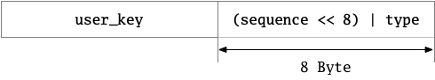
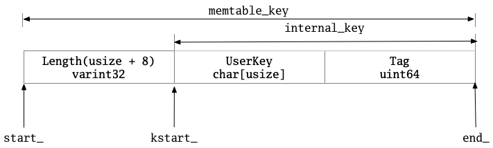

# §3.2 Internal

## 1 路径

* db/dbformat.h
* db/dbformat.cc

## 2 功能

## 3 ParsedInternalKey

* 这里的主要数据成员是：`Slice user_key;`、`Sequencenumber sequence;`、`ValueType type;`。

* 主要代码如下：

```cpp
// Value types encoded as the last component of internal keys.
// DO NOT CHANGE THESE ENUM VALUES: they are embedded in the on-disk
// data structures.
enum ValueType { kTypeDeletion = 0x0, kTypeValue = 0x1 };
// kValueTypeForSeek defines the ValueType that should be passed when
// constructing a ParsedInternalKey object for seeking to a particular
// sequence number (since we sort sequence numbers in decreasing order
// and the value type is embedded as the low 8 bits in the sequence
// number in internal keys, we need to use the highest-numbered
// ValueType, not the lowest).
static const ValueType kValueTypeForSeek = kTypeValue;

typedef uint64_t SequenceNumber;

// We leave eight bits empty at the bottom so a type and sequence#
// can be packed together into 64-bits.
static const SequenceNumber kMaxSequenceNumber = ((0x1ull << 56) - 1);

struct ParsedInternalKey {
  Slice user_key;
  SequenceNumber sequence;
  ValueType type;

  ParsedInternalKey() {}  // Intentionally left uninitialized (for speed)
  ParsedInternalKey(const Slice& u, const SequenceNumber& seq, ValueType t)
      : user_key(u), sequence(seq), type(t) {}
  std::string DebugString() const;
}

std::string ParsedInternalKey::DebugString() const {
  std::ostringstream ss;
  ss << '\'' << EscapeString(user_key.ToString()) << "' @ " << sequence << " : "
     << static_cast<int>(type);
  return ss.str();
}
```

## 4 InternalKey

* 功能：用这个类（而不是`std::string`）的重要原因是，不使用string比较，而使用InternalKeyComparator。

* 主要代码如下：

```cpp
// Modules in this directory should keep internal keys wrapped inside
// the following class instead of plain strings so that we do not
// incorrectly use string comparisons instead of an InternalKeyComparator.
class InternalKey {
 private:
  std::string rep_;

 public:
  InternalKey() {}  // Leave rep_ as empty to indicate it is invalid
  InternalKey(const Slice& user_key, SequenceNumber s, ValueType t) {
    AppendInternalKey(&rep_, ParsedInternalKey(user_key, s, t));
  }

  bool DecodeFrom(const Slice& s) {
    rep_.assign(s.data(), s.size());
    return !rep_.empty();
  }

  Slice Encode() const {
    assert(!rep_.empty());
    return rep_;
  }

  Slice user_key() const { return ExtractUserKey(rep_); }

  void SetFrom(const ParsedInternalKey& p) {
    rep_.clear();
    AppendInternalKey(&rep_, p);
  }

  void Clear() { rep_.clear(); }

  std::string DebugString() const;
};

std::string InternalKey::DebugString() const {
  ParsedInternalKey parsed;
  if (ParseInternalKey(rep_, &parsed)) {
    return parsed.DebugString();
  }
  std::ostringstream ss;
  ss << "(bad)" << EscapeString(rep_);
  return ss.str();
}
```

* 由此可见：InternalKey的数据结构应为：



## 5 InternalKeyComparator

* 功能：专门用在对InternalKey进行比较的。

* 主要代码如下：
* 主要成员变量：`user_comparator_`是用户提供的对UserKey排序的Comparator。

```cpp
// A comparator for internal keys that uses a specified comparator for
// the user key portion and breaks ties by decreasing sequence number.
class InternalKeyComparator : public Comparator {
 private:
  const Comparator* user_comparator_;

 public:
  explicit InternalKeyComparator(const Comparator* c) : user_comparator_(c) {}
  const char* Name() const override;
  int Compare(const Slice& a, const Slice& b) const override;
  void FindShortestSeparator(std::string* start,
                             const Slice& limit) const override;
  void FindShortSuccessor(std::string* key) const override;

  const Comparator* user_comparator() const { return user_comparator_; }

  int Compare(const InternalKey& a, const InternalKey& b) const;
};

const char* InternalKeyComparator::Name() const {
  return "leveldb.InternalKeyComparator";
}
```

* Compare：排序方法
  * UserKey升序（根据用户提供的Comparator）
  * SequenceNumber降序
    * anum > bnum; return -1;
    * anum < bnum; return +1;
    * anum = bnum; reutrn 0;
  * Type降序（但SequenceNumber应该就可以分出来大小了）

```cpp
inline int InternalKeyComparator::Compare(const InternalKey& a,
                                          const InternalKey& b) const {
  return Compare(a.Encode(), b.Encode());
}

int InternalKeyComparator::Compare(const Slice& akey, const Slice& bkey) const {
  // Order by:
  //    increasing user key (according to user-supplied comparator)
  //    decreasing sequence number
  //    decreasing type (though sequence# should be enough to disambiguate)
  int r = user_comparator_->Compare(ExtractUserKey(akey), ExtractUserKey(bkey));
  if (r == 0) {
    const uint64_t anum = DecodeFixed64(akey.data() + akey.size() - 8);
    const uint64_t bnum = DecodeFixed64(bkey.data() + bkey.size() - 8);
    if (anum > bnum) {
      r = -1;
    } else if (anum < bnum) {
      r = +1;
    }
  }
  return r;
}
```

* FindShortestSeparator
  * 先利用start的UserKey和limit的UserKey来调用`user_comparator_`的FindShortestSeperator方法，得到结果tmp。
    * 当找到一个size大于等于start的UserKey，或Compare下大于等于start的UserKey，结束函数。
    * 否则，在末尾添加一段数字。*备注：如注释所讲，UserKey在物理上（这里应该指的是所占的存储空间）变短了，但是在逻辑上（应该是说这个key作为prefix能代表的一类key的数量）变大了。所以要添加“earlist possible number”。*

```cpp
void InternalKeyComparator::FindShortestSeparator(std::string* start,
                                                  const Slice& limit) const {
  // Attempt to shorten the user portion of the key
  Slice user_start = ExtractUserKey(*start);
  Slice user_limit = ExtractUserKey(limit);
  std::string tmp(user_start.data(), user_start.size());
  user_comparator_->FindShortestSeparator(&tmp, user_limit);
  if (tmp.size() < user_start.size() &&
      user_comparator_->Compare(user_start, tmp) < 0) {
    // User key has become shorter physically, but larger logically.
    // Tack on the earliest possible number to the shortened user key.
    PutFixed64(&tmp,
               PackSequenceAndType(kMaxSequenceNumber, kValueTypeForSeek));
    assert(this->Compare(*start, tmp) < 0);
    assert(this->Compare(tmp, limit) < 0);
    start->swap(tmp);
  }
}
```

* FindShortSuccessor
  * 先调用调用`user_comparator_`的FindShortSuccessor的成员函数，接下来的内容与上类似。

```cpp
void InternalKeyComparator::FindShortSuccessor(std::string* key) const {
  Slice user_key = ExtractUserKey(*key);
  std::string tmp(user_key.data(), user_key.size());
  user_comparator_->FindShortSuccessor(&tmp);
  if (tmp.size() < user_key.size() &&
      user_comparator_->Compare(user_key, tmp) < 0) {
    // User key has become shorter physically, but larger logically.
    // Tack on the earliest possible number to the shortened user key.
    PutFixed64(&tmp,
               PackSequenceAndType(kMaxSequenceNumber, kValueTypeForSeek));
    assert(this->Compare(*key, tmp) < 0);
    key->swap(tmp);
  }
}
```

## 6 InternalFilterPolicy

* FilterPolicy的封装，将InternalKey转换为Key，并调用`user_policy_`来处理，如CreateFilter、KeyMayMatch等等。
* 主要代码：

```cpp
// Filter policy wrapper that converts from internal keys to user keys
class InternalFilterPolicy : public FilterPolicy {
 private:
  const FilterPolicy* const user_policy_;

 public:
  explicit InternalFilterPolicy(const FilterPolicy* p) : user_policy_(p) {}
  const char* Name() const override;
  void CreateFilter(const Slice* keys, int n, std::string* dst) const override;
  bool KeyMayMatch(const Slice& key, const Slice& filter) const override;
};

const char* InternalFilterPolicy::Name() const { return user_policy_->Name(); }

void InternalFilterPolicy::CreateFilter(const Slice* keys, int n,
                                        std::string* dst) const {
  // We rely on the fact that the code in table.cc does not mind us
  // adjusting keys[].
  Slice* mkey = const_cast<Slice*>(keys);
  for (int i = 0; i < n; i++) {
    mkey[i] = ExtractUserKey(keys[i]);
    // TODO(sanjay): Suppress dups?
  }
  user_policy_->CreateFilter(keys, n, dst);
}

bool InternalFilterPolicy::KeyMayMatch(const Slice& key, const Slice& f) const {
  return user_policy_->KeyMayMatch(ExtractUserKey(key), f);
}
```

## 7 LookupKey

主要代码如下，重点在其构造函数：

```cpp
// A helper class useful for DBImpl::Get()
class LookupKey {
 public:
  // Initialize *this for looking up user_key at a snapshot with
  // the specified sequence number.
  LookupKey(const Slice& user_key, SequenceNumber sequence);

  LookupKey(const LookupKey&) = delete;
  LookupKey& operator=(const LookupKey&) = delete;

  ~LookupKey();

  // Return a key suitable for lookup in a MemTable.
  Slice memtable_key() const { return Slice(start_, end_ - start_); }

  // Return an internal key (suitable for passing to an internal iterator)
  Slice internal_key() const { return Slice(kstart_, end_ - kstart_); }

  // Return the user key
  Slice user_key() const { return Slice(kstart_, end_ - kstart_ - 8); }

 private:
  // We construct a char array of the form:
  //    klength  varint32               <-- start_
  //    userkey  char[klength]          <-- kstart_
  //    tag      uint64
  //                                    <-- end_
  // The array is a suitable MemTable key.
  // The suffix starting with "userkey" can be used as an InternalKey.
  const char* start_;
  const char* kstart_;
  const char* end_;
  char space_[200];  // Avoid allocation for short keys
};

inline LookupKey::~LookupKey() {
  if (start_ != space_) delete[] start_;
}

LookupKey::LookupKey(const Slice& user_key, SequenceNumber s) {
  size_t usize = user_key.size();
  size_t needed = usize + 13;  // A conservative estimate
  char* dst;
  if (needed <= sizeof(space_)) {
    dst = space_;
  } else {
    dst = new char[needed];
  }
  start_ = dst;
  dst = EncodeVarint32(dst, usize + 8);
  kstart_ = dst;
  std::memcpy(dst, user_key.data(), usize);
  dst += usize;
  EncodeFixed64(dst, PackSequenceAndType(s, kValueTypeForSeek));
  dst += 8;
  end_ = dst;
}
```

如此可见，LookupKey的主要数据结构应为：



## 8 相关函数

* 从InternalKey中提取出UserKey。

```cpp
// Returns the user key portion of an internal key.
inline Slice ExtractUserKey(const Slice& internal_key) {
  assert(internal_key.size() >= 8);
  return Slice(internal_key.data(), internal_key.size() - 8);
}
```

* 用ParsedInternalKey组成InternalKey。

```cpp
void AppendInternalKey(std::string* result, const ParsedInternalKey& key) {
  result->append(key.user_key.data(), key.user_key.size());
  PutFixed64(result, PackSequenceAndType(key.sequence, key.type));
}
```

* 构造InternalKey的非UserKey部分。

```cpp
static uint64_t PackSequenceAndType(uint64_t seq, ValueType t) {
  assert(seq <= kMaxSequenceNumber);
  assert(t <= kValueTypeForSeek);
  return (seq << 8) | t;
}
```

* 将一个InternalKey转为ParsedInternalKey。

```cpp
inline bool ParseInternalKey(const Slice& internal_key,
                             ParsedInternalKey* result) {
  const size_t n = internal_key.size();
  if (n < 8) return false;
  uint64_t num = DecodeFixed64(internal_key.data() + n - 8);
  uint8_t c = num & 0xff;
  result->sequence = num >> 8;
  result->type = static_cast<ValueType>(c);
  result->user_key = Slice(internal_key.data(), n - 8);
  return (c <= static_cast<uint8_t>(kTypeValue));
}
```

