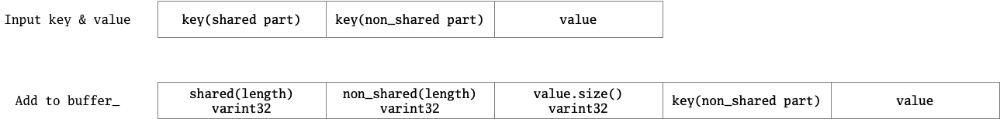
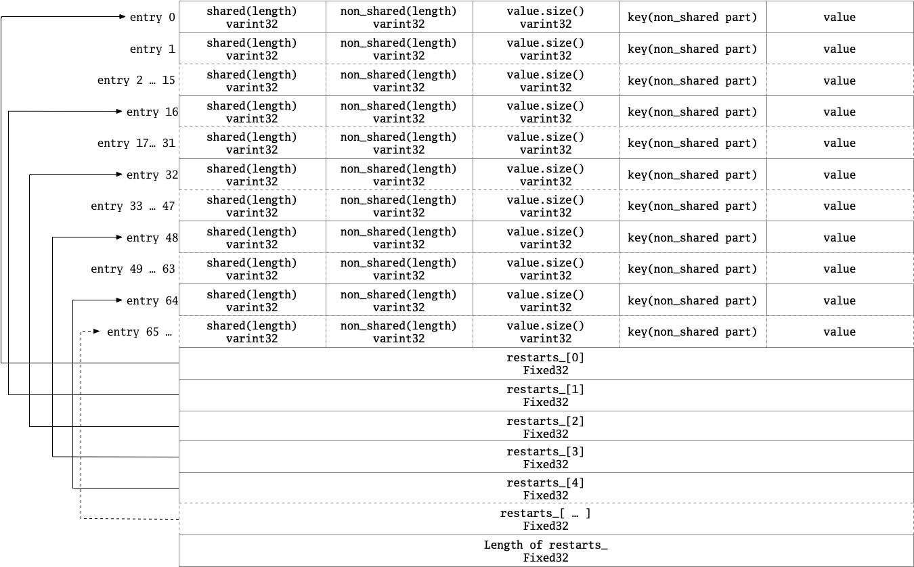

# §3.4 BlockBuilder

## 1 路径

* table/block_builder.h
* table/block_builder.cc

## 2 功能

## 3 主要成员变量

-  `const Options* options_;`这里的用处是：主要用来获得`block_restart_interval`。
-  `std::string buffer_;              // Destination buffer`：在此类中，数据会被放在这个地方。
-  `std::vector<uint32_t> restarts_;  // Restart points`：restart点时的`buffer_`，这里的restart指的是对**压缩**的重启。
-  `int counter_;                     // Number of entries emitted since restart`：自上次restart以来，又Add了几个KV对。
-  `bool finished_;                   // Has Finish() been called?`
-  `std::string last_key_;`上一个压入的Key。

## 4 主要成员函数

### 4.1 构造函数、Reset

`restarts_`的初始值，第一个元素是0，即第0个元素就是重启点。

```cpp
 public:
  explicit BlockBuilder(const Options* options);

  // Reset the contents as if the BlockBuilder was just constructed.
  void Reset();

BlockBuilder::BlockBuilder(const Options* options)
    : options_(options), restarts_(), counter_(0), finished_(false) {
  assert(options->block_restart_interval >= 1);
  restarts_.push_back(0);  // First restart point is at offset 0
}

void BlockBuilder::Reset() {
  buffer_.clear();
  restarts_.clear();
  restarts_.push_back(0);  // First restart point is at offset 0
  counter_ = 0;
  finished_ = false;
  last_key_.clear();
}
```

*备注：不允许拷贝构造和赋值。*

### 4.2 Add

* 当`counter_`小于`options->block_restart_interval`（*备注：目前的值是16，即每16条重启一次压缩。*）时，选出`last_key_`和输入key的相同的数据长度（`shared`）；当大于时直接将`buffer_`的长度放入`restarts_`中，`counter_`置0，此时`shared_`为0。
* 取`last_key_`和输入key不相同的长度（`non_shared`）为key的大小减去`shared`。
* 将`shared`、`non_shared`、value的大小全部经32为可变编码后追加到`buffer_`。
* 将key的非共享部分放入`buffer_`，将value放入`buffer_`。
* 将`last_key_`调整为共享长度，并将key的非共享部分追加到`last_key_`上。<u>总结：将输入key放入其中。</u>
* `counter_`加一。

主要代码如下：

```cpp
// REQUIRES: Finish() has not been called since the last call to Reset().
// REQUIRES: key is larger than any previously added key
void Add(const Slice& key, const Slice& value);

void BlockBuilder::Add(const Slice& key, const Slice& value) {
  Slice last_key_piece(last_key_);
  assert(!finished_);
  assert(counter_ <= options_->block_restart_interval);
  assert(buffer_.empty()  // No values yet?
         || options_->comparator->Compare(key, last_key_piece) > 0);
  size_t shared = 0;
  if (counter_ < options_->block_restart_interval) {
    // See how much sharing to do with previous string
    const size_t min_length = std::min(last_key_piece.size(), key.size());
    while ((shared < min_length) && (last_key_piece[shared] == key[shared])) {
      shared++;
    }
  } else {
    // Restart compression
    restarts_.push_back(buffer_.size());
    counter_ = 0;
  }
  const size_t non_shared = key.size() - shared;

  // Add "<shared><non_shared><value_size>" to buffer_
  PutVarint32(&buffer_, shared);
  PutVarint32(&buffer_, non_shared);
  PutVarint32(&buffer_, value.size());

  // Add string delta to buffer_ followed by value
  buffer_.append(key.data() + shared, non_shared);
  buffer_.append(value.data(), value.size());

  // Update state
  last_key_.resize(shared);
  last_key_.append(key.data() + shared, non_shared);
  assert(Slice(last_key_) == key);
  counter_++;
}
```

Key的组成内容和一次Add所放入`buffer_`的内容示意图如下：



### 4.3 Finish

将`restarts`中的数据经定长32位编码后放入`buffer_`，并将`restarts_`的大小经定长32位编码后放入`buffer_`。

主要代码如下：

```cpp
// Finish building the block and return a slice that refers to the
// block contents.  The returned slice will remain valid for the
// lifetime of this builder or until Reset() is called.
Slice Finish();

Slice BlockBuilder::Finish() {
  // Append restart array
  for (size_t i = 0; i < restarts_.size(); i++) {
    PutFixed32(&buffer_, restarts_[i]);
  }
  PutFixed32(&buffer_, restarts_.size());
  finished_ = true;
  return Slice(buffer_);
}
```

由此可见一个Block的数据为：



### 4.4 其它

这里是这个类的其它内容。结合4.3 Finish，就可以理解CurrentSizeEstimate了。

```cpp
// Returns an estimate of the current (uncompressed) size of the block
// we are building.
size_t CurrentSizeEstimate() const;

// Return true iff no entries have been added since the last Reset()
bool empty() const { return buffer_.empty(); }

size_t BlockBuilder::CurrentSizeEstimate() const {
  return (buffer_.size() +                       // Raw data buffer
          restarts_.size() * sizeof(uint32_t) +  // Restart array
          sizeof(uint32_t));                     // Restart array length
}
```

