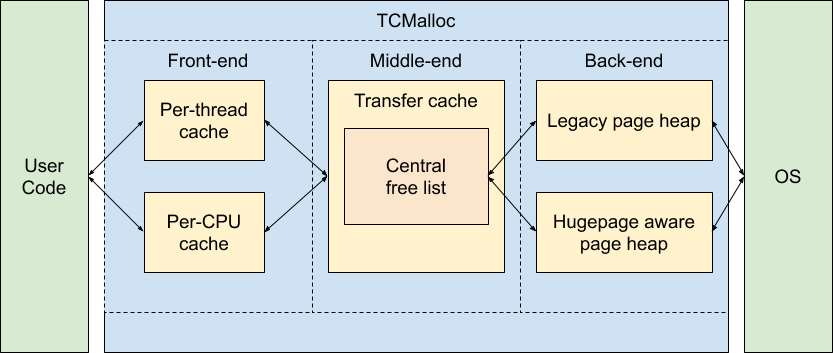
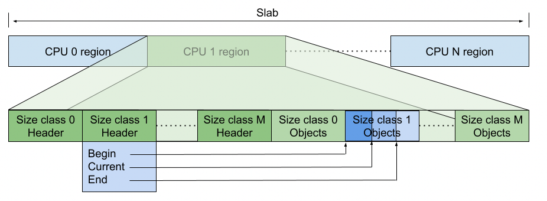
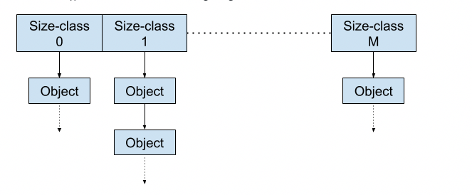
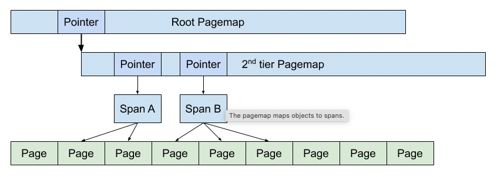
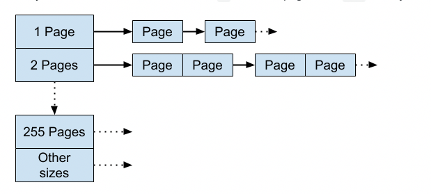

# TCMalloc Design Doc

thread caching malloc

[原文链接](https://google.github.io/tcmalloc/design.html)

## Motivation
TCMalloc被设计用来替代系统默认memory allocator，主要有以下特点：
- 对大多数object，分配和回收是**快速的、无竞争的**。根据不同的模式（per-thread或per-cpu），对象被缓存了。大多数的分配不需要锁，所以对于多线程应用是低竞争且好扩展的。
- **灵活使用内存**，所以空闲的内存可以被用在不同大小的对象，或者退还给。
- 通过分配相同大小的对象的几个页，使得每个对象内存的**额外开销**更小。导致了小对象的分配具有空间效率。
- 较低的采样额外开销，使得应用程序的内存使用有了详细的细节。

## Overview
将TCMalloc分为三个部分：
- 前端是一个缓存，提供了程序内存的快速分配和回收；
- 中端负责重新填充前端的缓存；
- 后端负责从OS取得内存。

## Front-end
前端处理对特定大小的内存的请求。它有一个内存的缓存，可以用来分配内存、持有空闲的内存。这个缓存某一时间只能被一个线程访问，所以它不需要任何的锁，所以大多数的分配和回收是很快的。

当前端缓存了适当大小的内存，它就可以满足相应的需求。如果缓存中没有特定大小的内存，它会向中端请求一批内存来重新装填自己的缓存。中端由CentralFreeList和TransferCache组成。

如果中端的内存被用光了，或者被请求的大小超过了前端缓存处理的最大的大小，会向后端请求来满足大的分配、或者重新装填中端的缓存。后端也叫做PageHeap。

有两种TCMalloc前端的实现：
- 最开始它支持每个线程（per-thread）对对象的缓存。然而，这导致了内存占用和线程数一起变化。现在应用程序都有很多的线程，这会产生大量的大的per-thread的内存，或者很多线程都有很小的per-thread的缓存。
- 最近的TCMalloc支持per-CPU模式。在这个模式下，每个逻辑CPU有自己的缓存，并利用它来分配内存。备注：x86架构上，一个逻辑CPU相当于一个超线程。

per-thread和per-CPU的区别取决于malloc/new和new/delete的实现。

## Small and Large Object Allocation
Small对象的分配被映射到某一个60-80个可分配的size-classes。比如，一个12B的内存分配会取整到16B的size-class。这种取整方法使得size-class可以最小化被浪费的内存总量。

编译时使用`__STDCPP_DEFAULT_NEW_ALIGNMENT__ <= 8`时，我们对使用`::operator new`原始的内存分配，使用对齐到8B的size集合。这个相对较小的对齐尺度，对很多常见的分配大小（20、40等），可以让浪费的内存最小化，否则要对齐到16B。在很多编译器上，这个行为被`-fnew-alignment=...`标志控制这。当没有指明`__STDCPP_DEFAULT_NEW_ALIGNMENT__`，或者它大于8B时，我们对`::operator new`使用标准的16B对齐。然而，对16B以下的内存分配，我们可能会返回一个更小的对齐的对象，因为这个空间内不能分配更大的对齐需求。

当请求一个给定大小的对象的时候，请求会使用`SizeMap::GetSizeClass()`的函数影射到一个特定的size-class，返回的内存也是来自这个size-class。这意味着返回的内存至少和请求的内存一样大。从size-class的分配是由前端负责。

比`kMaxSzie`定义的大小更大的对象被从后端直接分配。因为前端和中端不会缓存这些。大的对象的分配请求会被取整到TCMalloc page size。

## Deallocation
当一个对象被回收时，如果编译时就可以确定这个对象的大小，编译器就会提供对象大小，否则，会在pagemap中寻找。如果一个对象很小，则会被放回前端缓存。如果对象比`kMaxSize`更大，会被直接退回到pageheap。

### per-CPU模式
在per-CPU模式中，会分配一个大的内存块。

每一个逻辑CPU都会被分配这个内存的一段来存储metadata和指向特定size-class的可用对象的指针。metadata对每一个size-class都有一个header。header有一个指向每个size-class的对象的指针数组的开头的指针，和指向current、dynamic、maximum容量和数组段之内的现在的位置的指针。根据每个size-class的start的差，每个size-class指针数组的静态容量在开始时已经决定了。

在运行时，一个特定的size-class的，可以存储在per-cpu块的最大数量可能会不同，但是不会超过开始时赋值的最大容量。

当请求一个特定大小的size-class的对象时，它将被从这个数组中删除；当一个对象被释放时，它将会被放入这个数组。如果数组被耗光了，则会被中端的一批对象重新填满。当一个数组溢出的时候，一批对象将会被移出并退回到中端。

Per-cpu的可以被缓存的内存的数量由参数：`MallocExtension::SetMaxPerCpuCacheSize`限制。这意味着被缓存的内存的总量取决于活跃的每个CPU的缓存的数量。因此，有更多CPU数量的机器会缓存更多的内存。

当程序不再运行时，为了避免在CPU上持有内存，`MallocExtension::ReleaseCpuMemory`释放某个特定的CPU的缓存中的对象。

在一个CPU内，为了将缓存的内存的最大值限制在阈值以下，要综合所有的size-class内存来管理。要注意到，管理的是可以被缓存的内存的最大数量，而不是正在被缓存的数量。平均来看，真正缓存的数量应该大约是阈值的一半。

当一个size-class消耗掉所有的对象，或者获取更多的对象时，会增加其最大容量。直到所有的size-class的缓存可以持有的总内存达到per-cpu的阈值，或者直到这个size-class的容量达到硬编码的大小阈值，它会一直提高容量。如果size-class没有达到硬编码的容量，则为了增加容量，它可以从相同CPU的其他的size-class中“偷取”容量。

### Restartable Sequences and Per-CPU TCMalloc
为了正确地工作，per-CPU模式依赖<u>可重启序列（Restartable Sequence）</u>。一个可重启序列只是一个汇编指令块，很像一个典型的函数。可重启序列的一个限制是，不能向内存写部分状态，最后一个指令必须是一个单纯的写更新状态的指令。可重启序列的思想是，如果一个正在执行可重启序列的线程从CPU离开了（比如上下文切换），这个序列会从最顶上重启。所以这个序列或者不被中断地执行完成，或者不断地重启直到它不被中断地执行完成。不使用任何的锁或者原子指令就可以完成这个操作，所以在这个序列中避免了任何的竞争。

这个实际上对TCMalloc的作用是，代码可以类似`TcmallocSlab_Internal_Push`来使用可重启序列来向per-cpu数组获取或者返回一个元素，而不需要锁。可重启序列保证了或者是线程没被中断的情况下更新了数组，或者是当线程被中断了的情况下序列被重启了（比如，上下文切换使得另一个线程运行在了这个CPU上）。

### Legacy Per-Thread mode
在per-thread模式下，TCMalloc给每一个thread一个thread-local的缓存。这个缓存可以满足小的分配请求。对象根据需要会在中端缓存和这个thread-local缓存之间移动。

一个线程的缓存包含了一个单向链表，它含有每一个size-class的空闲的对象。（所以如果有N个size-class，则有N个对应的链表）。

在分配时，一个object会被从per-thread缓存中相应适当大小的size-class中移出。在回收时，这个对象会放在适当size-class的最前面。下溢和上溢通过访问中端来获取更多对象，或退回一些对象来处理。

Per-thread缓存的最大容量由`MallocExtension::SetMaxTotalThreadCacheBytes`这个参数来决定。然而，总大小超过这个限制也是可能的，因为每个per-thread缓存有一个最小值`kMinThreadCacheSize`，这个一般是512KiB*（注：KiB、MiB，中间带个i的，特指1024进制）*。在一个线程想提高自己的容量的时候，它需要从其他线程那里获得容量。

当线程退出时，它们缓存的内存会被退回到中端。

### Runtime Sizing of Front-end Caches
前端缓存的空闲内存列表的大小需要最优地调整。如果空闲列表很小，去Central free list就过于频繁。如果它很大，就会因为内存的空闲而导致浪费。

注意到缓存对回收和对分配是同样重要的。没有缓存的话，每一个回收会需要将内存移动到Central free list。

Per-cpu和per-thread模式有着不同的实现动态缓存大小的算法。

- 在per-thread模式下，在任何需要从中端中获取更多的对象的时候，最大可以被存储的对象的数量就会一直增长到阈值。类似地，当我们发现缓存了太多的对象的时候，容量就会下降。当缓存的对象的总大小超过了per-threa的限制，缓存的大小也会减小。
- 在per-cpu模式下，空闲列表的容量增长取决于是否我们交替地出现下溢和上溢（这表示一个更大的缓存可能会停止这种交替）。当它一段时间没有增长，可能会有过大的容量时，容量会被减少。

## TCMalloc Middle-end

中端负责向前端提供内存，并且回退内存给后端。中端由Transfer cache和Central free list组成。每一个size-class都有一个Transfer cache和Central free list。这些缓存都由互斥锁保护着，所以访问它们会有一个序列化（serialization，*注：这里指的应该是多线程执行时，CPU将多线程的指令序列化到“一个”线程的指令的操作*）的时间。

### Transfer Cache

当前端请求内存时，或者回退内存时，它会联系Transfer cache。

Transfer cache持有一个指向空闲内存的指针的数组，它可以很快速地将对象移动到这个数组，或者从这个数组取出对象。

因为一个CPU（或thread）分配的内存是从另一个CPU（或thread）回收的，所以叫做transfer cache。transfer cache允许两个不同的CPU（thread）之间快速地转移内存。

如果Transfer cache不能满足内存请求，或者没有可以持有回退对象的空间，它会访问Central free list。

### Central Free List

Central free list在“span”维度上管理内存，一个span是一个或更多个内存中TCMalloc pages的集合。这些名词会在下几节中解释。

Central free list通过从span中取得对象来满足对一个或多个对象的请求。如果span中没有足够的可供使用的对象，会向后端请求更多的span。

当对象被返回到Central free list，每一个对象被映射到它所属的span（使用pagemap），并且被释放到span。如果一个span中所有的对象都被返回了，那么这整个span都会被回退到后端。

### Pagemap and Spans

TCMalloc将heap分成几个编译时决定大小的pages来进行管理。一系列连续的page成为一个span。span可以被用来管理给程序的大的对象，也可以管理被分为一系列小对象的一系列的pages。如果span管理小对象，那么这个对象的size-class会被记录在span里面。

pagemap是用来查找一个对象属于哪个span，或者识别某个对象的size-class。

为了将所有可能的内存位置映射到span上面，TCMalloc使用一个2层或3层的<u>基数树（radix tree）</u>。

在中端中，使用span来判断哪里放置退回的对象，在后端中使用span来处理page范围。

### Storing Small Obejcts in Spans

span包含了一个指向span控制的TCMalloc pages的基地址。对小对象来说，这些page被分为最多2^16个对象。使用这个值是因为在span内，我们可以使用2个字节来寻址一个对象。

这意味着我们可以使用<u>松散链表（unrolled linked list</u>，*一个节点可以持有多个元素的链表*）来持有对象。比如，如果我们有8个字节，我们可以存储3个可以使用的对象的索引，然后使用第四个位置来存储链上的下一个对象的索引。这种数据结构比起来完全链表可以减少cache miss。

使用两个字节的索引的另一个好处就是，我们可以使用span中的空闲的容量来缓存4个对象。

当一个size-class中没有可用的对象时，我们需要从pageheap中获取一个新的span。

## TCMalloc Page Sizes

TCMalloc可以使用不同的page size来构建。注意这些是和对应硬件的TLB中使用的page size是不同的。TCMalloc的page size现在是4KiB、8KiB、32KiB和256KiB。

一个TCMalloc页或者持有一个特定大小的多个object，或者用来作为持有一个大小比一个页大的对象的group的一部分。如果一整个页都是空闲的，就会被退回到后端（pageheap），然后将来重新用作持有不同的大小的object（或者退回到OS）。

小的页会更好地处理程序的内存需求，因其有着更小的额外开销。比如，一个使用了一半的4KiB的页，会有2KiB剩余，但是一个32KiB的会有16KiB剩余。小的页也是更可能地变为空闲。比如，一个4KiB的页可以持有8个512B的object，但是一个32KiB的页持有64个512B的object。64个object同时空闲的可能性比8个object同时空闲的可能性小。

大的页导致了很少需要从后端取或退回内存。一个32KiB的页比起4KiB的页可以持有8倍的object。这会导致管理大的页的开销相对较小。使用很少的页就能映射整个虚地址空间。TCMalloc有一个pagemap，它将一个虚拟地址映射到管理这个地址范围的结构上。更大的页意味着pagemap需要更少的记录，所以也就额外开销就更小。

## TCMalloc Backend

TCMalloc的后端有三个工作：

- 管理大块的未使用的内存。
- 当没有适当的大小的满足分配请求的内存时，向OS获取内存。
- 向OS退回没有需要的内存。

TCMalloc有两种backend：

- 管理TCMalloc页大小的块的内存的传统上的pageheap
- hugepage aware pageheap管理hugepage大小的内存块。管理hugepage块，使得分配器通过减少TLB miss来提高应用程序的性能。

### Legacy Pageheap

传统的pageheap是特定大小的连续页的可用内存的空闲链表的数组。对于<256的k，第k个记录就是一系列的空闲列表，它包含k个TCMalloc页。第256个记录是长度>=256的页。

通过查找第k个空闲列表满足对k个页的分配。如果这个空闲列表是空的，那么就去寻找下一个空闲列表，以此类推。最终，如果需要的话，会查找最后一个空闲列表。如果这个也没找到，使用`mmap`从系统中获取内存。

如果通过一系列的长度>k的页，满足了对k个页的分配，这一系列剩下的会重新插入到pageheap的适当的空闲列表。

当一个范围的页被退回到pageheap，会检查相邻的页来确定是否组成了一个连续的区域，如果是的话，这些页会串联起来，并放到适当的空闲列表里。

### Hugepage Aware Allocator

hugepage aware allocator的目标就是持有hugepage大小的块的内存。在x86上，hugepage的大小是2MiB。back-end有三个不同的缓存：

- Filler cache持有hugepage，它会让一些内存分配从这里获取。可以认为这与传统pageheap持有一定数量的TCMalloc页的链表很像。对一个小于一个hugepage大小的分配请求，一般会从这里返回。如果Filler cache没有足够的可用的内存，它会请求更多的hugepage来分配。
- Region cache处理比hugepage更大的分配。这个cache允许对多个hupage的分配，并将多个这种分配组装成一个连续的region。这对刚刚超过hugepage大小（如2.1MiB）的分配很有用。
- hugepage cache处理至少一个hugepage的分配。这在使用上和region cache有些重叠，但是region cache只有在运行时确定这中分配模式会获益的情况下生效。

## Caveats

TCMalloc会在启动的时候预留一些内存给metadata。metadata的数量会随着堆的增长而增长。特别地，pagemap会随着TCMalloc使用的虚拟地址的范围而增长，span会随着内存中活跃的页的数量增长。在per-cpu模式，TCMalloc会留下一小块内存（一般是256KiB），在有大量的逻辑CPU的机器上，这个总量会达到几MiB。

TCMalloc从系统中获取大块的内存（如1GiB）是毫无用处的。虽然地址空间被预留了，但是使用之前是没有物理内存的支持的。这种方法会使得程序的*VSS（Virtual Set Size，虚拟内存占用）*远大于*RSS（Resident Set Size，实际内存占用）*。这种方法的副作用是，试图通过限制VSS来限制程序使用的内存会在真正使用这么多物理内存之前就失败了。

不要试图将TCMalloc放进一个正在运行的二进制文件中（如，使用JNI的Jave程序）。这个程序可能使用了系统的malloc来分配内存，但试图传给TCMalloc进行回收。TCMalloc处理不了这些对象。