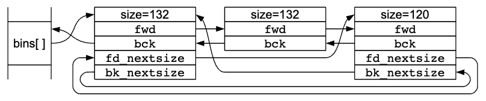

# Glibc Malloc (PTMalloc) Overview

本文主要参考：https://sourceware.org/glibc/wiki/MallocInternals

## 简述

历史：glibc中使用的malloc即是从ptmalloc（pthread malloc）中演化得到的。

名词解释：

- Arena：在一个或多个thread之间共享，包含有对多个heap的引用和这些heap中空闲（free）的chunk的链表。分配到每个arena的线程会从这个空闲链表中分配内存。
- Heap：一段连续的内存，被分成了多个chunk。每一个heap只属于一个arena。
- Chunk：一小段内存，可以从这里分配、释放、或者和相邻的chunk合并为一个大段的内存。注意到chunk是分配到程序的一块内存的wrapper。每一个chuck存在于一个heap，且属于一个arena。
- Memory：程序的地址空间的一部分，一般背后实际上是RAM、或swap区域。

## Chunk简介

glibc malloc将一大段内存（heap）分为不同size的多个chunk。每一个chunk包含一个mata-data指明这个chunk的size（通过chunk header的size数据），和相邻的chunk的位置。当一个chunk被程序使用时，记住的数据只有chunk的size。当chunk被释放时，之前存放程序数据的内存，将重新用来存放arena相关的额外信息。另外，一个被释放的chunk的最后一个word包含了一个chunk的size字段的拷贝。3个LSB（最低有效位）置为0。与之相反的是，chunk最前面的3个LSB是作为标志位来使用的。

chunk指针（*mchunkptr*）指向的不是chunk的开始位置，而是前一个chunk的最后一个word。

由于所有的chunk都是8B的倍数，chunk的size字段的3个LSB可以被用作标志位，其定义如下：

- A（0x04）：被分配的区域。使用程序的heap的main arena。其他的区域使用的mmap的heap（使用mmap获得的内存的区域）。如果这个位是0，chunk来自于main arena、main heap。如果是1，chunk来源于mmap的内存，heap的位置可以通过chunk的地址来计算得到。
- M（0x02）：mmap的chunk。这个chunk使用mmap的一个调用来分配的，不属于某个heap。
- P（0x01）：前一个chunk正在被使用。如果置为1，程序还在使用前面一个chunk，`prev_size`字段无效。注意，一些chunk如在fastbin中的，也会设置这个位。这个位真实的意思是前一个chunk是否被考虑要作为合并的一部分。（此处的“合并”指的是将两个地址相邻的chunk合并为一个大的chunk。）

下图中的“prev_size”指的是前一个chunk的size字段，并不是真实地存在这一个名为“prev_size”的字段。

## Arean和Heap

为了高效地处理多线程程序，glibc malloc允许内存的多个区域同时处于活跃状态。所以，不同的线程可以访问不同的内存区域，不打扰其它的线程。这些区域统一被称为arena。有一个叫做main arena的，对应于程序的初始heap。在malloc代码中有一个静态变量指向这个arena，每一个arena都有一个`next`指针指向相应的额外的arena。

当线程之间的冲突增多时，会使用`mmap`来创建额外的arena来缓轻压力。arena的数量最多是8倍的CPU的个数。（除非有指定，参见`mallopt`），这意味着“重线程”（heavily threaded）的程序仍然会看到一些竞争，但相较之下这种方法会有更少的碎片。

每个arena有一个mutex，用来控制对这个arena的访问。注意到，一些操作，如访问fastbin，会使用原子操作，不需要锁住arena。所有其它的操作都需要thread对arena加锁。这个竞争情况就是创建多个arena的原因，分配到不同arena的thread不需要等待其它thread。如果有竞争的话，thread会自动切换到未被使用的（未加锁的）的arena。

每个arena从一个或多个heap获取内存。main arena使用程序的初始heap（从.bss开始）。额外的arena使用mmap为它们的heap分配内存。每一个arena跟踪一个特殊的**top chunk**，这一般是一个最大的可用的chunk，并且也一般指的是最近刚分配的heap。被分配的arena的内存一般是来自这个arena的初始heap。

在每个arena之内， chunk或者在被程序使用，或者是空闲的（可用的）。arena不跟踪正在被使用的chunk。空闲的chunk根据size和历史，被存储在不同的列表中，所以可以快速地找到合适的chunk来满足分配请求。这个列表被称为“bin”。有以下几类的bin：

- fast：小的chunk被存储在特定size的bin里。被放到fastbin的chunk不会和相邻的chunk合并。原因是这样可以让访问很快。fastbin中的chunk可能会根据需要移动到其它的bin。fastbin中的chunk会存储到链表的数组中。
- unsorted：当chunk被释放的时候，它们一开始存储在单个的bin里。为了使得它们能尽快地被重新使用，它们之后会被排序。这也意味着，排序逻辑会在某个时间点执行，只需要将被释放的chunk放到这个bin里面，它们之后会被排序。
- small：普通的bin会被划分为几个small bin，其中每一个chunk是相同的size，large bin中的chunk是一个范围的size。当chunk被添加到这些bin中，它们首先和相邻的chunk合并为更大的chunk。所以，这些chunk永远不会和其它类似的chunk相邻（尽管它们可能和fast、unsorted、或正在被使用的chunk相邻）。小的和大的chunk使用双向链接，所以可以从中间移出chunk（比如当它们和新释放的chunk合并）。
- large：如果它们的bin可能包含多个size，则称其为large。对small bin，可以选择第一个chunk来使用。对large bin，需要找到最适合的chunk，并且可能会分为两个chunk（一个是需要的size，一个是剩下的）。

注意：bin不是chunk，它们是fwd、bck指针的数组。

因为需要对large chunk找到最适合的，large chunk有一个额外的双向链表，链接列表中每个size的第一个元素，并且根据size来排序chunk，从大到小。这允许malloc来快速地扫描第一个足够大的chunk。注意：如果对于一个给定的size，有多个chunk满足，一般会选择第二个，使得不需要调整next-size链表。chunk被插入列表时，会插入到相同size的chunk之后，并且可能指向他自己的chunk来组成一个环。

## Thead Local Cache (tcache)

此malloc对于多线程基本上没有过多的特殊优化。*注：ptmalloc/glibc malloc设计的时间很早，那个时候机器核数较少，多线程没有那么流行，这种设计是情理之中的。这也造成了现在很多的工程应用都会使用tcmalloc、jemalloc或自己定制的malloc，很少直接使用原生的malloc。*

每一个thread都有一个thread-local的变量，来记住它上次使用的arena。当一个thread需要使用某个arena，但是这个arena正在被使用，这个线程会被阻塞，等待这个arena变为空闲。如果在这之前，这个thread从未使用过一个arena，它会试图使用一个未被使用的、创建一个新的、或者选择全局列表中的下一个。

每个thread有一个per-thread的缓存（称为tcache），包含一个chunk的小集合，它可以不对arena加锁而访问。这些chunk用单链表来存储，类似fastbin，但是有指向载荷（而不是chunk header）的链接。每一个bin包含一个size的chunk，所以数组可以间接地用chunk size来寻址。和fastbin不同，tcache的每个bin允许的chunk数量是有限制的（`tcache_count`）。如果对于一个请求的size，tcache是空的，不会去用比这个size大的chunk（因其可能会造成内部碎片），而是会回退到普通的malloc的方法，即对thread的arena加锁。

## Malloc算法

简而言之，malloc算法如下：

- 当tcache有一个合适（恰好满足）的chunk，它就会被返回给调用者。不会试图使用一个更大size的bin的chunk。
- 如果请求足够大，使用`mmap`来直接从OS中请求内存。
- 如果合适的fastbin中有chunk，使用这个。如果额外的chunk可用，也要提前装填tcache。
- 如果合适的small bin中有chunk，使用这个，也可能提前装填tcache。
- 如果请求很“大”，将fastbin中的所有移动到unsorted bin，在过程中进行合并操作。
- 开始从unsorted list中拿出chunk，移动它们到small、large bin，在过程中进行合并操作。（注意这是唯一把chunk放到small、large bin中的时机。）如果看到一个合适的chunk，使用这个。
- 如果请求很“大”，找寻适当的large bin，和接下来更大的bin，直到找到一个足够大的chunk。
- 如果fastbin中仍然有chunk（可能在“小”的请求的情况下出现），合并这些，并且重复前两步。
- 将top chunk切开一些，可能需要提前扩大top chunk。

对于过大对齐的malloc，如`valloc`、`pvalloc`、`memalign`，会找到一个过大的chunk，使得chunk适合对齐的情况下，将其分为2个或更多个chunk，然后返回给调用者，这部分的之前、之后的多余的部分会被放到unsorted列表，以便后续重复使用。

## Free算法

注意，总体上，释放内存不代表会返回到OS以供其它的程序使用。`free`调用标志了内存中chunk为“可以被重新使用的”，但是从OS的层面看，这个内存仍然归属于这个程序。然而，如果heap中的top chunk（未被映射的内存相邻的部分），变为足够大，这些内存的一部分可能会被unmmaped，并且返回给OS。

简而言之，free算法如下：

- 如果tcache中有空间，将其存储起来。
- 如果chunk足够小，将其放入适当的fastbin中。
- 如果chunk是mmap得到的，调用munmap。
- 看这个chunk是否和其它空闲的chunk相邻，如果相邻的话合并它们。
- 将其放入unsorted列表，除非它现在是top chunk。
- 如果chunk足够大，合并任何一个fastbin，看下top chunk是否足够大来将一些内存退回给OS。注意到，这个步骤由于性能原因，可能会被延后执行，然后在malloc或其他调用的情况下发生。

## Realloc算法

注意到对NULL或size为0的realloc处理是不同的。

简而言之，realloc算法如下：

对于mmap得到的chunk：

由单个的`mmap`调用的（大的）分配，使用`mremap`来重新分配，这个可能会得到和之前的内存相同或不同的地址，取决与内核的工作。

如果OS不支持`munmap()`，新的size比之前的size小，不会有任何的事情发生，会返回之前的地址，否则会执行malloc-copy-free。

对arena chunk（为方便表述，采用new_size为调用realloc的size，old_size为之前的size）：

- 如果new_size比之前的old_size足够小，chunk会被分为两个chunk。返回前半个（有之前的地址），后半个会作为空闲的chunk被返回到arena。如果old_size与new_size相差很小，会被认为是“相同大小”，不做任何操作。
- 如果new_size大于old_size，检查下一个相邻的chunk。如果是空闲的，或者是“top”块（代表了heap中可以扩展的部分），并且足够大，这个chunk和现在的chunk合并，产生一个足够大的块。这种情况下，返回原来的指针。
- 如果new_size大于old_size，并且没有办法使用现在的或相邻的chunk，就会使用malloc-copy-free。

## 切换arena

在进程的生命周期，线程绑定的arena一般可以认为是不变的。但是，存在下列情况会切换arena：

- 线程不能从关联的arena来分配内存的时候。
  - 假设试图合并过了，寻找空闲的列表，处理unsorted列表等。
  - 假设试图扩大过heap了，但是sbrk、或创建新的mapping失败了。
- 如果之前使用了non-main arena中mmap的heap，线程通过`arena_get_retry`切换到sbrk heap的main arena。或者如果之前用到的main arena，变换到non-main arena（从空闲列表或者新的arena）。作为一个优化项，如果进程是单线程，不会这样做，并且在这个上面失败，然后返回ENOMEM（假设sbrk不管用，使用mmap试图扩展main arena，non-main arena也不管用）。

注意到在内存比较少的情况下，一个线程可能会频繁地切换arena，从sbrk的main arena到mmap的non-main arena，这一切的目的都是为了找到满足分配需求的heap。

