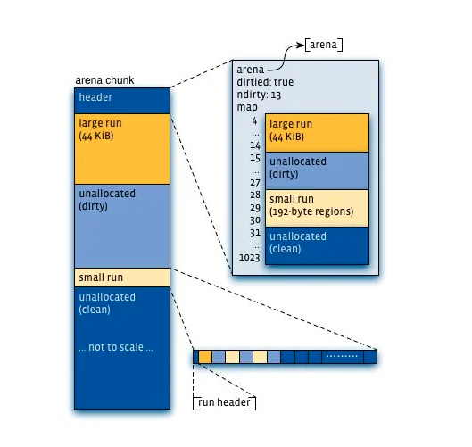
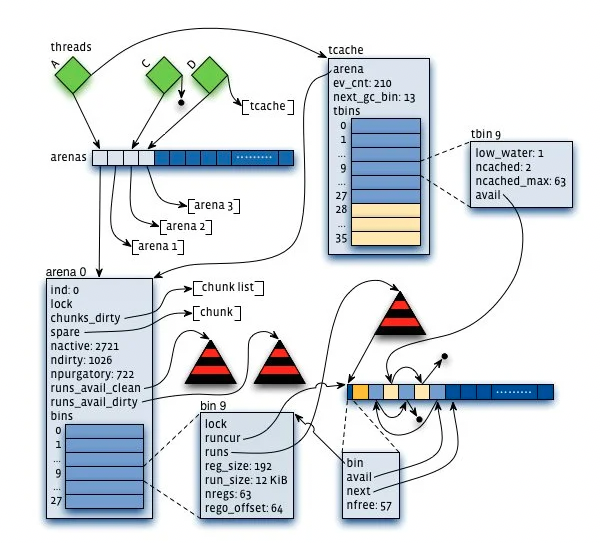

# jemalloc Overview

主要参考：

[1] Facebook对jemalloc的优化：[Scalable memory allocation using jemalloc](https://engineering.fb.com/2011/01/03/core-data/scalable-memory-allocation-using-jemalloc/)

[2] jemalloc原始论文：[A Scalable Concurrent malloc(3) Implementation for FreeBSD](https://www.bsdcan.org/2006/papers/jemalloc.pdf)

备注：[1]相对[2]较新，代表了jemalloc更新的研究成果，和更好的性能。当两者冲突时，以[1]为准。

## 目标与成果

对应用程序，提供一个**可扩展的**并行的内存分配器。当处理器的个数增加时，对多线程的内存分配有足够的<u>扩展性</u>。对多线程应用程序，相比于其他的内存分配其，有着更好的性能。

## 设计理念

*关于内存碎片：内存碎片分为内部碎片和外部碎片。内部碎片衡量由于单次分配产生的未使用的前面或后面浪费的空间。外部碎片衡量由虚拟内存系统支持的、但未直接被程序使用的内存。理想状态是两种碎片都很小，但是内存分配器需要在两者之间做出权衡。*

过去十年来RAM变得价格很便宜、量也大了，所以phkmalloc特别地优化来减少总的内存页工作集（working set），**jemalloc更关心缓存局部性，引申开来，也是CPU缓存行（cache line）的工作集**。换页（paging）仍然是性能骤降的潜在原因，但是更常见的问题是，相比于CPU的性能，从RAM获取数据引起了很大的延迟。

使用更少的内存的分配器并不一定代表着有更好的缓存局部性，这是因为如果程序的工作集不能合适地放进缓存，性能会在工作集在内存中紧凑地包装而提高。分配的对象在时间上更靠近的，一般也会一起使用，所以，如果分配器可以连续地分配对象，就会有局部性改进的可能。实际上，内存使用量可以合理地代表缓存局部性；**jemalloc先是试图最小化内存使用量，并且在这种条件下，尽量连续地分配内存。**

<u>假缓存行共享（即假共享，false sharing，false cache line sharing）</u>（解释见最后）的问题，一种解决方法是用填充的方法，但是填充是和尽量包装紧凑的目标正好相反，这会造成严重的内部碎片。**jemalloc依赖多个分配arena来缓解这个问题，然后交给程序在性能关键的代码的地方做内存填充来避免假共享问题，或者在代码中一个线程分配对象，然后交给其他的线程。**

**jemalloc的主要目标之一就是，在多处理器系统上的多线程程序，减少锁竞争。**其他人的方法：使用多个arena，通过线程标识符的哈希来讲每个线程分给arena。**jemalloc也使用多个arena，但是使用比哈希更好的机制来将线程分给arena。**

## 算法和数据结构

### size-class

分配的size-class一般归为3个主要类型：small、large、huge。所有的分配都取整到最近的size-class。

### arena & chunk

每个程序都会在运行期设置一个固定的arena数量，这个是和处理器的个数有关的：

- 单处理器：一个arena。
- 多处理器：arena的数量是处理器的4倍。

*对于高效地实现循环arena分配，TLS（线程本地存储，thread-local storage）是很重要的，因为每个线程的arena的分配需要存储在某个地方。对于Non-PIC（位置独立代码，Position Independent Code）代码和一些不支持TLS的架构，使用线程标识符的哈希来分配arena。*

线程第一次分配或释放内存时，就被分配到一个arena，arena用循环（round-robin）的方式选出，这样基本可以保证每个arena都分配了差不多个数的线程。*多个线程仍然有可能会竞争一个arena，但是平均来看，在初始化时候的分配，round-robin已经是最好的了。动态再平衡可能解决这个竞争问题，但是会带来比较昂贵的额外开销。*各个arena之间是独立的。

虚拟内存被逻辑上分为2^k的大小的chunk。（默认4MiB）

各个arena各自管理自己的chunk，为了便于small、large对象的分配，将chunk分割成page runs（一系列的page，以下简称run）。释放的内存总是会退回到分配的arena，与是否同一个线程分配、释放无关。

每一个arena chunk包含一个metadata（主要是一个page map），然后是一个或多个page run。small对象聚集在一起，其中每个run在开头的地方有一个额外的metadata。large对象之间相互独立，它们的metadata都在areana chunk头部。huge对象大于半个chunk，直接由专用的chunk支持，相关metadata存储在一个红黑树里面。

每个arena使用红黑树（每个size-class都有一个）来跟踪未满的small对象的run，并且一直使用size-class最低地址的非满的run来满足分配需求。每个arena通过两个红黑树来跟踪可用的run，一个用来跟踪clean/untouched的run，一个用来跟踪dirty/touched的run。run优先地使用dirty tree来分配内存，采用最小的最佳适配（best fit）方法。

对于small、large的分配，使用了<u>binary buddy algorithm</u>（解释见最后）来分割成page run，这些run可以不断地分成两半来得到更小的page。关于这些run的状态作为一个page map存储在每个chunk的开头。因为不在page上存储这些信息，所以只有当page被正式使用的时候才会创建。large分配的情况：比半个page大，比半个chunk小。

small分配比半个page小，且分为3个类型：tiny、quantum-spaced、sub-page。*如果将quantum-spaced去掉，将small分配同一为一个类型会看起来很简单。但是程序主要的分配大都会小于512B，quantum-spaced的size-class可以有效地减少内部碎片。虽然大量的size-class会增加外部碎片，但是在实际情况中，减少的内部碎片可以有余地抵消掉增加的外部碎片。*small分配是独立分开的，这样就可以使得每一个run管理单独的一个size-class。每个run的开头会存放一个region bitmap。它的优势在于：

- bitmap可以快速地扫描第一个空闲的region，这就允许了正在使用的region的紧凑包装。
- 分配器数据和应用程序数据是分开存储的。这减少了程序破坏分配器数据的可能性。这也潜在地增加了程序的缓存局部性。
- 可以很简单地支持小的region。

### tcache

每个线程维护一个small对象的缓存和large对象的缓存（最大到32KiB），即tcache。所以，大多数的分配需求在访问arena之前先检查缓存中是否有可用的对象。从缓存中获取对象不需要加锁，但是从arena中分配，可能需要对arena中的bin或整个arena加锁。

### GC

为了减少碎片，线程缓存会进行一个**垃圾回收（garbage collection，GC）**，淘汰是以时间为主要指标的。如果在一个或多个GC过程，缓存的对象都是空闲的（没有被使用），这些对象会被逐渐地放回相应的arena，使用的是指数衰减方法。

## 相关名词解释

- 假共享（false sharing）：两个线程使用两个不同的对象，但是处在同一个缓存行（cache line）。看似使用了不同的对象没有竞争，但是实际上是有竞争的。因为CPU取数据是按照cache line来的。[Wikipedia](https://en.wikipedia.org/wiki/False_sharing)
- 伙伴算法（binary buddy algorithm，buddy memory allocation）：内存分配的时候，将一块内存分为两个部分，一部分完美满足（best fit）分配需求，另一部分剩下作其他处理。[Wikipedia](https://en.wikipedia.org/wiki/Buddy_memory_allocation)

