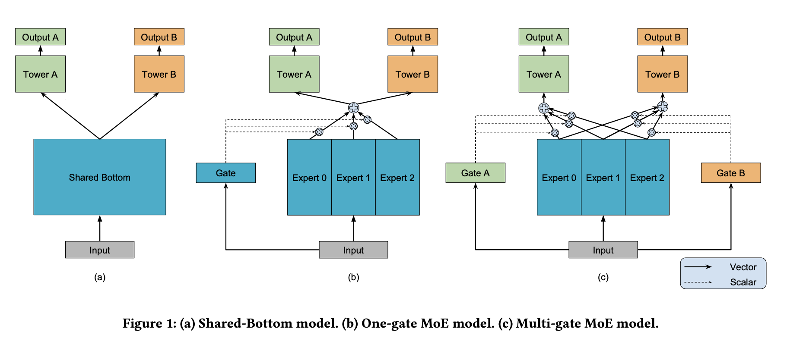

# MMoE论文研读

论文：*Modeling Task Relationships in Multi-task Learning With Multi-gate Mixture-of-experts*

## 要解决的问题

常用的多任务（multi-task）模型对于任务之间的关系很敏感。

## 目标

构建一个模型，可以**同时**学习多目标、多任务。捕捉到任务的不同，且不显著增加更多的模型参数（和Shared-Bottem多任务模型相比）。

## MMoE简介

MMoE对任务之间的关系建模，学习任务特殊性与共享的表示之间进行权衡。

它使得参数可以自动的分配，来学习任务间共享的信息，或任务独特的信息。

MMoE很容易训练，并且在几个回合就会收敛到一个比较好的损失。

通过共享expert子网络，采用MoE结构来进行多任务学习，同时训练一个gate网络来优化每个任务。

图1-a是shared-bottom结构，在input层之后的多个bottom层，由各个task共享，在这之上，每个task都有一个单独的tower网络。图1-c是MMoE网络，有着一群叫做expert的bottom网络。gate网络把输入的特征作为输入，输出集合不同权重的softmax gate，使得不同的任务区别使用不同的expert。整合后的expert被传输到不同的tower网络。

## 网络结构详解

### 1 Shared-Bottom Multi-task Model

共$K$个任务，模型包含了一个shared-bottom网络，用函数$f$表示，tower网络用$h^k$表示，其中$k=1,2,3,...K$。任务$k$的输出表示为：
$$
y_k=h^k(f(x))
$$

### 2 Mixture-of-Experts

原始MoE网络可以用如下公式表示：
$$
y=\sum_{i=1}^ng(x)_if_i(x)
$$
其中，$\sum_{i=1}^ng(x)_i=1$，$g(x)_i$是第$i$个$g(x)$的逻辑回归输出，表示了expert $f_i$的概率。$f_i$是expert网络，$g$代表了整合所有expert结果的gate网络。gate网络根据输入，产生在$n$个expert上的分布，最后的输出是所有expert的加权和。

### 3 Multi-gate Mixture-of-Experts

核心思想是将公式1中的共享bottom网络替换为公式2中的MoE层。更重要的，我们对每个任务$k$增加了一个gate网络$g^k$。任务$k$的输出是：
$$
y_k=h^k(f^k(x))
$$

$$
where f^k(x)=\sum_{i=1}^ng^k(x)_if_i(x)
$$

我们的实现包含了相同的ReLU激活函数的层。gate网络只是简单的输入的先性转换，加一个softmax层。
$$
g^k(x)=softmax(W_{g^k}x)
$$
其中，$W_{g^k}\in \mathbb R^{n\times d}$是一个可训练的矩阵，$n$是expert的数量，$d$是特征维度。

每一个gate网络都可以学习“选择”一个expert的子集来使用，取决于输入。MMoE通过决定不同的gate相重合的分离的程度，来建模任务的区别。如果任务是相对不相关的，共享的expert会被惩罚，这些任务的gate网络会学习使用不同的expert。相较于Shared-Bottom模型，MMoE只需要有几个gate网络，其模型的参数规模可以忽略不计。

